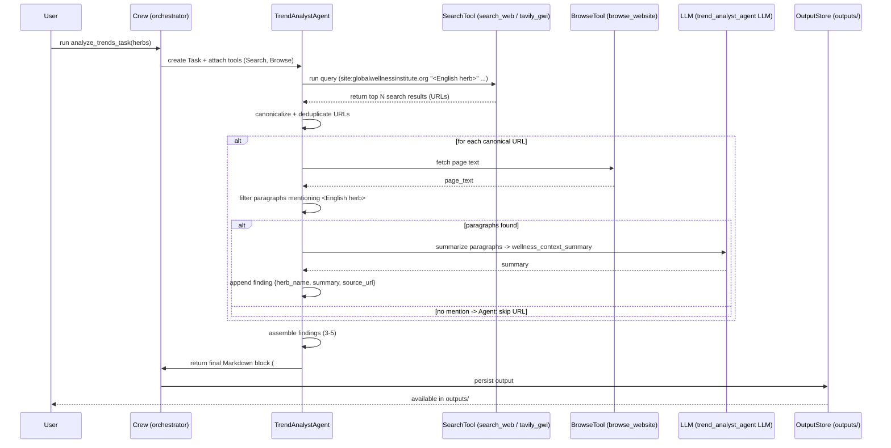

# analyze_trends_task — Flow, sequence diagram and pseudo-code

This document describes the runtime flow of `analyze_trends_task` (as defined in
`src/herbal_article_creator/crew.py` and `src/herbal_article_creator/config/tasks_production.yaml`).
It includes a mermaid sequence diagram and step-by-step pseudo-code plus guardrails
and testing notes.

## Purpose
- Discover high-quality trend content for a target herb on Global Wellness Institute (GWI) and similar sources.
- Produce a single English Markdown block beginning with `# ===TRENDS_DATA===` containing 3–5 findings. Each finding is a key-value list with `herb_name`, `wellness_context_summary`, and `source_url`.

## Sequence diagram (mermaid)



## Pseudo-code (step-by-step)

```python
def analyze_trends_task(herbs: str) -> str:
    # 0. Resolve input
    thai_name = herbs
    english_name = translate_to_english(thai_name)  # prefer internal mapping or RAG

    # 1. Build search queries
    queries = [
        f'site:globalwellnessinstitute.org "{english_name}" "health" OR "benefit"',
        f'"{english_name}" wellness trends',
    ]

    # 2. Stage 1 - run platform-specific searches
    raw_results = []
    for q in queries:
        results = search_tool.run(query=q, max_results=5)
        raw_results.extend(results)

    # 3. Extract, canonicalize and deduplicate URLs
    urls = canonicalize_and_filter_urls(raw_results)
    urls = [u for u in urls if is_html(u)]
    urls = deduplicate_by_hostname_and_path(urls)
    urls = urls[:5]  # limit to up to 5

    findings = []

    # 4. Stage 2 - browse & per-URL processing
    for url in urls:
        try:
            page_text = browse_tool.run(url)
        except FetchError:
            continue  # skip failed url

        # 4.a Filter paragraphs that mention the English herb name
        paragraphs = [p for p in split_paragraphs(page_text)
                      if english_name.lower() in p.lower()]
        if not paragraphs:
            continue  # skip: Herb-Mention rule

        # 4.b Summarize only the matched paragraphs (LLM)
        summary = llm_summarize(paragraphs, length_words=150, language='en')

        findings.append({
            'herb_name': f"{english_name} ({thai_name})",
            'wellness_context_summary': summary,
            'source_url': canonicalize_url(url)
        })

    # 5. Ensure count and format
    if not findings:
        # produce a minimal TRENDS_DATA block stating no findings
        return format_trends_markdown(english_name, thai_name, findings=[])

    findings = findings[:5]  # cap

    # 6. Final formatting - MUST return a single Markdown block
    markdown = format_trends_markdown(english_name, thai_name, findings)
    return markdown
```

## format_trends_markdown (output schema)

The final Markdown MUST be a single block beginning with `# ===TRENDS_DATA===`.

Example skeleton:

```
# ===TRENDS_DATA===
## Wellness Trends for: Turmeric (ขมิ้นชัน)

### Finding 1
* **herb_name:** Turmeric (ขมิ้นชัน)
* **wellness_context_summary:** <150-word summary>
* **source_url:** https://globalwellnessinstitute.org/...

### Finding 2
* **herb_name:** ...
* **wellness_context_summary:** ...
* **source_url:** ...

<!-- up to Finding 5 -->
```

# Explanation Field

| Field (English) | คำอธิบาย (ภาษาไทย) |
|---|---|
| Final answer — output template | Final output MUST be a single Markdown block starting with `# ===TRENDS_DATA===` and the structure shown: a short header `## Wellness Trends for: <English (Thai)>` then 3–5 findings. Each Finding must include: `herb_name` (English + Thai), `wellness_context_summary` (an original 100–150 word summary based ONLY on the paragraphs that mention the herb), and `source_url` (the canonical GWI URL). <br><br>ตัวผลลัพธ์ต้องเป็นบล็อก Markdown เดียวที่ขึ้นต้นด้วย `# ===TRENDS_DATA===` ตามรูปแบบที่ให้ไว้: หัวเรื่องย่อย `## Wellness Trends for: <ชื่ออังกฤษ (ไทย)>` แล้วตามด้วย 3–5 Finding แต่ละ Finding ต้องมี `herb_name` (อังกฤษ+ไทย), `wellness_context_summary` (สรุปต้นฉบับ ~100–150 คำ อ้างอิงเฉพาะย่อหน้าที่กล่าวถึงสมุนไพรเท่านั้น) และ `source_url` (URL แบบ canonical ของบทความ GWI) |
| Guardrails (critical) | - ENGLISH-ONLY RULE: Output must be English-only Markdown. <br>- HERB-MENTION RULE: Include a page only if the body paragraphs contain the English herb name. <br>- COUNT: Produce 3–5 findings when possible (max 5). <br>- URL HYGIENE: Strip tracking params (e.g., `utm_*`), canonicalize URLs, deduplicate by hostname/path. <br>- ERROR HANDLING: If a fetch fails or a page has no mention, skip and continue. <br><br>- กฎสำคัญ: ต้องเป็น Markdown ภาษาอังกฤษเท่านั้น. <br>- กฎการกล่าวถึงสมุนไพร: รวมหน้าเฉพาะเมื่อตัวเนื้อหามีการกล่าวถึงชื่อสมุนไพรเป็นภาษาอังกฤษเท่านั้น. <br>- จำนวนผลลัพธ์: พยายามส่ง 3–5 Finding (ไม่เกิน 5). <br>- ทำความสะอาด URL: ลบพารามิเตอร์ติดตาม (เช่น `utm_*`), canonicalize URL และตัดรายการซ้ำตาม hostname/path. <br>- การจัดการข้อผิดพลาด: หากดึงหน้าไม่ได้หรือหน้าไม่กล่าวถึงสมุนไพร ให้ข้ามหน้าและดำเนินการต่อ |
| Tools & config mapping (where in repo) | Reference locations for implementers: <br>- Task spec: `src/herbal_article_creator/config/tasks_production.yaml` (`analyze_trends_task` entry) <br>- Task factory / agent: `src/herbal_article_creator/crew.py` → `analyze_trends_task()` / `trend_analyst_agent()` <br>- Search tools: `MyTavilySearchTool` (configured in `crew.py`, e.g., `serper_tool`, `tavily_gwi`) <br>- Browse tool: `src/herbal_article_creator/tools/browse_website_tools.py` <br><br>ตำแหน่งไฟล์อ้างอิงในรีโปสำหรับผู้พัฒนา: <br>- สเปคงาน: `src/herbal_article_creator/config/tasks_production.yaml` (entry ของ `analyze_trends_task`) <br>- ตัวสร้างงาน/agent: `src/herbal_article_creator/crew.py` → ฟังก์ชัน `analyze_trends_task()` และ `trend_analyst_agent()` <br>- เครื่องมือค้นหา: `MyTavilySearchTool` ถูกกำหนดใน `crew.py` (เช่น `serper_tool`, `tavily_gwi`) <br>- เครื่องมือท่องเว็บ: `src/herbal_article_creator/tools/browse_website_tools.py` |
| Testing suggestions | - Unit test: mock `search_tool` to return example URLs; mock `browse_tool` to return canned HTML pages that do and do not contain the herb term; assert the final Markdown structure and that all guardrails are respected (English-only, herb mention, count, URL hygiene). <br>- Integration test: run end-to-end (with live search creds if available) and verify outputs saved under `outputs/` contain a correct `# ===TRENDS_DATA===` block. <br><br>- Unit test: จำลอง `search_tool` ให้คืนรายการ URL ตัวอย่าง; จำลอง `browse_tool` ให้คืน HTML ที่มี/ไม่มีคำของสมุนไพร แล้วตรวจว่า Markdown สุดท้ายถูกต้องและเคร่งครัดตาม guardrail (ภาษาอังกฤษเท่านั้น, ตรวจพบชื่อสมุนไพร, จำนวนผลลัพธ์, ทำความสะอาด URL). <br>- Integration test: ทดสอบแบบ end-to-end (ใช้บัญชีค้นหาจริงถ้ามี) และยืนยันว่าไฟล์ใน `outputs/` มีบล็อก `# ===TRENDS_DATA===` ที่ถูกต้อง |
| Implementation notes / improvements | - Prefer an internal Thai→English mapping (JSON) rather than live translation to avoid unreliable translations. <br>- Add a robust URL canonicalization util and centralize in `tools/utils`. <br>- Log skipped URLs and the skip reason for QA and debugging. <br>- Limit concurrent fetches and add timeouts/retries to avoid long hangs. <br><br>- ข้อแนะนำการพัฒนา: ใช้ฐานข้อมูลแมปชื่อไทย→อังกฤษ (ไฟล์ JSON ภายใน) แทนการแปลสดเพื่อความแน่นอน. <br>- เพิ่มยูทิลิตี้ canonicalize URL ที่แข็งแรงและรวบรวมไว้ที่ `tools/utils`. <br>- บันทึก URL ที่ถูกข้ามและเหตุผลในการข้ามเพื่อ QA/ดีบัก. <br>- จำกัดการดึงแบบขนานและตั้ง timeout/retry เพื่อป้องกันการค้างนานเกินไป |
## Guardrails (critical)
- ENGLISH-ONLY RULE: final output must be English Markdown only.
- HERB-MENTION RULE: include a page only if the body paragraphs contain the English herb name.
- COUNT: produce 3–5 findings when possible (no more than 5).
- URL HYGIENE: strip tracking params (`utm_*`), canonicalize URLs, and deduplicate by hostname/path.
- ERROR HANDLING: if a URL fetch fails or has no relevant mention, skip it and proceed.

| ส่วนประกอบ<br>(Component) | คำสั่งและข้อกำหนด<br>(Instructions & Requirements) | รูปแบบข้อมูล<br>(Format Example) |
| :--- | :--- | :--- |
| **Start Tag** | **TH:** **ต้อง** เริ่มต้นด้วยแท็กนี้เท่านั้น เพื่อระบุจุดเริ่มของข้อมูล<br>**EN:** **MUST** start with this tag to identify the data block start. | `# ===TRENDS_DATA===` |
| **Main Title** | **TH:** หัวข้อหลัก ระบุชื่อสมุนไพรทั้งภาษาอังกฤษและไทย<br>**EN:** Main header specifying the herb name in English and Thai. | `## Wellness Trends for: `<br>`<Eng Name (Thai Name)>` |
| **Finding Header** | **TH:** หัวข้อย่อยสำหรับแต่ละบทความที่พบ (ต้องมี 3-5 หัวข้อ)<br>**EN:** Sub-header for each processed URL (Total 3-5 findings). | `### Finding X` |
| **herb_name** | **TH:** ระบุชื่อสมุนไพร (อังกฤษและไทย)<br>**EN:** Specify the herb name (English and Thai). | `* **herb_name:** `<br>`<Eng Name (Thai Name)>` |
| **wellness_context_summary** | **TH:** เขียนสรุปใหม่ (100-150 คำ) เฉพาะเนื้อหาที่เกี่ยวข้องกับสมุนไพรนั้นๆ ห้ามคัดลอกมาตรงๆ<br>**EN:** Newly written original summary (100-150 words) based *only* on relevant mentions. | `* **wellness_context_summary:** `<br>`<Summary text...>` |
| **source_url** | **TH:** ลิงก์ URL ต้นฉบับที่ถูกต้อง<br>**EN:** The exact canonical URL of the article. | `* **source_url:** `<br>`<URL>` |
| **General Constraint** | **TH:** **กฎเหล็ก:** ห้ามมีข้อความอื่นนอกเหนือจาก Block นี้ และต้องเป็น Markdown ก้อนเดียว<br>**EN:** **Strict Rule:** No text outside this block. Must be a single Markdown block. | N/A (Formatting Rule) |

## Tools & config mapping (where in repo)
- Task spec: `src/herbal_article_creator/config/tasks_production.yaml` (`analyze_trends_task` entry)
- Task factory: `src/herbal_article_creator/crew.py` → `analyze_trends_task()`
- Agent: `src/herbal_article_creator/crew.py` → `trend_analyst_agent()`
- Search tools: `MyTavilySearchTool` created in `crew.py` (`serper_tool`, `tavily_gwi`)
- Browse tool: `src/herbal_article_creator/tools/browse_website_tools.py`

## Testing suggestions
- Unit test: mock `search_tool` to return a sample list of URLs, mock `browse_tool` to return canned HTML pages that both contain and do not contain the herb term. Assert final Markdown structure and guardrail adherence.
- Integration test: run `analyze_trends_task` end-to-end with live search credentials (if available) and inspect `outputs/` for a correctly formatted `# ===TRENDS_DATA===` block.

## Implementation notes / improvements
- Use an internal mapping (data/json) for Thai→English herb names to avoid unreliable translations.
- Add robust URL canonicalization util and centralize it in `tools/utils`.
- Log skipped URLs and reasons to help QA and debugging.

---

File created to help contributors implement or test `analyze_trends_task` reliably.
