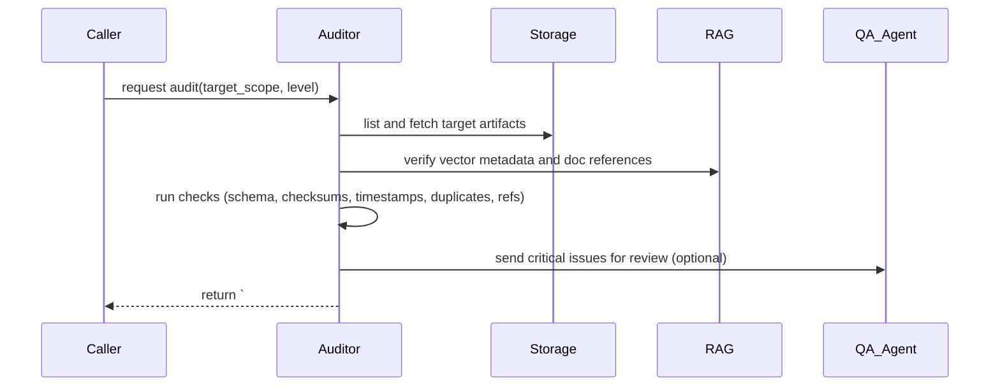

(The file `/Users/topgun/crew-herbal-article-creator/herbal_article_creator/project-documents/audit_data_integrity_task.md` exists, but is empty)
# Audit Data Integrity Task — Flow and Implementation Notes

Purpose
-------
The Audit Data Integrity task validates the internal consistency, provenance, and completeness of evidence and intermediate artifacts used across the multi-agent pipeline. Its role is to detect and report data corruption, missing fields, inconsistent timestamps, duplicated or conflicting records, broken references, and mismatched schemas so downstream agents (Planner, Writer, QA) can trust the inputs they receive.

Contract (small)
-----------------
- Inputs: { target_scope: { plan_id?, draft_id?, doc_ids?: [...], collection_name?: string }, validation_level: (light|full|fast), options: { check_duplicates: bool, check_checksums: bool, check_refs: bool } }
- Outputs: Guarded markdown block with header `# ===AUDIT_DATA_INTEGRITY===` followed by a single JSON object: audit_id, scope, created_at, level, results[], summary {status, issues_count, severity_counts}, provenance, actions_recommended.
- Error modes: inaccessible storage (return status "storage_error" with diagnostics), partial index (mark affected docs as `unvalidated`), malformed documents (report with error detail and sample), transient connectivity failures (retry/backoff suggested in actions_recommended).
- Success criteria: All targeted artifacts validated at the requested level; critical issues (schema mismatch, missing provenance, tampered checksum) are reported with remediation steps.

Mermaid sequence diagram
------------------------


Pseudocode (high level)
-----------------------
1. validate_request(scope, level)
2. targets = resolve_scope(scope)
3. for target in targets:
		 - fetch doc/metadata from storage
		 - run schema_check(target)
		 - run checksum_or_hash_check(target) if enabled
		 - run timestamp_and_order_check(target, peers)
		 - run duplicate_detection(target, peers)
		 - run reference_resolution(target) (ensure evidence_refs point to reachable docs)
		 - run provenance_check(target) (agent, ts, doc_id present)
		 - record per-target findings in results[]
4. aggregate = summarize_results(results)
5. determine_overall_status(aggregate)
6. attach_recommendations(aggregate)
7. emit_guarded_block('# ===AUDIT_DATA_INTEGRITY===', {audit_id, scope, created_at, level, results, summary, provenance, actions_recommended})

### Explanation Field

| ฟิลด์ (Field) | คำอธิบาย (Description) | รูปแบบข้อมูล (Format) |
| :--- | :--- | :--- |
| **Header** | **TH:** หัวข้อหลักสำหรับส่วนรายงานการตรวจสอบความสมบูรณ์ของข้อมูล<br>**EN:** Main header for the Data Integrity Audit Report section. | `# ===AUDIT_DATA_INTEGRITY_REPORT===` |
| **Collaboration Robustness (Data Loss)** | **TH:** คะแนนประเมินว่าข้อมูลจากต้นฉบับถูกนำมาใช้ครบถ้วนเพียงใด (ยิ่งสูงยิ่งดี ข้อมูลไม่หาย)<br>**EN:** Score evaluating data retention from source (Higher is better; minimal data loss). | Percentage<br>`<Score_6>%` |
| **Explanation Clarity (Hallucination)** | **TH:** คะแนนประเมินความถูกต้อง ไม่มีการมโนหรือบิดเบือนข้อมูล (ยิ่งสูงยิ่งดี)<br>**EN:** Score evaluating accuracy and absence of hallucinations (Higher is better). | Percentage<br>`<Score_5>%` |
| **Dropped Entities** | **TH:** ระบุรายการข้อเท็จจริงที่มีใน Fact Sheet แต่ **หายไป** ในบทความปลายทาง (ถ้าครบให้ใส่ 'None')<br>**EN:** List facts present in the Fact Sheet but **missing** in the final Article (Put 'None' if all present). | List text or 'None'<br>`- <Item>` |
| **Hallucinated Entities** | **TH:** ระบุรายการข้อเท็จจริงที่ **ถูกแต่งเติมขึ้นมาเอง** ในบทความ โดยไม่มีใน Fact Sheet (ถ้าไม่มีให้ใส่ 'None')<br>**EN:** List facts **invented/added** in the Article not found in the Fact Sheet (Put 'None' if clean). | List text or 'None'<br>`- <Item>` |
| **Feedback** | **TH:** คำอธิบายสั้นๆ เพื่อให้เหตุผลประกอบการให้คะแนนด้านบน<br>**EN:** Brief justification to support the scores assigned above. | Text string |

Checks performed (examples)
---------------------------
- Schema validation: check document JSON against pydantic or jsonschema models (missing required fields are high severity).
- Checksum/hash validation: compare stored checksum against recomputed checksum (detect tampering or corruption).
- Timestamp coherence: ensure created_at <= updated_at and timestamps align across related artifacts (no future-dated entries).
- Duplicate detection: detect identical doc content or high-similarity vectors in RAG index; flag likely duplicates.
- Reference resolution: confirm all evidence_refs and artifact references map to existing, accessible documents; flag broken refs.
- Provenance presence: verify agent id, timestamp, and source id exist; missing provenance is critical.
- RAG / vector metadata sanity: check vector docs have stable ids and metadata fields (doctype, source, doc_id) required for retrieval.

Tools and code locations
------------------------
- Orchestrator: `src/herbal_article_creator/crew.py` — call this audit task the same way other tasks are called.
- Storage helpers: `src/herbal_article_creator/tools/gdrive_browse_for_rag.py`, `pinecone_tools.py`, and disk helpers under `tools/` for fetching raw artifacts.
- RAG checks: use `src/herbal_article_creator/tools/common_rag.py` or `pinecone_tools.py` to validate vector store metadata and reverse lookups.
- Validators: add `src/herbal_article_creator/tools/audit_tools.py` where schema validators, checksum helpers, duplicate detectors, and reference resolvers live.
- Models/schemas: define validation models in `src/herbal_article_creator/schemas/` (e.g., `evidence.py`, `plan.py`, `article.py`) to run schema checks.

Guardrails and output format
---------------------------
- Guarded header: the auditor must emit `# ===AUDIT_DATA_INTEGRITY===` exactly (single line) followed by the JSON report.
- Minimal report fields:
	- audit_id (uuid)
	- scope (as requested)
	- created_at (ISO8601)
	- level (light|full|fast)
	- summary { status: (ok|issues_found|critical), issues_count, severity_counts }
	- results: array of per-target objects { doc_id, status, issues: [ {code, severity, message, sample_context, evidence_ref} ], checks: [names] }
	- provenance: which auditor agent ran, parameters, and storage snapshot id (if applicable)
	- actions_recommended: prioritized remediation steps

Severity levels
---------------
- critical: data corruption, missing provenance for clinical evidence, checksum mismatch, or broken references in critical fields.
- high: missing required schema fields, broken but recoverable references, duplicated high-confidence clinical documents.
- medium: minor schema suggestions, inconsistent optional metadata, timestamp drift.
- low: stylistic metadata issues or non-actionable warnings.

Actions recommended (examples)
------------------------------
- For checksum mismatch: re-fetch source, compare backups, restore from backup if available, mark target as `quarantined` until resolved.
- For missing provenance: flag document for manual review and attach a `provenance_missing` tag to prevent publication.
- For broken references: schedule a re-ingest or re-index for the referenced doc; in the short term mark consumer steps as `blocked` and add suggested fallback sources.

Edge cases and failure modes
---------------------------
- Large collections: when scope contains many thousands of documents, run in paginated batches and provide incremental reports with `partial = true`.
- Transient storage failures: implement exponential backoff and limited retries; if persistent, return `storage_error` with endpoint diagnostics.
- Inconsistent vector stores: if vector metadata differs from on-disk documents, run a reconciliation pass that re-indexes affected docs.
- Cross-index conflicts: when multiple RAG stores disagree on a doc_id, mark as conflict and surface conflicting metadata in results.

Testing recommendations
-----------------------
- Unit tests: validate each check function (schema_check, checksum_check, ref_resolution) with positive and negative cases.
- Integration: create synthetic collections with known issues (missing fields, corrupted content, duplicates) and assert the auditor reports them with correct severity.
- Load test: run audit at scale (e.g., 10k small docs) in a CI environment to ensure batching and pagination logic works.

Example guarded output (abbreviated)
-----------------------------------
```
# ===AUDIT_DATA_INTEGRITY===
{
	"audit_id": "audit-123e4567-e89b-12d3-a456-426614174000",
	"scope": {"plan_id":"plan-123e4..."},
	"created_at": "2025-11-18T11:00:00Z",
	"level": "full",
	"summary": {"status":"issues_found","issues_count":3,"severity_counts":{"critical":1,"high":1,"low":1}},
	"results": [
		{"doc_id":"EVID-abc123","status":"critical","issues":[{"code":"checksum_mismatch","severity":"critical","message":"Recomputed hash differs from stored hash","sample_context":"..."}],"checks":["schema","checksum"]},
		{"doc_id":"EVID-xyz789","status":"ok","issues":[],"checks":["schema","refs"]}
	],
	"provenance": {"auditor":"AuditAgent","ts":"2025-11-18T11:00:00Z","storage_snapshot":"snapshot-20251118-1100"},
	"actions_recommended": ["quarantine EVID-abc123","reindex collection 'evidence_v1'","manual provenance review for EVID-abc123"]
}
```

Implementation notes
--------------------
- Idempotency: audits should be idempotent for the same scope and level; include a deterministic `audit_id` or allow reuse when `force_refresh=false`.
- Persist audit reports in `outputs/audits/` keyed by `audit_id` and optionally index them in RAG for historical comparison.
- When running in automated CI, non-critical issues can surface as warnings, while critical issues should fail the pipeline stage and block publication.

Where to start
---------------
- Create `src/herbal_article_creator/tools/audit_tools.py` and implement: resolve_scope, fetch_targets, schema_check, checksum_check, ref_resolution, duplicate_detection, summarize_results, emit_guarded_audit.
- Add schemas in `src/herbal_article_creator/schemas/` used by schema_check.
- Add tests under `tests/test_audit_tools.py` covering typical issues and success cases.

Document created: 2025-11-18

