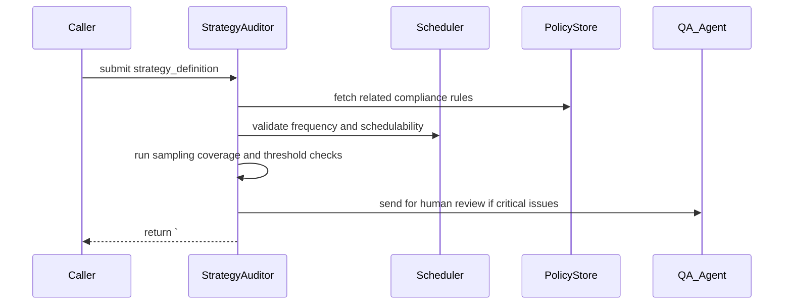

(The file `/Users/topgun/crew-herbal-article-creator/herbal_article_creator/project-documents/audit_strategy_task.md` exists, but is empty)
# Audit Strategy Task — Flow and Implementation Notes

Purpose
-------
The Audit Strategy task evaluates and validates the audit plans, schedules, thresholds, and policies that drive automated and manual audits across the pipeline. Instead of checking raw documents, this task audits the auditing strategy itself: that is, it verifies coverage, sampling rules, severity thresholds, escalation paths, frequency, and alignment with regulatory or organizational requirements.

Contract (small)
-----------------
- Inputs: { strategy_id?: string, strategy_definition: {name, scope, sampling_rules, frequency, thresholds, owners, escalation}, validation_level: (light|full), context: {collections, compliance_rules} }
- Outputs: Guarded markdown block with header `# ===AUDIT_STRATEGY===` followed by a JSON object: strategy_id, validated_at, validation_level, summary {status, issues_count}, results[], recommendations, provenance.
- Error modes: invalid strategy schema (return schema errors), conflicting thresholds (return conflict items), missing owners or escalation (return high-severity issue), unreachable referenced collections (storage/connectivity error).
- Success criteria: Strategy is schema-valid, sampling rules cover declared scope, thresholds are consistent and non-conflicting, owners and escalation paths are present, and recommended audit jobs can be scheduled from the strategy.

Mermaid sequence diagram
------------------------


Pseudocode (high level)
-----------------------
1. validate_schema(strategy_definition)
2. fetch_context_rules(context.collections, context.compliance_rules)
3. check_scope_coverage(strategy_definition.scope, collections)
4. simulate_sampling(strategy_definition.sampling_rules, collections, sample_size=1000) -> coverage_metrics
5. check_threshold_consistency(strategy_definition.thresholds)
6. validate_owners_and_escalation(strategy_definition.owners, strategy_definition.escalation)
7. validate_schedule(strategy_definition.frequency) via Scheduler API
8. aggregate_results = compile_findings(coverage_metrics, threshold_checks, owner_checks, schedule_checks)
9. recommendations = propose_remediations(aggregate_results)
10. emit_guarded_block('# ===AUDIT_STRATEGY===', {strategy_id, validated_at, validation_level, summary, results, recommendations, provenance})

Checks performed (examples)
---------------------------
- Schema validation: ensure required fields (name, scope, sampling_rules, frequency, thresholds, owners) are present and typed.
- Coverage check: sampling rules must adequately cover declared scope; report under-covered areas.
- Sampling simulation: run lightweight simulations to estimate expected sample coverage and false-negative risk for the configured sampling rules.
- Threshold consistency: detect overlapping/conflicting thresholds (e.g., two rules that both claim to mark 'critical' for the same metric range).
- Escalation and ownership: ensure each critical alert has an owner and a clear escalation path.
- Scheduling feasibility: frequency must be schedulable given known collection sizes and estimated audit durations; flag unrealistic frequencies.
- Compliance alignment: verify strategy references required compliance rules from `context.compliance_rules` and that thresholds meet regulatory minimums.

### Explanation Field

| ฟิลด์ (Field) | คำอธิบาย (Description) | รูปแบบข้อมูล (Format) |
| :--- | :--- | :--- |
| **Header** | **TH:** หัวข้อหลักสำหรับส่วนรายงานการตรวจสอบกลยุทธ์<br>**EN:** Main header for the Strategy Audit Report section. | `# ===AUDIT_STRATEGY_REPORT===` |
| **Practical Efficacy (Relevance)** | **TH:** คะแนนประเมินว่าเนื้อหามีประโยชน์และตรงจุดประสงค์แค่ไหน (ยิ่งสูงยิ่งตรงเป้า)<br>**EN:** Score evaluating practical utility and relevance to the goal (Higher is more relevant). | Percentage<br>`<Score_4>%` |
| **Implementation Feasibility (Scalability)** | **TH:** คะแนนประเมินความเป็นไปได้ในการนำไปปฏิบัติจริงและการขยายผล (ทำจริงได้ไหม)<br>**EN:** Score evaluating how feasible and scalable the strategy is in real life. | Percentage<br>`<Score_7>%` |
| **Go/No-Go for Publication** | **TH:** การตัดสินใจขั้นสุดท้ายว่าจะ "เผยแพร่" หรือไม่<br>**EN:** Final decision on whether to proceed with publication. | Text Select<br>`<Go / No-Go>` |
| **Feedback** | **TH:** คำอธิบายสั้นๆ เพื่อให้เหตุผลประกอบคะแนนและการตัดสินใจ (Go/No-Go)<br>**EN:** Brief justification for the assigned scores and the final decision. | Text string |

Tools and code locations
------------------------
- Orchestrator: `src/herbal_article_creator/crew.py` — call the audit_strategy task as a normal task.
- Strategy validation: implement in `src/herbal_article_creator/tools/audit_strategy_tools.py` or add functions to `src/herbal_article_creator/tools/audit_tools.py` if shared with data-audit logic.
- Scheduler integration: if the project has a scheduler or job runner, validate via `src/herbal_article_creator/tools/scheduler_*` helpers or external APIs.
- Policy store: compliance rules and policies may be in `knowledge/` or a config file under `src/herbal_article_creator/config/`; fetch them for alignment checks.
- Simulation helpers: reuse sampling and RAG-access functions from `src/herbal_article_creator/tools/common_rag.py` or implement lightweight mocks for estimation.

Guardrails and output format
---------------------------
- Guarded header: the auditor must output `# ===AUDIT_STRATEGY===` exactly on its own line, followed by a single JSON object.
- Minimal report fields:
	- strategy_id (uuid or provided id)
	- validated_at (ISO8601)
	- validation_level (light|full)
	- summary {status: ok|issues_found|critical, issues_count}
	- results: array [{check_name, status, details, severity}]
	- recommendations: prioritized list of fix actions
	- provenance: auditor agent id, parameters, context snapshot id

Checks and validation rules
---------------------------
- Required fields: fail fast if `scope`, `sampling_rules`, `frequency`, or `owners` are missing.
- Sampling coverage threshold: require a minimum expected coverage (configurable; default 80%) for high-risk scopes.
- Threshold conflicts: identify ranges that produce overlapping severities and flag as high severity.
- Scheduling feasibility: compute estimated audit duration from sample sizes and per-item processing time; if estimated duration > available window, flag as scheduling conflict.

Edge cases and failure modes
---------------------------
- Undefined scope: if `scope` references unknown collections, return `unknown_scope` with guidance.
- Very large scope: for coverage simulation, use sampling and estimation rather than full enumeration and report `partial=true` with confidence intervals.
- Conflicting policy references: if strategy references an older compliance rule with lower thresholds than a newer rule, report the conflict and recommend using the stricter rule.
- Missing escalation: treat as high severity and block strategys that would auto-publish audits without an escalation path.

Testing recommendations
-----------------------
- Unit tests: schema validation, threshold conflict detection, and owner/escalation checks.
- Simulation tests: deterministic sampling simulations with seeded randomness to validate coverage metrics.
- Integration tests: run with example strategies (ok, under-covered, conflicting thresholds) and assert the correct severity and recommendations appear in the guarded output.

Example guarded output (abbreviated)
-----------------------------------
```
# ===AUDIT_STRATEGY===
{
	"strategy_id": "strategy-20251118-001",
	"validated_at": "2025-11-18T11:30:00Z",
	"validation_level": "full",
	"summary": {"status":"issues_found","issues_count":2},
	"results": [
		{"check_name":"schema","status":"ok","details":"required fields present","severity":"low"},
		{"check_name":"sampling_coverage","status":"under_covered","details":"Collection 'evidence_v1' expected coverage 45% < required 80%","severity":"high"}
	],
	"recommendations": ["increase sampling rate for evidence_v1","assign owner for escalation path 'oncall_pharmacist'"],
	"provenance": {"auditor":"AuditStrategyAgent","ts":"2025-11-18T11:30:00Z","context_snapshot":"snap-20251118-1130"}
}
```

Implementation notes
--------------------
- Idempotency: validating the same strategy without changes should yield the same report (unless context has changed); support `force_refresh` to ignore cached snapshots.
- Persist validated strategies and reports under `outputs/audits/strategies/` for auditability and historical comparison.
- Provide a `dry_run` mode that returns recommendations without marking the strategy as active.

Where to start
---------------
- Add `src/herbal_article_creator/tools/audit_strategy_tools.py` with: validate_schema, simulate_sampling, check_thresholds, validate_escalation, emit_guarded_strategy_report.
- Add tests under `tests/test_audit_strategy_tools.py`.
- Optionally add a CLI helper or crew task binding so the strategy auditor can be invoked from `crew.py` with a JSON strategy payload.

Document created: 2025-11-18

