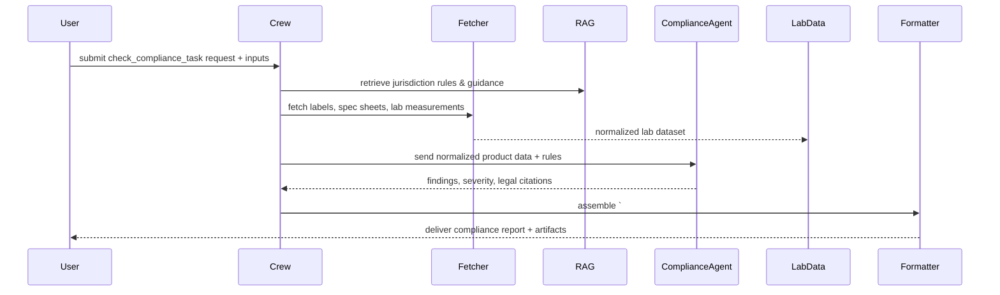

## check_compliance_task — Flow, diagram and pseudocode

Summary
- Purpose: Programmatically verify regulatory and labeling compliance for a target herbal product, ingredient, or dataset against jurisdiction-specific rules and thresholds. The task identifies violations, maps findings to legal citations, and outputs an actionable compliance report suitable for editorial review or legal escalation.
- Primary outputs: a guarded machine-parseable JSON payload plus a human-readable compliance summary, suggested remediation actions, and references to applicable regulations.

### Inputs
- request context: target (herb name, product name, ingredient, or sample_id), jurisdiction(s) to check (e.g., US-FDA, EU, TH), scope (labeling, ingredient limits, contaminants, health claims), and metadata (batch, supplier, sample measurements)
- optional: uploaded artifacts (labels, product spec sheets, lab measurements, prior compliance reports), or URLs to regulatory documents

### Outputs
- a guarded Markdown block starting with `# ===COMPLIANCE_REPORT===` followed by a JSON payload
- a human-readable summary with key violations, severity levels, and suggested corrective actions
- structured JSON fields: findings[], severity_scores[], legal_references[], remediation[], confidence_score

### High-level steps (summary)
1. Validate request and normalize jurisdiction(s)
2. Fetch applicable regulations and thresholds for the selected jurisdictions (via `fda_tools`, `sac_tools`, or internal RAG)
3. Ingest supporting artifacts (labels, product specs, lab data) and normalize the data (units, ingredient names)
4. Map product ingredients/assays to regulatory thresholds and check for exceedances or prohibited substances
5. Evaluate labeling/claims against allowed claims and health-claim regulations
6. Aggregate findings, assign severity (critical/high/medium/low), and attach legal citations and provenance
7. Optionally run a sanity review with an LLM-backed compliance agent to produce a concise narrative and suggested remediation language
8. Produce guarded output and formatted artifacts (JSON + Markdown + optionally DOCX), and optionally create an escalation ticket or flag for legal review

### Sequence diagram (mermaid)



### Pseudocode (step-by-step)

```python
def check_compliance_task(request):
    # 0. Validate input
    require_keys(request, ['target', 'jurisdictions'])
    target = normalize_target(request['target'])
    jurisdictions = normalize_jurisdictions(request['jurisdictions'])

    # 1. Retrieve regulatory rules for jurisdictions
    rules = {}
    for j in jurisdictions:
        rules[j] = RAG.retrieve_regulatory_rules(j, scope=request.get('scope'))

    # 2. Ingest supporting artifacts
    artifacts = fetch_and_normalize_artifacts(request.get('artifacts', []))
    measurements = artifacts.get('measurements') or request.get('measurements') or []
    labels = artifacts.get('labels', [])

    # 3. Normalize ingredients and units
    normalized_ingredients = normalize_ingredient_names(artifacts.get('ingredients', []))
    measurements = normalize_units(measurements)

    # 4. Map to thresholds and check exceedances
    findings = []
    for m in measurements:
        for j, rule_set in rules.items():
            threshold = find_threshold(rule_set, m['assay'], m.get('unit'))
            if threshold is not None and compare(m['value'], threshold, rule_set.get('direction','>')):
                findings.append({
                    'sample_id': m.get('sample_id'),
                    'assay': m['assay'],
                    'value': m['value'],
                    'unit': m.get('unit'),
                    'jurisdiction': j,
                    'threshold': threshold,
                    'citation': rule_set.get('citation_for', m['assay'])
                })

    # 5. Evaluate labeling and claims
    label_issues = []
    for label in labels:
        label_issues.extend(check_label_against_rules(label, rules))

    # 6. Aggregate, score severity and add provenance
    findings = attach_provenance(findings)
    severity_scores = score_severity(findings, label_issues)

    # 7. Optional LLM-backed review for narrative & remediation
    narrative = ComplianceAgent.summarize_findings(findings, label_issues, rules)

    # 8. Build output
    output = {
        'target': target,
        'jurisdictions': jurisdictions,
        'findings': findings,
        'label_issues': label_issues,
        'severity': severity_scores,
        'narrative': narrative,
        'confidence': estimate_confidence(findings, label_issues)
    }

    guarded = '# ===COMPLIANCE_REPORT===\n' + json.dumps(output, ensure_ascii=False, indent=2)

    # 9. Optionally create artifacts / escalation
    md = Formatter.to_markdown(output)
    if request.get('create_ticket'):
        ticket_url = create_escalation_ticket(output)
        output['escalation'] = ticket_url

    return {'guarded_markdown': guarded, 'json': output, 'md': md}
```

## Explanation Field

Below is the machine-facing, bilingual (English + Thai) Explanation Field that documents the guarded Final Answer block used by downstream parsers. Keep the guarded header string exactly as shown in the "Guarded header" row — downstream code relies on this exact token for deterministic extraction.

| Field | Description (English) | คำอธิบาย (ภาษาไทย) | Example |
|---|---|---|---|
| Guarded header | Exact string that starts the machine-parseable block. Must remain unchanged for downstream parsers. | สตริงที่ใช้เป็นหัวข้อบล็อกสำหรับการดึงข้อมูลโดยอัตโนมัติ ต้องไม่เปลี่ยนแปลง | `# ===COMPLIANCE_DATA===` |
| herb_name | Canonical English name of the herb/product under review. Use normalized names (no local script). | ชื่อสมุนไพร/ผลิตภัณฑ์เป็นภาษาอังกฤษแบบมาตรฐาน (กำหนดรูปแบบให้คงที่) | `Turmeric` |
| registrations | List of registration records found on agency pages. Each item is an object containing registration_number, product_name, company_name, status, and source. | รายการข้อมูลการขึ้นทะเบียนที่พบในหน้าองค์การ ประกอบด้วย หมายเลขลงทะเบียน ชื่อผลิตภัณฑ์ บริษัท สถานะ และแหล่งที่มา | `[ {"registration_number":"1234567890123","product_name":"Turmeric Tea","company_name":"HerbCo","status":"Active","source":"https://..."} ]` |
| registration_number | Identifier string (e.g., 13 digits for Thai food registration) if found; otherwise `'Not found'`. Preserve formatting found on the page but validate length where applicable. | หมายเลขลงทะเบียน (เช่น 13 หลักสำหรับการขึ้นทะเบียนอาหารในไทย) หากไม่พบให้ส่งค่า 'Not found' | `1234567890123` |
| product_name | Product name as written on the source artifact. If OCRed, include confidence or mark as `'uncertain'`. | ชื่อผลิตภัณฑ์ตามที่ปรากฏบนเอกสารต้นฉบับ หากได้จาก OCR ให้รวมคะแนนความมั่นใจหรือมาร์กเป็น 'uncertain' | `Turmeric Tea` |
| company_name | Name of the company/manufacturer on the registration or label. | ชื่อบริษัทผู้ผลิตตามการขึ้นทะเบียนหรือฉลาก | `HerbCo Ltd.` |
| status | Registration status or agency-provided state (e.g., Active, Suspended, Expired). If not present, return 'Not found'. | สถานะการขึ้นทะเบียน (เช่น Active, Suspended, Expired) หากไม่พบให้ส่ง 'Not found' | `Active` |
| findings | Array of compliance findings (chemical, contaminant, ingredient, or claim violations). Each finding must include provenance: source, extractor, timestamp, and citation for the rule used. | อาร์เรย์ของผลการตรวจสอบที่พบการละเมิด (เช่น สารปนเปื้อน ข้ออ้างสุขภาพ) แต่ละรายการต้องมีข้อมูลแหล่งที่มา: แหล่งข้อมูล, เครื่องมือสกัด, เวลา และอ้างอิงกฎ | `[ {"assay":"lead","value":5.2,"unit":"mg/kg","threshold":1.0,"jurisdiction":"US-FDA","citation":"21 CFR ...","source":"lab-results.csv","extractor":"lab-parser-v1","timestamp":"2025-11-18T09:23:00Z"} ]` |
| label_issues | Array of detected labeling problems (missing declarations, prohibited claims, incorrect claims). Include detail and source. | อาร์เรย์ของปัญหาฉลากที่ตรวจพบ (เช่น ขาดการแจ้งสารก่อภูมิแพ้ ข้ออ้างต้องห้าม) รวมรายละเอียดและแหล่งที่มา | `[ {"issue":"missing_allergen_declaration","detail":"contains nut oil but no allergen label","source":"label-image-1.png"} ]` |
| severity | Summary counts or categorical severity flags (critical/high/medium/low). Also include a scored confidence per finding if available. | สรุประดับความร้ายแรงเป็นจำนวนหรือหมวดหมู่ (critical/high/medium/low) พร้อมคะแนนความมั่นใจต่อรายการถ้ามี | `{"critical":1,"high":0,"medium":1,"low":0}` |
| remediation | Suggested corrective actions or wording for editors/legal (short, actionable items). Each item can include recommended timeline and responsible party. | ข้อเสนอการแก้ไขที่เป็นไปได้หรือข้อความที่เสนอสำหรับบรรณาธิการ/กฎหมาย (กระชับและปฏิบัติได้) รวมเวลาที่แนะนำและผู้รับผิดชอบหากมี | `[ {"action":"Remove claim X","timeline":"30d","responsible":"Manufacturer"} ]` |
| legal_references | Array of rule citations used for each decision (prefer canonical citations or URLs). Always attach the jurisdiction. | รายการของการอ้างอิงกฎหมายที่ใช้ในการตัดสินใจ (ควรเป็นการอ้างอิงหรือ URL ที่เป็นทางการ) ระบุเขตอำนาจศาลด้วย | `[ {"jurisdiction":"US-FDA","citation":"21 CFR ...","url":"https://..."} ]` |
| provenance | Per-field provenance keys (source_file/url, extractor_version, extraction_timestamp). Required for any machine-facing finding. | ข้อมูลแหล่งที่มาของแต่ละฟิลด์ (ไฟล์/URL, เวอร์ชันของตัวสกัด, เวลาที่สกัด) จำเป็นต้องมีสำหรับผลลัพธ์ที่ส่งให้เครื่อง | `{ "source":"lab-results.csv","extractor":"lab-parser-v1","timestamp":"2025-11-18T09:23:00Z" }` |
| confidence | System-estimated confidence for the overall report (0.0–1.0) and optionally per-finding confidence. Document how this is calculated in the agent code. | คะแนนความเชื่อมั่นโดยรวมสำหรับรายงาน (0.0–1.0) และอาจรวมคะแนนต่อรายการด้วย ระบุวิธีคำนวณในโค้ดของเอเยนต์ | `0.78` |
| guardrails | Parsing & content guardrails: machine fields must be English only; do not hallucinate registrations or regulatory citations; numeric values must preserve original and normalized units; flagged critical issues should include an attached source file or image. | ข้อกำชับสำหรับการแยกวิเคราะห์และเนื้อหา: ฟิลด์สำหรับเครื่องต้องเป็นภาษาอังกฤษเท่านั้น ห้ามสร้างหมายเลขการขึ้นทะเบียนหรือการอ้างอิงที่ไม่มีแหล่ง และค่าตัวเลขต้องเก็บทั้งรูปแบบต้นฉบับและค่าที่แปลงแล้ว หากพบปัญหาร้ายแรงต้องแนบแหล่งที่มาด้วย | `English-only; no fabrication; include provenance` |

### Minimal JSON example (what the guarded block should contain)

```json
{
    "target": "Turmeric",
    "jurisdictions": ["TH-FDA"],
    "registrations": [
        {
            "registration_number": "1234567890123",
            "product_name": "Turmeric Tea",
            "company_name": "HerbCo Ltd.",
            "status": "Active",
            "source": "https://example.gov/record/1234567890123"
        }
    ],
    "findings": [
        {
            "assay": "lead",
            "value": 5.2,
            "unit": "mg/kg",
            "threshold": 1.0,
            "jurisdiction": "TH-FDA",
            "citation": "TH-FDA regulation X",
            "source": "lab-results.csv",
            "extractor": "lab-parser-v1",
            "timestamp": "2025-11-18T09:23:00Z"
        }
    ],
    "label_issues": [],
    "severity": {"critical":1,"high":0,"medium":0,"low":0},
    "remediation": [{"action":"Remove product from shelf","timeline":"Immediate"}],
    "provenance": {"report_generated_by":"compliance-agent-v1","timestamp":"2025-11-18T09:30:00Z"},
    "confidence": 0.85
}
```

Notes:
- If this doc shows `# ===COMPLIANCE_DATA===` but other parts of the codebase use `# ===COMPLIANCE_REPORT===`, do not change the header here without coordinating a code change — downstream extractors rely on exact tokens.
- Machine-facing fields must be English and strictly structured; human summaries can be localized (Thai) but must not be used by downstream parsers as canonical values.

| ส่วนประกอบ<br>(Component) | คำสั่งและข้อกำหนด<br>(Instructions & Requirements) | รูปแบบข้อมูล<br>(Format Example) |
| :--- | :--- | :--- |
| **Start Tag** | **TH:** **ต้อง** เริ่มต้นด้วยแท็กนี้เท่านั้น เพื่อระบุจุดเริ่มของข้อมูล<br>**EN:** **MUST** start with this tag to identify the data block start. | `# ===COMPLIANCE_DATA===` |
| **Main Title** | **TH:** หัวข้อหลัก ระบุชื่อสมุนไพรเป็นภาษาอังกฤษ<br>**EN:** Main header specifying the herb English Name. | `## Thai FDA Status for:`<br>`<English Name>` |
| **herb_name** | **TH:** ระบุชื่อสมุนไพร (ภาษาอังกฤษ)<br>**EN:** Specify the English Name of the herb. | `* **herb_name:**`<br>`<English Name>` |
| **Section Header** | **TH:** หัวข้อย่อยสำหรับรายการจดทะเบียนอาหาร<br>**EN:** Sub-header for the Food Registrations list. | `### Food Registrations` |
| **Registration Item** | **TH:** หัวข้อย่อยของแต่ละรายการทะเบียน (ถ้ามี)<br>**EN:** Bullet point for each registration item found. | `* **Food Registration 1:**` |
| **Detail Fields** | **TH:** รายละเอียด: เลข 13 หลัก, ชื่อสินค้า, ชื่อบริษัท, สถานะ<br>**EN:** Details: 13-digit ID, Product name, Company, Status. | `* **registration_number:** ...`<br>`* **product_name:** ...`<br>`* **company_name:** ...`<br>`* **status:** ...` |
| **Empty Data Handling** | **TH:** **กรณีไม่พบข้อมูล:** ต้องระบุว่า `* None found.` ห้ามปล่อยว่าง<br>**EN:** **If no data found:** MUST explicitly write `* None found.` | `* None found.` |
| **General Constraint** | **TH:** **กฎข้อบังคับ:** ต้องเป็น Markdown ก้อนเดียว ห้ามมีข้อความอื่นปน<br>**EN:** **Strict Rule:** Must be a single Markdown block. No outside text. | N/A (Formatting Rule) |

### Guardrails and output schema notes
- Always return a guarded block starting with `# ===COMPLIANCE_REPORT===` so downstream systems can extract the payload deterministically.
- All findings must include provenance: source artifact id (file/URL), extractor version, timestamp, and the rule/citation used for the decision.
- Severity categories: critical (e.g., prohibited substance detected), high (exceeds mandatory thresholds), medium (near-threshold or labeling omission), low (minor labeling style issues).

Example minimal JSON structure:

```json
{
  "target": "Herb X",
  "jurisdictions": ["US-FDA"],
  "findings": [{"assay":"lead","value":5.2,"unit":"mg/kg","threshold":1.0,"jurisdiction":"US-FDA","citation":"21 CFR ..."}],
  "label_issues": [{"issue":"missing_allergen_declaration","detail":"contains nut oil but no allergen label"}],
  "severity": {"critical":1,"high":0,"medium":1,"low":0}
}
```

### Tools / agents mapping
- Regulatory data: `fda_tools`, `sac_tools`, and other jurisdiction connectors
- RAG: `rag_manager_tools` for internal policy documents or stored regulations
- Artifact ingestion: PDF/label parsers, OCR tools, and CSV/Excel parsers in `tools`
- Compliance logic: `compliance_checker_agent` or `ComplianceAgent` implemented in `crew.py`
- Formatter: `docx_tools` / `gdrive_upload_file_tools` and Markdown renderers

### Validation checks & QA
- Rule coverage: ensure rules are found for each requested jurisdiction; warn if a jurisdiction is unsupported
- Provenance completeness: verify that each finding includes a source and timestamp
- Unit consistency: confirm units were normalized before comparison; if conversions were made, log original values
- False-positive reduction: apply heuristic thresholds for OCR-extracted numeric tokens (e.g., require at least N matching occurrences or table context)

### Edge cases
- Missing or ambiguous jurisdiction rules — return a clear warning and mark findings as provisional
- Conflicting rules across jurisdictions — report all findings and clearly show jurisdiction-specific conclusions
- Paywalled or unavailable regulation documents — attempt fallback via cached RAG data and mark source confidence
- Label images with poor OCR — escalate to manual review if critical fields (ingredients, claims) cannot be reliably parsed

### Testing suggestions
- Unit tests: threshold matching, unit normalization, label-check functions, provenance attachment
- Integration test: sample product (label + lab CSV) -> run check_compliance_task -> assert `# ===COMPLIANCE_REPORT===` exists, expected violation detected, and severity assigned
- Regression test: add a new regulation change (mock rule) and assert the system flags previously compliant items appropriately

---

This document is a developer-facing reference for implementing `check_compliance_task` in `src/herbal_article_creator/crew.py` or for building a dedicated `compliance_checker_agent` in `src/herbal_article_creator/tools/`.
