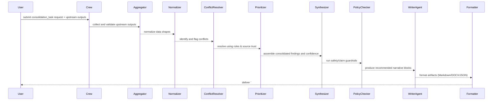

## consolidation_task — Flow, diagram and pseudocode

Summary
- Purpose: Aggregate outputs from upstream tasks (trend analysis, research evidence extraction, lab results, safety and toxicity findings, cultural context), reconcile conflicts, prioritize high-confidence evidence, and produce a consolidated, machine-parseable package plus a polished draft ready for the `writer_agent` and downstream QA/formatter agents.
- Primary outputs: guarded JSON + human-readable consolidated report that includes synthesized findings, source provenance, conflict resolution notes, prioritized evidence list, recommended content for publication, and confidence/quality metrics.

### Inputs
- request context: targets (herb/product), desired output scope (short article, fact sheet, full draft), priority ordering for evidence sources (e.g., prioritize RCTs > systematic reviews > lab reports > case reports > cultural claims), and formatting requirements
- inputs from upstream tasks: `analyze_trends_task` results, `research_evidence_task` output, `laboratory_data_task` output, `find_safety_data_task` output, `find_clinical_toxicity_task` output, and cultural outputs (translated/synthesized)

### Outputs
- a guarded Markdown block starting with `# ===CONSOLIDATION_DATA===` followed by a JSON payload (machine-parseable)
- a human-readable consolidated summary (executive summary, prioritized evidence list, safety flags, cultural notes, recommended editorial angle)
- structured JSON fields: consolidated_findings[], provenance_map{}, conflicts[], prioritized_references[], recommended_sections[], confidence_overall

### High-level steps (summary)
1. Accept and validate inputs from upstream tasks; ensure each input includes provenance and confidence metadata
2. Normalize data shapes (standardize fields like assay names, outcome keys, claim text) to a canonical schema
3. Merge overlapping findings by canonical keys (e.g., endpoints, assays, claims) and group by theme (efficacy, safety, usage, cultural relevance)
4. Detect conflicts (contradictory numeric results, opposing conclusions) and run conflict resolution rules: prefer higher-quality sources, more recent data, or multiple independent corroborations
5. Compute confidence and quality metrics per consolidated item (weighted by source trust and extraction confidence)
6. Build prioritized evidence list for each section and map to citation snippets and provenance entries
7. Generate recommended narrative blocks or section outlines for `writer_agent`, including suggested tone and length
8. Run an LLM-based consistency & policy check (guardrails) to ensure no disallowed claims, unsafe instructions, or unredacted sensitive cultural content
9. Produce final guarded output plus artifacts for writer, formatter, and QA teams

### Sequence diagram (mermaid)



### Pseudocode (step-by-step)

```python
def consolidation_task(request, upstream_outputs):
    # 0. Validate and require provenance
    require_keys(request, ['targets', 'output_scope'])
    for name, out in upstream_outputs.items():
        assert 'provenance' in out and 'confidence' in out, f"{name} missing provenance/confidence"

    # 1. Normalize shapes
    normalized = {}
    for name, out in upstream_outputs.items():
        normalized[name] = normalize_upstream_output(out)

    # 2. Merge / group by canonical keys
    merged = merge_by_keys(normalized)

    # 3. Detect conflicts
    conflicts = detect_conflicts(merged)

    # 4. Resolve conflicts using rules (source_priority, recency, corroboration)
    resolved = []
    for key, items in merged.items():
        if key in conflicts:
            resolved_item = resolve_conflict(items, rules=request.get('conflict_rules'))
        else:
            resolved_item = aggregate_items(items)
        resolved.append(resolved_item)

    # 5. Score confidence and build provenance map
    for r in resolved:
        r['confidence'] = compute_weighted_confidence(r)
    provenance_map = build_provenance_map(resolved)

    # 6. Prioritize evidence for writer
    prioritized = prioritize_evidence(resolved, source_priority=request.get('source_priority'))

    # 7. Generate recommended narrative blocks (short summaries, suggested section headings)
    narratives = []
    for section in generate_sections(prioritized, scope=request['output_scope']):
        narratives.append(WriterAgent.suggest_text(section, guardrails=CONSOLIDATION_GUARDRAILS))

    # 8. Run policy/safety checks
    policy_issues = PolicyChecker.scan(narratives)
    if policy_issues:
        mark_for_manual_review(policy_issues)

    # 9. Build output
    output = {
        'consolidated_findings': resolved,
        'provenance_map': provenance_map,
        'conflicts': conflicts,
        'prioritized_references': prioritized,
        'narratives': narratives,
        'policy_issues': policy_issues,
        'confidence_overall': aggregate_overall_confidence(resolved)
    }

    guarded = '# ===CONSOLIDATION_DATA===\n' + json.dumps(output, ensure_ascii=False, indent=2)

    # 10. Optionally format and upload
    md = Formatter.to_markdown(output)
    if request.get('format_docx'):
        docx = Formatter.to_docx(output)
        if request.get('upload_to_gdrive'):
            output['artifacts'] = {'docx_gdrive': gdrive_upload(docx)}

    return {'guarded_markdown': guarded, 'json': output, 'md': md}
```

## Explanation Field

The table below documents the machine-facing guarded block emitted by `consolidation_task`. Preserve the guarded header token exactly and follow the English-only rule for machine-facing fields — downstream extractors rely on these tokens and field names for deterministic parsing.

| Field | Description (English) | คำอธิบาย (ภาษาไทย) | Example |
|---|---|---|---|
| Guarded header | Exact header token that begins the consolidation block. Do not rename without coordinating code changes. | สตริงหัวข้อที่ใช้เริ่มบล็อก consolidation ห้ามเปลี่ยนโดยไม่ได้ประสานงานกับโค้ด | `# ===CONSOLIDATION_DATA===` |
| consolidated_findings | Array of consolidated items. Each item is an object with canonical_key, summarized_finding (one-line English-only summary), evidence_list (array of evidence ids + confidence), conflict_notes, resolved_value, item_confidence. | รายการผลการสรุปที่รวมกันแต่ละรายการเป็นออบเจกต์ที่มี canonical_key, summarized_finding (สรุปเป็นภาษาอังกฤษ 1 บรรทัด), evidence_list (รายการหลักฐานพร้อมความเชื่อมั่น), conflict_notes, resolved_value, item_confidence | `[{"canonical_key":"glucose_lowering","summarized_finding":"Modest glucose lowering seen in small RCTs","evidence_list":[{"id":"PMID:111","confidence":0.9}],"item_confidence":0.78}]` |
| provenance_map | Map of evidence id → minimal provenance (source id, extractor, timestamp). Required for traceability. | แผนที่ของรหัสหลักฐานไปยังแหล่งที่มาย่อ (รหัสแหล่ง, ตัวสกัด, เวลา) จำเป็นสำหรับการตรวจสอบ | `{ "PMID:111": {"source":"pubmed","extractor":"research-v1","timestamp":"2025-11-19T11:10:00Z"} }` |
| conflicts | Array of detected conflicts with metadata about the rule applied and dropped items. Keep conflict resolution transparent. | รายการข้อขัดแย้งที่พบพร้อมเมตาดาทาเกี่ยวกับกฎที่ใช้และรายการที่ถูกตัดออก การตัดสินใจต้องโปร่งใส | `[{"key":"efficacy","rule":"prefer_RCT","dropped":["case:45"],"notes":"RCT preferred over case reports"}]` |
| prioritized_references | Ordered list of reference ids with reason & score used for writer prioritization. | รายการอ้างอิงที่เรียงลำดับพร้อมเหตุผลและคะแนนที่ใช้สำหรับการจัดลำดับความสำคัญของผู้เขียน | `[{"id":"PMID:111","reason":"RCT","score":0.95}]` |
| recommended_sections | Suggested narrative sections for the writer with short prompts and linked evidence ids. | ส่วนที่แนะนำสำหรับผู้เขียน พร้อม prompt สั้น ๆ และรหัสหลักฐานที่เชื่อมโยง | `[{"section":"Safety","prompt":"Summarize safety signals","evidence_ids":["Dailymed:xyz"]}]` |
| confidence_overall | Aggregate confidence score for the entire consolidation output (0–1). | คะแนนความเชื่อมั่นโดยรวมของผลลัพธ์ consolidation (0–1) | `0.75` |
| usage_note | How consumers should treat this block (e.g., require provenance before asserting as evidence; use for editorial drafts). | วิธีการใช้งานบล็อกนี้โดยระบบผู้บริโภค (เช่น ต้องมีแหล่งก่อนจะอ้างเป็นหลักฐาน; ใช้สำหรับร่างบทความ) | `Use for editorial drafts; require provenance to assert as evidence.` |
| guardrails | Rules: machine-facing fields must be English-only; do not fabricate claims, dates, or citations; include provenance for every evidence item; redact PII and culturally sensitive items; surface low-confidence items for manual review. | ข้อกำชับ: ฟิลด์สำหรับเครื่องต้องเป็นภาษาอังกฤษเท่านั้น ห้ามสร้างข้อเท็จจริง วันที่ หรือการอ้างอิงขึ้นเอง ต้องมีแหล่งข้อมูลสำหรับแต่ละหลักฐาน ปกปิดข้อมูลระบุตัวบุคคล และดึงรายการความเชื่อมั่นต่ำเพื่อให้มนุษย์ตรวจสอบ | `English-only; no fabrication; include provenance; redact sensitive content; flag low-confidence` |

### Minimal guarded snippet example

```text
# ===CONSOLIDATION_DATA===
{
  "consolidated_findings": [
    {
      "canonical_key": "glucose_lowering",
      "summarized_finding": "Modest glucose lowering seen in a small RCT (one-line English summary)",
      "evidence_list": [{"id":"PMID:111","confidence":0.9}],
      "conflict_notes": [],
      "resolved_value": "modest_evidence",
      "item_confidence": 0.78
    }
  ],
  "provenance_map": {"PMID:111": {"source":"pubmed","extractor":"research-v1","timestamp":"2025-11-19T11:10:00Z"}},
  "confidence_overall": 0.75
}
```

Notes:
- Preserve the guarded token `# ===CONSOLIDATION_DATA===` exactly; downstream parsers rely on it.
- Machine-parsable fields must be English-only. Human-readable localized content (Thai) may be included elsewhere in the output artifacts, but not inside these machine fields.
- Every evidence item referenced in `consolidated_findings` must exist in `provenance_map` with source and timestamp.
- For conflicts, include the resolution rule and list of dropped items with reasons to ensure auditability.

| ฟิลด์ข้อมูล<br>(Key Field) | คำอธิบายและข้อกำหนด<br>(Description & Instructions) | ตัวอย่างรูปแบบข้อมูล<br>(Format Example) |
| :--- | :--- | :--- |
| **Start Tag** | **TH:** **ต้อง** เริ่มต้นด้วยแท็กนี้เท่านั้น<br>**EN:** **MUST** start with this tag. | `# ===MASTER_FACT_SHEET===` |
| **Main Title** | **TH:** หัวข้อหลัก ระบุชื่อสมุนไพร<br>**EN:** Main header specifying the Herb Name. | `## Consolidated Facts for:`<br>`<Herb Name>` |
| **Trend Fact** | **TH:** สรุปเทรนด์จากผลลัพธ์ TRENDS_DATA (Finding 1 & 2)<br>**EN:** Full summary text from TRENDS_DATA findings. | `* **Trend Fact:** <Text>` |
| **Lab Facts** | **TH:** ข้อมูลผลแล็บ: วิธีการ, การสกัด, สารที่พบ, ผลเภสัชวิทยา, QC<br>**EN:** Lab details: Methods, Compounds, Pharmacology, QC. | `* **Lab Fact (Experimental Method):** ...`<br>`* **Lab Fact (Compound Identified):** ...` |
| **Science Fact** | **TH:** ชื่อวิทยาศาสตร์และชื่อสารสำคัญ<br>**EN:** Scientific name and key compound name. | `* **Science Fact (Herb):** ...`<br>`* **Science Fact (Compound):** ...` |
| **Science Fact (Abstracts)** | **TH:** **(โครงสร้างซ้อน)** บทคัดย่อดิบ (ห้ามตัด) และการอ้างอิง APA<br>**EN:** **(Nested)** Raw abstract (verbatim) and APA citation. | `* **Science Fact (Abstracts):**`<br>`  * **Study 1:**`<br>`    * **abstract_raw:** ...`<br>`    * **citation_apa:** ...` |
| **Compliance Fact** | **TH:** ข้อมูล อย.: เลขทะเบียน, ขนาดรับประทาน, คำเตือน<br>**EN:** FDA info: Reg numbers, Dosage, Warnings. | `* **Compliance Fact (Food Registration 1):**`<br>`  registration_number=..., status=...` |
| **Safety Fact** | **TH:** ข้อมูลฉลากยา: ส่วนประกอบ, วิธีใช้, คำเตือน, ข้อบ่งใช้<br>**EN:** Drug Label info: Ingredients, Uses, Warnings, Directions. | `* **Safety Fact (Uses):** ...`<br>`* **Safety Fact (Warnings):** ...` |
| **Toxicity Fact** | **TH:** ข้อมูลพิษวิทยา: บทสรุป, กลไก, ผลข้างเคียง, Case Reports<br>**EN:** Toxicity info: Summary, Mechanism, Side effects. | `* **Toxicity Fact (Summary):** ...`<br>`* **Toxicity Fact (Side Effects):** ...` |
| **Culture Fact (Critical Rule)** | **TH:** **ห้ามรวมกลุ่ม** ต้องแยกข้อมูลตามแต่ละ "ชื่อชุมชน" ให้ชัดเจน (ทำซ้ำชุดข้อมูลสำหรับทุกชุมชนที่พบ)<br>**EN:** **DO NOT MERGE.** Generate a set of facts tagged with the specific `<CommunityName>` for EVERY community found. | `* **Culture Fact (Community - <Name>):** ...`<br>`* **Culture Fact (Location - <Name>):** ...`<br>`* **Culture Fact (Local Wisdom - <Name>):** ...` |
| **Internal RAG Fact** | **TH:** สรุปข้อมูลจากฐานข้อมูลภายใน (สมุนไพรและวัฒนธรรม)<br>**EN:** Summaries from internal RAG (Herbal & Cultural). | `* **Internal RAG Fact (Herbal):** ...`<br>`* **Internal RAG Fact (Cultural):** ...` |
| **Source URL** | **TH:** ลิงก์อ้างอิงทั้งหมดที่ใช้ (Trend, Science, Compliance, etc.)<br>**EN:** All canonical URLs used in the process. | `* **Source URL (Trend):** <URL>`<br>`* **Source URL (Science):** <URL>` |

### Guardrails and output schema notes
- Always return a guarded block beginning with `# ===CONSOLIDATION_DATA===` for deterministic downstream parsing.
- Each consolidated item must include: canonical_key, summarized_finding, evidence_list (with provenance and confidence), conflict_notes (if any), resolved_value, and item_confidence.
- Conflict resolution must be transparent: include which rule applied (e.g., 'prefer_RCT', 'more_recent', 'multiple_corroboration') and list dropped items with reasons.
- All recommended narrative blocks must be labeled with their source evidence IDs and confidence scores.

Example minimal JSON:

```json
{
  "consolidated_findings": [{
    "canonical_key":"glucose_lowering",
    "summarized_finding":"Small RCT evidence suggests modest glucose lowering (SMD -0.3)",
    "evidence_list":[{"id":"PMID:111","type":"RCT","confidence":0.9},{"id":"LR-2024-05","type":"lab","confidence":0.6}],
    "conflict_notes":[],
    "resolved_value":"modest_evidence",
    "item_confidence":0.78
  }],
  "confidence_overall":0.75
}
```

### Tools / agents mapping
- Aggregator / Normalizer: utilities in `tools` that standardize upstream schema and canonical keys
- ConflictResolver: rule-based engine (configurable) that applies source priority, recency, and corroboration checks
- Prioritizer: scores and orders evidence for writing and citation
- Synthesizer / WriterAgent: LLM-backed `writer_agent` that creates narrative blocks following guardrails
- PolicyChecker: safety/claim scanner (could reuse `safety_inspector_agent` or `compliance_checker_agent` checks)
- Formatter: `docx_tools`, Markdown/JSON writers, and `gdrive_upload_file_tools`

### Validation checks & QA
- Provenance completeness: every consolidated item must point to at least one evidence item with a resolvable id
- Conflict transparency: any resolved conflict must include dropped items and rule applied
- Confidence thresholds: raise alerts if final confidence for critical safety items < threshold (e.g., 0.6)
- Policy checks: ensure no unsafe instructions, unverified medical claims, or unredacted sensitive cultural content

### Edge cases
- Upstream outputs with incompatible schemas — normalization must fail-fast with detailed error for ingestion
- Highly contradictory evidence (equal-quality opposing RCTs) — flag and surface to human reviewer rather than auto-resolving
- Missing provenance or low-confidence upstream outputs — deprioritize and surface as low-confidence items
- Urgent safety signals (regulatory recall or severe toxicity) — override normal prioritization and escalate immediately

### Testing suggestions
- Unit tests: merging/normalization functions, conflict resolution rules, prioritization scoring
- Integration tests: run consolidation on a synthetic bundle of upstream outputs that include conflicts and missing provenance; assert guarded block present and expected decisions
- End-to-end test: simulate full pipeline (analysis → evidence → lab → safety → consolidation → writer) with mocked agents to validate interfaces and artifacts

This document is a developer reference for implementing `consolidation_task` in `src/herbal_article_creator/crew.py` or for building supporting utilities in `src/herbal_article_creator/tools/`.
