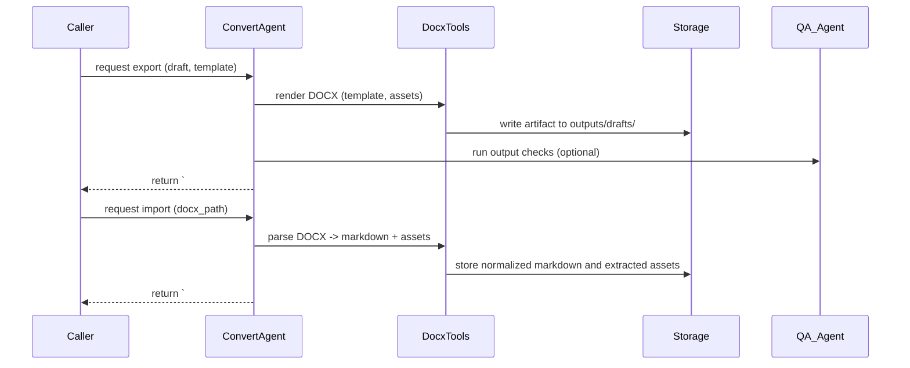

# Convert DOCX Task — Flow and Implementation Notes

Purpose
-------
The Convert DOCX task is responsible for creating, exporting, and validating DOCX artifacts from machine-readable drafts (e.g., guarded article drafts or structured Markdown) and for converting incoming DOCX uploads into normalized internal formats (Markdown/JSON) for downstream tasks. This task ensures DOCX files follow the project's style templates, embed correct metadata, preserve evidence references, and produce artifact paths that other agents and systems can consume.

Contract (small)
-----------------
- Inputs (create/export mode): { draft: guarded_article_object OR markdown_string, template?: template_name, assets?: [image_paths], docx_options?: {styles, language} }
- Inputs (import/normalize mode): { docx_path: string, mode: import|normalize, extract_images: bool }
- Outputs: Guarded markdown block with header `# ===DOCX_ARTIFACT===` followed by JSON metadata that includes artifact_id, path, created_at, source, checks: {file_exists, word_count, images_embedded}, and an export_status (success|partial|failed). For import mode, outputs include normalized markdown or JSON body and extracted assets listed under `assets`.
- Error modes: missing template or malformed DOCX (return `failed` with error reason), missing images (include `missing_assets`), export timeout, or write-permission errors.
- Success criteria: DOCX artifact is produced at expected path, metadata checks pass (file exists, size > 0, required sections present), and embedded evidence references and footnotes are preserved or captured in metadata.

Mermaid sequence diagram
------------------------


Pseudocode (high level)
-----------------------
function export_docx(draft, template, options):
	validate(draft)
	normalized = ensure_markdown(draft)
	rendered = DocxTools.render_from_markdown(normalized, template, options.styles)
	path = Storage.write(rendered.bytes, dest=outputs/drafts/)
	checks = run_checks(path, normalized)
	metadata = { artifact_id: uuid(), path, created_at, source: 'export', checks, export_status }
	emit_guarded_block('# ===DOCX_ARTIFACT===', metadata)

function import_docx(docx_path, options):
	bytes = Storage.read(docx_path)
	parsed = DocxTools.parse_docx(bytes, extract_images=options.extract_images)
	normalized = normalize_structure(parsed)
	assets = store_extracted_assets(parsed.images)
	metadata = { artifact_id: uuid(), source: 'import', original_path: docx_path, created_at, assets, checks }
	emit_guarded_block('# ===DOCX_ARTIFACT===', metadata + {normalized_preview: truncated_markdown})

Tools and code locations
------------------------
- Orchestrator: `src/herbal_article_creator/crew.py` — task binding and agent orchestration.
- Rendering / parsing helpers: `src/herbal_article_creator/tools/docx_tools.py` — functions: render_from_markdown, parse_docx, export_docx, import_docx.
- Storage helpers: `src/herbal_article_creator/tools/gdrive_upload_file_tools.py` and local `outputs/` helpers for writing artifacts.
- QA checks: `src/herbal_article_creator/tools/qa_checks.py` for validating final DOCX (word counts, sections present, link integrity).

Guardrails and formatting rules
------------------------------
- Guarded header: always output `# ===DOCX_ARTIFACT===` exactly on its own line followed by a JSON metadata object.
- Metadata minimal fields:
	- artifact_id (uuid)
	- path (relative artifact path)
	- created_at (ISO8601)
	- source (export|import)
	- export_status (success|partial|failed)
	- checks { file_exists: bool, size_bytes, word_count, images_count }
	- warnings: []

- When exporting, use a project DOCX template (store templates under `src/herbal_article_creator/templates/`) and apply consistent styles (headings, body, references).
- Preserve evidence references: embed doc_ids or inline citations as footnotes in the DOCX and also record them in metadata under `evidence_refs`.

Checks and validation
---------------------
- File existence: confirm the artifact exists at `path` and size > 0.
- Structural checks: confirm required sections (Title, Summary, Key findings, References) exist; if missing, mark `partial` and include `missing_sections` in metadata.
- Evidence refs: verify that all in-line evidence ids included in the markdown are present in the DOCX as footnotes or bracketed tags; add `evidence_mismatch` warnings for any missing.
- Asset embedding: ensure images referenced in the draft are embedded in the DOCX; report `missing_assets` with expected vs. embedded counts.
- Accessibility basics: ensure headings use proper styles (Heading 1/2/3) and images include alt text where provided.

Edge cases and failure modes
---------------------------
- Large images or unsupported media: downscale or convert images and include a warning with `image_transform` details.
- Unsupported markup: if the draft includes advanced markdown features not supported by the renderer (e.g., complex tables), convert best-effort and list `conversion_notes`.
- Template mismatch: if template variables are missing, return `failed` with `template_error` including missing keys.
- Storage write errors: if writing fails due to permission or disk full, return `failed` and include `storage_error` diagnostics.

Testing recommendations
-----------------------
- Unit tests: test `render_from_markdown` with simple markdown and assert the generated DOCX bytes decode into expected paragraphs and styles.
- Round-trip tests: export a draft to DOCX then import the produced DOCX and assert the normalized markdown contains the original key sections (allowing for formatting differences).
- Failure tests: simulate missing assets, template errors, and ensure the task returns `partial`/`failed` statuses with appropriate metadata.

Example guarded output (abbreviated)
-----------------------------------
```
# ===DOCX_ARTIFACT===
{
	"artifact_id": "docx-123e4567-e89b-12d3-a456-426614174000",
	"path": "outputs/drafts/herbX_benefits_20251118.docx",
	"created_at": "2025-11-18T12:00:00Z",
	"source": "export",
	"export_status": "success",
	"checks": {"file_exists": true, "size_bytes": 124832, "word_count": 945, "images_count": 2},
	"warnings": []
}
```

Implementation notes
--------------------
- Idempotency: when exporting, if the same draft and template are provided and `force_refresh=false`, prefer returning the existing artifact (same artifact_id) to avoid duplicates.
- Template management: store templates in a versioned way and include `template_version` in metadata.
- Storage: write artifacts to `outputs/drafts/` and optionally upload to GDrive via `gdrive_upload_file_tools.py`; include both local and remote URIs in metadata.

Where to start
---------------
- Implement or extend `src/herbal_article_creator/tools/docx_tools.py` with render and parse functions.
- Add tests under `tests/test_docx_tools.py` covering export, import, and round-trip scenarios.
- Add a small CLI helper or crew binding to call convert_docx_task with JSON payloads for quick developer testing.

Document created: 2025-11-18

