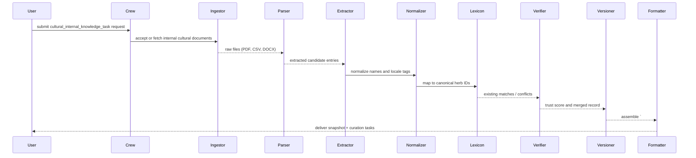

## cultural_internal_knowledge_task — Flow, diagram and pseudocode

Summary
- Purpose: Build, curate, and expose an internally maintained cultural knowledge layer about herbs and traditional practices that complements scientific evidence. This task centralizes vetted cultural entries, maps local terms to canonical herbs, tracks provenance and consent, and provides queryable snapshots for content generation, editorial guidance, and compliance review.
- Primary outputs: guarded JSON + human-readable snapshot containing cultural records, localized names, use-contexts, provenance, trust-scores, editorial notes, and outstanding curation tasks.

### Inputs
- request context: targets (herb names or identifiers), scope (local names, uses, rituals, contraindications, preparation methods), mode (query, refresh, append), and visibility/access controls
- optional: internal cultural documents, curated spreadsheets, prior curation logs, links to vetted ethnobotanical sources, or instructions to sync from an internal folder

### Outputs
- a guarded Markdown block starting with `# ===CULTURE_INTERNAL_KB===` followed by a JSON payload
- a human-readable snapshot summarizing canonical cultural entries for each target, unresolved mappings, provenance summary, and recommended curation actions
- structured JSON fields: cultural_records[], aliases[], provenance[], trust_scores[], curation_tasks[], quality_metrics

### High-level steps (summary)
1. Validate request and enforce access controls (who may read/update cultural KB)
2. If update mode: ingest provided internal cultural documents and pre-process (OCR, CSV/JSON parsing, encoding normalization)
3. Extract candidate cultural entries (local names, uses, preparations, ritual contexts) using rule-based and LLM-assisted extractors
4. Map extracted entries to canonical herb identifiers via lexicon + fuzzy matching; produce alias mappings where mappings are uncertain
5. Attach provenance to each field: source id, excerpt, page/paragraph, language, and extractor version
6. Compute trust and verification scores (cross-source corroboration, vetted-tool matches, curator flags)
7. Merge new entries with existing internal KB, version changes and record curation actions
8. Export a snapshot and generate curation tasks for unresolved or low-confidence mappings

### Sequence diagram (mermaid)



### Pseudocode (step-by-step)

```python
def cultural_internal_knowledge_task(request):
    require_keys(request, ['targets'])
    mode = request.get('mode','query')  # 'query', 'refresh', 'append'
    user = request.get('user')
    if not has_access(user, request.get('visibility')):
        return format_failure({'error': 'access_denied'})

    # Ingest documents if updating
    docs = []
    if mode in ('refresh','append'):
        for src in request.get('sources', []):
            raw = fetch_file_or_url(src)
            docs.extend(parse_document(raw))

    # Extract cultural entries
    entries = []
    for d in docs:
        for seg in segment_text(d['text'], lang=d.get('lang')):
            cand = Extractor.extract_cultural_entries(seg, lang=d.get('lang'))
            for c in cand:
                c.update({'source': d['source'], 'lang': d.get('lang')})
                entries.append(c)

    # Normalize and map
    for e in entries:
        e['locale_tag'] = normalize_locale(e.get('locale'))
        e['herb_id_candidate'], e['mapping_confidence'] = map_to_lexicon(e.get('name'))

    # Attach provenance and compute trust
    for e in entries:
        e['provenance'] = build_provenance(e)
    trust_results = compute_trust_scores(entries)
    for e,tr in zip(entries, trust_results):
        e['trust_score'] = tr

    # Merge with KB and schedule curation
    merged, unresolved = merge_with_internal_kb(entries)
    if unresolved:
        create_curation_tasks(unresolved)

    snapshot = {'cultural_records': merged, 'unresolved': unresolved, 'timestamp': now_iso()}
    guarded = '# ===CULTURE_INTERNAL_KB===\n' + json.dumps(snapshot, ensure_ascii=False, indent=2)

    return {'guarded_markdown': guarded, 'json': snapshot}
```

# Explanation Field

The table below documents the machine-facing guarded summary block used by the cultural internal-knowledge pipeline. Preserve the guarded header token exactly and follow the English-only rule for machine-facing summary fields — downstream agents (synthesis, writers, compliance) rely on these tokens for deterministic extraction.

| Field | Description (English) | คำอธิบาย (ภาษาไทย) | Example |
|---|---|---|---|
| Guarded header | Exact string that begins the cultural internal summary block. Do not change without coordinating code updates. | สตริงหัวข้อบล็อกสำหรับสรุปความรู้ภายในด้านวัฒนธรรม ต้องไม่แก้ไขโดยไม่ได้ประสานกับโค้ด | `# ===CULTURAL_INTERNAL_SUMMARY===` |
| summary_text | A concise one-line canonical summary in English only. Keep it factual and short (one sentence). Do not include Thai in machine fields. | ข้อความสรุปสั้น ๆ เป็นภาษาอังกฤษเท่านั้น จำกัดเป็นประโยคเดียว และต้องเป็นข้อเท็จจริง ห้ามมีภาษาไทยในฟิลด์สำหรับเครื่อง | `Turmeric has been used traditionally in Thai medicine for digestive complaints ($citation_format).` |
| citation_placeholder | Placeholder or citation token indicating where source citations belong (preserve internal citation token format). | ตำแหน่งหรือโทเค็นสำหรับการอ้างอิงแหล่งที่มา (รักษารูปแบบโทเค็นการอ้างอิงภายในไว้) | `$citation_format` or `doc:internal-45` |
| provenance | Minimal provenance for auditability: source id(s), extractor_version, timestamp. Required for downstream trust checks. | ข้อมูลแหล่งที่มาย่อสำหรับการตรวจสอบ ได้แก่ รหัสแหล่งข้อมูล เวอร์ชันของตัวสกัด และเวลาที่สร้าง จำเป็นต้องมีสำหรับการตรวจสอบความน่าเชื่อถือ | `{ "source":"doc:123","extractor":"culture-kb-v1","timestamp":"2025-11-19T11:10:00Z" }` |
| sensitivity_flags | Optional flags such as `restricted`, `sacred`, or `requires_consent`. If present, downstream systems must respect handling instructions. | ป้ายกำกับความอ่อนไหว เช่น restricted, sacred หรือ requires_consent หากมี ระบบถัดไปต้องปฏิบัติตามข้อกำชับ | `[ {"flag":"requires_consent","reason":"sacred_practice","handling":"manual_review"} ]` |
| usage_note | How downstream consumers should treat this block (e.g., enrichment-only; require provenance before asserting as evidence). | คำแนะนำการใช้งานสำหรับระบบถัดไป (เช่น ใช้เพื่อขยายเนื้อหาเท่านั้น หากจะอ้างเป็นหลักฐานต้องมีแหล่งที่มา) | `Use for editorial enrichment; require provenance before asserting as evidence.` |
| guardrails | Rules: machine-facing fields must be English-only; do not fabricate claims, dates, or citations; limit to one-line canonical summaries; redact PII or sacred/restricted content. Coordinate any header renames across repo. | ข้อกำชับ: ฟิลด์สำหรับเครื่องต้องเป็นภาษาอังกฤษเท่านั้น ห้ามสร้างข้อเท็จจริง วันเวลา หรือการอ้างอิงขึ้นเอง จำกัดให้เป็นสรุปหนึ่งบรรทัด ปกปิดข้อมูลระบุตัวบุคคลหรือข้อมูลศักดิ์สิทธิ์ และต้องประสานก่อนเปลี่ยนชื่อหัวข้อ | `English-only; no fabrication; one-line summary; include provenance; redact sensitive content` |

### Minimal guarded snippet example

```text
# ===CULTURAL_INTERNAL_SUMMARY===
Turmeric has been used traditionally in Thai medicine for digestive complaints ($citation_format).
```

Notes:
- Preserve the guarded token `# ===CULTURAL_INTERNAL_SUMMARY===` exactly if you use it in generated output. If code uses a different token, coordinate before renaming.
- Machine-parsable fields must be English-only and strictly typed; human-readable narrative or localized content may appear elsewhere but not inside the machine summary block.

### Guardrails and output schema notes
- Always return a guarded block `# ===CULTURE_INTERNAL_KB===` for deterministic downstream parsing.
- Each cultural record must include: herb_id (canonical), local_name, locale, use_context, preparation, source_excerpt (raw text), source_id, extractor_version, mapping_confidence, trust_score, and timestamp.
- Respect access and sensitivity: cultural KB records may have visibility restrictions; never export restricted entries to public artifacts.

Example minimal JSON:

```json
{
  "cultural_records": [{
    "herb_id":"HX-001",
    "local_name":"Bai Yai",
    "locale":"th-TH",
    "use_context":"postpartum tonic",
    "preparation":"boil leaves, drink as decoction",
    "provenance":{"source":"doc:456","page":4,"paragraph":2},
    "mapping_confidence":0.82,
    "trust_score":0.75
  }],
  "unresolved": [],
  "timestamp":"2025-11-18T00:00:00Z"
}
```

| ส่วนประกอบ<br>(Component) | คำสั่งและข้อกำหนด<br>(Instructions & Requirements) | ตัวอย่างรูปแบบข้อมูล<br>(Format Example) |
| :--- | :--- | :--- |
| **Start Tag** | **TH:** **ต้อง** เริ่มต้นด้วยแท็กนี้เท่านั้น เพื่อระบุจุดเริ่มของข้อมูล<br>**EN:** **MUST** start with this tag to identify the data block start. | `# ===CULTURAL_INTERNAL_SUMMARY===` |
| **Content Language** | **TH:** เนื้อหาต้องเขียนเป็น **ภาษาอังกฤษ 100%** เท่านั้น ห้ามมีภาษาไทยปน<br>**EN:** Content MUST be written in **100% English**. No Thai text allowed. | English Text Block |
| **Citation Rule** | **TH:** ทุกประโยคที่มีข้อมูลอ้างอิง ต้องต่อท้ายด้วยรูปแบบ `$citation_format`<br>**EN:** Every fact-based sentence must end with the `$citation_format`. | `Text text **[Source.pdf, p.1]**.` |
| **Scenario: Data Found** | **TH:** **กรณีพบข้อมูล:** สรุปภูมิปัญญาหรือการใช้งานดั้งเดิม พร้อมใส่การอ้างอิง<br>**EN:** **If data exists:** Summarize wisdom/traditional use with citations. | `Turmeric has been used for healing... **[Ref, p.5]**.` |
| **Scenario: No Data** | **TH:** **กรณีไม่พบข้อมูล:** ให้ใช้ประโยคมาตรฐานที่กำหนดไว้เท่านั้น (ห้ามแต่งเอง)<br>**EN:** **If context is empty:** Use the specific standard fallback sentence. | `No relevant information about {herbs} was found in the provided cultural context.` |

### Tools / agents mapping
- Ingestor / parsers: `tools` for PDF/DOCX/CSV parsing, OCR utilities, and input normalization
- Extractor: LLM-assisted cultural extractor or rule-based extractor in `tools` or a `culture_agent` in `crew.py`
- Lexicon / Normalizer: lexicon service and fuzzy-matching utilities in `tools/utils` and `rag_manager_tools`
- Verifier: cross-source corroboration logic and trust-scoring (RAG lookups to vetted ethnobotanical corpora)
- Versioning & Curation: internal DB with version metadata, curation task queue, and curator-assigned actions
- Formatter: `docx_tools`, Markdown/JSON writers, and optional `gdrive_upload_file_tools`

### Validation checks & QA
- Provenance completeness: ensure every high-trust entry includes explicit provenance
- Mapping confidence: flag entries with mapping_confidence below a threshold (e.g., 0.6)
- Trust thresholds: surface low-trust clusters for curator review
- Access checks: enforce visibility on exports and snapshots

### Edge cases
- One local name mapping to multiple species — do not auto-merge; create curation task
- Historical/archival texts with uncertain dates or authorship — keep provenance, mark confidence lower
- Sensitive cultural material — redact or restrict per policy and require manual approval
- Bulk noisy imports (bad OCR) — apply cleaning heuristics and require manual sampling

### Testing suggestions
- Unit tests: parser/ingestor behavior on sample docs, lexicon mapping accuracy, trust computation
- Integration tests: small internal corpus -> update KB -> run snapshot -> assert `# ===CULTURE_INTERNAL_KB===` and expected fields
- UX test: verify curator task creation and review workflow for unresolved mappings

This document is a developer reference for implementing `cultural_internal_knowledge_task` in `src/herbal_article_creator/crew.py` or building supporting tools in `src/herbal_article_creator/tools/`.
