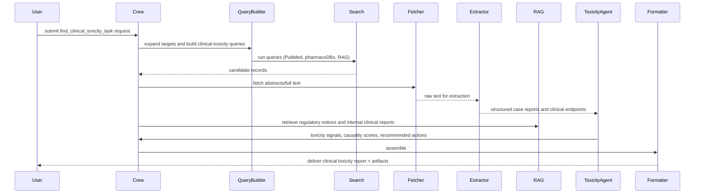

## find_clinical_toxicity_task — Flow, diagram and pseudocode

Summary
- Purpose: Locate and synthesize clinical toxicity evidence related to a target herb, constituent, or product. This task focuses on clinically relevant toxicity endpoints (hepatotoxicity, nephrotoxicity, cardiotoxicity, neurotoxicity, allergic reactions), dose-response relationships, case reports, and population-specific risks to inform safety assessments and clinical advice.
- Primary outputs: guarded JSON + human summary containing identified clinical toxicity records, structured case-report data, severity assessments, dose/context information, confidence scores, and recommended next steps for editorial/clinical review.

### Inputs
- request context: targets (herb, active constituent, product), scope (types of toxicity to prioritize), jurisdictions/time windows, and optional filters (age groups, co-medications, dose ranges)
- optional: PMIDs/DOIs, uploaded clinical case reports, adverse event CSVs, EHR-style extracts, or URLs

### Outputs
- a guarded Markdown block starting with `# ===CLINICAL_TOXICITY===` followed by a JSON payload
- human-readable summary: prioritized toxicity signals, typical presentation, dose/context, vulnerable populations, and citations
- structured JSON fields: toxicity_records[], case_reports[], severity_assessments[], dose_response[], references[], confidence_score

### High-level steps (summary)
1. Validate request, expand synonyms, and normalize the scope
2. Build clinical-toxicity-focused queries and search configured sources (PubMed, pharmacovigilance / adverse event databases, RAG/internal corpora)
3. Rank and deduplicate candidate records; fetch abstracts and full texts where available
4. Extract structured clinical data (case reports, clinical cohorts, reported lab abnormalities, time-to-event, dose/exposure, concomitant medications)
5. Normalize clinical endpoints and map to canonical terms (e.g., MedDRA where possible)
6. Assess causality and severity for each record using standard frameworks (e.g., RUCAM for hepatotoxicity, WHO-UMC causality categories) or LLM-assisted heuristics
7. Aggregate signals: frequency (if available), consistency across sources, plausibility (biological mechanism), and vulnerability (age, pregnancy, comorbidities)
8. Cross-reference with regulatory/advisory sources (RAG, `fda_tools`) and known contraindications
9. Produce guarded output, narrative summary, and artifacts (CSV of case reports, JSON, Markdown, optionally DOCX)

### Sequence diagram (mermaid)



### Pseudocode (step-by-step)

```python
def find_clinical_toxicity_task(request):
    # 0. Validate and expand targets
    require_keys(request, ['targets'])
    targets = expand_synonyms(request['targets'])
    scope = request.get('scope', ['hepatotoxicity','nephrotoxicity','allergic_reactions'])

    # 1. Build clinical toxicity queries
    queries = build_clinical_toxicity_queries(targets, scope)

    # 2. Run searches across providers
    records = []
    for q in queries:
        records.extend(search_pubmed(q))
        records.extend(search_tavily(q))
        # optionally search adverse event databases
    records = deduplicate_records(records)

    # 3. Fetch and pre-process texts
    fetched = fetch_records(records)

    # 4. Extract clinical toxicity data
    toxicity_records = []
    for r in fetched:
        recs = Extractor.extract_clinical_toxicity(r)  # returns case reports, clinical study signals
        toxicity_records.extend(recs)

    # 5. Normalize clinical endpoints and map terms
    for t in toxicity_records:
        t['mapped_endpoints'] = map_to_canonical_terms(t.get('endpoints', []))
        t['dose_normalized'] = normalize_dose(t.get('dose'))

    # 6. Assess causality & severity
    for t in toxicity_records:
        t['causality'] = assess_causality(t, method=request.get('causality_method','rucam'))
        t['severity'] = assess_severity(t)

    # 7. Aggregate signals
    signals = aggregate_toxicity_signals(toxicity_records)

    # 8. Cross-check regulatory/advisory sources
    reg_notes = check_regulatory_notices(targets)
    internal_docs = rag.retrieve(query_for_targets(targets))

    # 9. Build output
    output = {
        'targets': targets,
        'toxicity_records': toxicity_records,
        'signals': signals,
        'regulatory': reg_notes,
        'confidence': estimate_confidence(signals, toxicity_records)
    }

    guarded = '# ===CLINICAL_TOXICITY===\n' + json.dumps(output, ensure_ascii=False, indent=2)

    # 10. Artifacts and optional uploads
    md_summary = Formatter.to_markdown(output)
    csv_cases = Formatter.to_csv(output['toxicity_records'])
    if request.get('upload_to_gdrive'):
        output['artifacts'] = {'csv_cases': gdrive_upload(csv_cases)}

    return {'guarded_markdown': guarded, 'json': output, 'md_summary': md_summary}
```

## Explanation Field

Below is the machine-facing bilingual (English + Thai) Explanation Field for downstream parsers and extraction tooling. Preserve the guarded header token exactly as shown in the "Guarded header" row — downstream extractors rely on that exact string for deterministic parsing.

| Field | Description (English) | คำอธิบาย (ภาษาไทย) | Example |
|---|---|---|---|
| Guarded header | Exact string that starts the machine-parseable block. Do not change without coordinating code updates. | สตริงหัวข้อบล็อกที่ใช้สำหรับการดึงข้อมูลโดยอัตโนมัติ ต้องไม่แก้ไขโดยไม่ประสานกับโค้ด | `# ===TOXICITY_DATA===` (or `# ===CLINICAL_TOXICITY===` depending on implementation) |
| herb_name / targets | Canonical English name(s) of the herb, constituent, or product under review. Use normalized forms. | ชื่อสมุนไพร/สารสำคัญ/ผลิตภัณฑ์เป็นภาษาอังกฤษในรูปแบบมาตรฐาน | `Turmeric` |
| source_browsed | Canonical URL or identifier for the single-best source used for the summary, or `None`. | URL หรือรหัสของแหล่งข้อมูลหลักที่ใช้สรุป หากไม่มีให้ส่ง `None` | `https://pubmed.ncbi.nlm.nih.gov/12345678` |
| toxicity_summary | Short (<=200 words) clinical summary of major toxicity concerns, prioritizing high-quality evidence (systematic reviews, case series, regulatory notices). | สรุปสั้น (ไม่เกิน 200 คำ) เกี่ยวกับปัญหาพิษวิทยาทางคลินิกที่สำคัญ โดยให้ความสำคัญกับหลักฐานคุณภาพสูง | `Summary: Multiple case reports describe hepatotoxicity associated with...` |
| mechanism_of_injury | Brief description of the proposed mechanism of injury if reported (e.g., immune-mediated, mitochondrial toxicity). | คำอธิบายสั้น ๆ ของกลไกการเกิดอันตรายถ้ามีการรายงาน | `Immune-mediated hepatocellular injury` |
| reported_side_effects | List of commonly reported clinical adverse effects (mapped to canonical terms if possible). | รายการผลข้างเคียงที่รายงานบ่อย (แปลงเป็นคำศัพท์มาตรฐานถ้าเป็นไปได้) | `["nausea","rash","elevated_LFTs"]` |
| case_reports | Array of structured case-report summaries. Each item should include id (PMID/DOI/internal), age, sex, dose, time_to_onset_days, outcome, causality_assessment, and provenance. | อาร์เรย์ของสรุปเคสรีพอร์ตที่มีโครงสร้าง แต่ละรายการต้องมี id อายุ เพศ ขนาดยา เวลาเริ่มมีอาการ ผลลัพธ์ การประเมินสาเหตุ และแหล่งข้อมูล | `[ {"id":"PMID:12345","age":45,"sex":"F","dose":"2 g/day","time_to_onset_days":21,"outcome":"recovered","causality_assessment":"probable","provenance":{...}} ]` |
| severity_assessments | Per-record severity labels or scores (e.g., mild/moderate/severe) and any numerical score used. | การประเมินความรุนแรงต่อแต่ละรายการเป็นป้ายหรือคะแนน | `[{"id":"PMID:12345","severity":"severe"}]` |
| dose_response | Structured dose-response observations where available (dose range, relationship to event). Include units and normalized values. | ข้อมูลรูปแบบปริมาณ-ผลที่มีโครงสร้าง (ช่วงขนาดยา ความสัมพันธ์) ระบุหน่วยและค่าที่แปลงแล้ว | `[ {"dose":"2 g/day","normalized_dose_mg_per_kg":28.6} ]` |
| causality_method | The causality assessment method used (e.g., RUCAM, WHO-UMC) and version/parameters. | วิธีการประเมินความเป็นสาเหตุที่ใช้ (เช่น RUCAM, WHO-UMC) และเวอร์ชัน/พารามิเตอร์ | `{"method":"RUCAM","version":"2.0"}` |
| references | Array of canonical citations (PMID/DOI/URL) supporting findings. | รายการอ้างอิงที่ใช้ในการสรุปผล (PMID/DOI/URL) | `["PMID:12345","DOI:10.1000/xyz"]` |
| provenance | Per-item provenance metadata: source (file/URL), extractor_version, extraction_timestamp, OCR/confidence if relevant. Required. | เมตาดาต้าต้นทางสำหรับแต่ละรายการ: แหล่ง/ไฟล์/URL เวอร์ชันตัวสกัด เวลา และคะแนนความมั่นใจ | `{ "source":"article.pdf","extractor":"toxicity-extractor-v1","timestamp":"2025-11-19T10:15:00Z" }` |
| confidence | System-estimated confidence for each signal and for the overall report (0.0–1.0). Document computation method in code. | คะแนนความมั่นใจที่ประมาณโดยระบบสำหรับแต่ละสัญญาณและสำหรับรายงานโดยรวม (0.0–1.0) ระบุวิธีคำนวณในโค้ด | `0.65` |
| guardrails | Parsing & content guardrails: machine fields must be English-only; do not invent PMIDs/DOIs or case counts; include original text excerpts for critical claims; flag polyherbal/confounded reports and lower confidence accordingly. | ข้อกำชับการแยกวิเคราะห์: ฟิลด์สำหรับเครื่องต้องเป็นภาษาอังกฤษเท่านั้น ห้ามสร้าง PMID/DOI หรือจำนวนเคสขึ้นเอง ต้องแนบข้อความต้นฉบับสำหรับข้อกล่าวหาสำคัญ และมาร์กกรณีสูตรผสมหรือมีปัจจัยรบกวน | `English-only; no fabrication; include excerpts & provenance; flag confounding`

### Minimal JSON example (what the guarded block should contain)

```json
{
    "targets": ["Turmeric"],
    "toxicity_records": [
        {
            "id": "PMID:12345",
            "type": "case_report",
            "age": 45,
            "sex": "F",
            "event": "hepatotoxicity",
            "dose": "2 g/day",
            "time_to_onset_days": 21,
            "causality_assessment": "probable",
            "severity": "severe",
            "provenance": {"source":"pubmed:12345","extractor":"toxicity-extractor-v1","timestamp":"2025-11-19T10:15:00Z"}
        }
    ],
    "signals": [ { "endpoint": "hepatotoxicity", "signal_strength": "moderate", "evidence_count": 3 } ],
    "references": ["PMID:12345"],
    "provenance": { "report_generated_by": "toxicity-agent-v1", "timestamp": "2025-11-19T10:20:00Z" },
    "confidence": 0.65
}
```

Notes:
- Preserve the exact guarded header token (e.g., `# ===TOXICITY_DATA===` or the project's canonical `# ===CLINICAL_TOXICITY===`) unless you coordinate a code change — extractors depend on exact tokens.
- Machine-readable fields must be English-only and strictly typed (arrays/objects); human-readable narrative summaries may be localized but are not canonical for downstream parsing.

### Guardrails and output schema notes
- Always deliver a guarded block `# ===CLINICAL_TOXICITY===` so downstream consumers can parse the payload deterministically.
- Each case report or clinical record must include: id (PMID/DOI/internal), short excerpt or table reference, patient demographics (age/sex) if available, time-to-onset, dose/exposure, concomitant medications, outcome, causality assessment, severity, and provenance (fetcher/extractor id and timestamp).
- For hepatotoxicity, consider using RUCAM or documented causality frameworks; include the chosen framework in the output.

Example minimal JSON structure:

```json
{
  "targets": ["Herb X"],
  "toxicity_records": [{"id":"PMID:12345","type":"case_report","age":45,"sex":"F","event":"hepatotoxicity","dose":"2 g/day","time_to_onset_days":21,"causality":"probable","severity":"severe","evidence":["PMID:12345"]}],
  "signals": [{"endpoint":"hepatotoxicity","signal_strength":"moderate","evidence_count":3}],
  "confidence": "moderate"
}
```

### Tools / agents mapping
- Search connectors: `pubmed_tools`, `tavily_tools`, and any adverse-event/pharmacovigilance connectors configured
- Fetcher / extractor: PDF/abstract fetchers, LLM-assisted extractors for case reports and clinical tables
- RAG: `rag_manager_tools` for internal clinical reports and regulatory notices
- ToxicityAgent: `clinical_toxicologist_agent` or `safety_inspector_agent` that applies causality frameworks and clinical judgment
- Formatter: `docx_tools`, CSV makers, `gdrive_upload_file_tools`

### Validation checks & QA
- Evidence link: every toxicity record should link to at least one primary evidence item
- Causality transparency: output the causality method used and all relevant input fields that influenced the score
- Duplicate detection: identify and collapse duplicate case reports or the same case reported across multiple sources
- Sensitivity check: for signals built from few reports, label them as low confidence and recommend manual review

### Edge cases
- Polyherbal formulas where causality to a single herb is uncertain — flag and require manual adjudication
- Passive surveillance signals (spontaneous reports) — present frequency and denominator limitations and mark confidence low
- Missing dose/temporal information — include as incomplete and lower confidence; try to infer dose from context only if robust
- Confounding by co-medications or underlying disease — describe and flag uncertainty

### Testing suggestions
- Unit tests: extractor accuracy for case reports, mapping to canonical endpoints, causality assessor logic
- Integration test: small set of known clinical case reports -> run task -> assert `# ===CLINICAL_TOXICITY===` exists and expected fields are present
- End-to-end test: mock PubMed and PDF fetch -> full pipeline -> validate aggregated signals and artifacts

This document is a developer reference for implementing `find_clinical_toxicity_task` in `src/herbal_article_creator/crew.py` or for designing the `clinical_toxicologist_agent` behavior.
