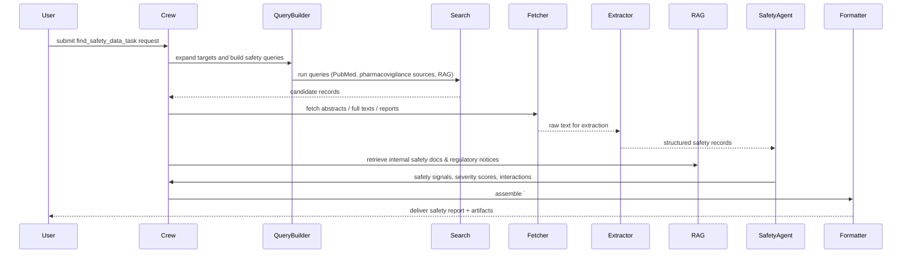

## find_safety_data_task — Flow, diagram and pseudocode

Summary
- Purpose: Programmatically search for and retrieve safety-related information about a target herb, ingredient, or product. The task collates toxicology data, adverse event reports, regulatory safety signals, known contraindications, and interactions so downstream agents can make evidence-based safety assessments.
- Primary outputs: a guarded machine-parseable JSON payload and a human-readable safety summary that includes safety flags, severity levels, provenance, and recommended next steps.

### Inputs
- request context: targets (herb names, active constituents), scope (toxicology, adverse events, interactions, contraindications), jurisdictions/time windows, and optional filters (age groups, doses, routes of exposure)
- optional: user-supplied PMIDs/DOIs, uploaded safety reports, adverse event CSVs, or URLs

### Outputs
- a guarded Markdown block starting with `# ===SAFETY_DATA===` followed by a JSON payload
- human-readable summary describing safety signals, highest-priority risks, recommended warnings/actions, and citations
- structured JSON fields: safety_signals[], toxicology_records[], adverse_events_summary[], interactions[], references[], confidence_score

### High-level steps (summary)
1. Validate request and expand synonyms for the targets
2. Build and run searches across configured safety sources (PubMed, pharmacovigilance databases if available, internal RAG, regulatory safety notices)
3. Fetch and deduplicate results; prioritize high-quality sources (regulatory notices, systematic reviews, case reports)
4. Extract structured safety-relevant data: toxic doses, LD50s (if available), reported adverse events, severity, populations affected, and interactions
5. Normalize terminology and map reported signs/symptoms to canonical terms
6. Assess signal strength and confidence (frequency, plausibility, consistency) using heuristics and LLM-assisted assessment
7. Cross-reference findings with regulatory watchlists and known contraindications via `fda_tools`/`sac_tools` and internal RAG
8. Produce guarded output and supporting artifacts (JSON, Markdown, CSV of extracted events)

### Sequence diagram (mermaid)



### Pseudocode (step-by-step)

```python
def find_safety_data_task(request):
    # 0. Validate
    require_keys(request, ['targets'])
    targets = expand_synonyms(request['targets'])

    # 1. Build safety queries
    queries = build_safety_queries(targets, scope=request.get('scope'))

    # 2. Run searches
    records = []
    for q in queries:
        records.extend(search_pubmed(q))
        records.extend(search_tavily(q))
        # optionally query pharmacovigilance / adverse event DBs

    records = deduplicate_records(records)

    # 3. Fetch abstracts/full text and reports
    fetched = fetch_records(records)

    # 4. Extract safety information
    safety_records = []
    for r in fetched:
        rec = Extractor.extract_safety_info(r)  # returns events, severity, population, dose, route
        safety_records.append(rec)

    # 5. Normalize and map terms
    for s in safety_records:
        s['mapped_terms'] = map_to_canonical_terms(s.get('symptoms', []))

    # 6. Assess signal strength and confidence
    signals = assess_signals(safety_records)

    # 7. Cross-reference regulatory watchlists and RAG
    regulatory_notes = check_regulatory_watchlists(targets)
    internal_docs = rag.retrieve(query_for_targets(targets))

    # 8. Assemble output
    output = {
        'targets': targets,
        'safety_signals': signals,
        'toxicology_records': collect_toxicology(safety_records),
        'adverse_events_summary': summarize_events(safety_records),
        'interactions': infer_interactions(safety_records, internal_docs),
        'regulatory': regulatory_notes,
        'confidence': estimate_confidence(signals)
    }

    guarded = '# ===SAFETY_DATA===\n' + json.dumps(output, ensure_ascii=False, indent=2)

    # 9. Optionally create artifacts / upload
    md_summary = Formatter.to_markdown(output)
    csv_events = Formatter.to_csv(output['adverse_events_summary'])
    if request.get('upload_to_gdrive'):
        output['artifacts'] = {'csv_events': gdrive_upload(csv_events)}

    return {'guarded_markdown': guarded, 'json': output, 'md_summary': md_summary}
```

## Explanation Field

Below is the machine-facing bilingual (English + Thai) Explanation Field for downstream parsers. Preserve the guarded header string exactly as shown in the "Guarded header" row — extractors rely on that token for deterministic parsing.

| Field | Description (English) | คำอธิบาย (ภาษาไทย) | Example |
|---|---|---|---|
| Guarded header | Exact string that starts the machine-parseable block. Must not be changed. | สตริงหัวข้อบล็อกที่ใช้สำหรับการดึงข้อมูลโดยอัตโนมัติ ต้องไม่แก้ไข | `# ===SAFETY_DATA===` |
| herb_name / targets | Canonical English name(s) of the target herb(s) or active constituents. Use normalized forms (Latin/English). | ชื่อสมุนไพร/สารสำคัญเป็นภาษาอังกฤษในรูปแบบมาตรฐาน | `Turmeric` or `["Turmeric","Curcumin"]` |
| source_browsed | The single canonical URL or identifier that was successfully browsed for summary-level extraction, or `None`. | URL หรือรหัสแหล่งข้อมูลที่ถูกเรียกดูสำเร็จสำหรับการสรุป หากไม่มีให้ส่งค่า `None` | `https://pubmed.ncbi.nlm.nih.gov/12345678` |
| safety_signals | Array of detected safety signals. Each item must include signal_id, event (mapped term), severity, evidence (PMIDs/DOIs/URLs), confidence, and provenance (extractor, timestamp). | อาร์เรย์ของสัญญาณความปลอดภัยที่ตรวจพบ แต่ละรายการต้องมี id เหตุการณ์ ระดับความร้ายแรง หลักฐาน คะแนนความมั่นใจ และแหล่งที่มา | `[ {"signal_id":"S1","event":"hepatotoxicity","severity":"high","evidence":["PMID:98765"],"confidence":"moderate","provenance":{...}} ]` |
| toxicology_records | Structured toxicology items (e.g., LD50, NOAEL) with species/context and source citation. Include units and original reported values. | บันทึกข้อมูลพิษวิทยาที่มีโครงสร้าง (เช่น LD50, NOAEL) ระบุชนิดสัตว์ บริบท และการอ้างอิง | `[ {"type":"LD50","value":5000,"unit":"mg/kg","species":"rat","citation":"PMID:..."} ]` |
| adverse_events_summary | Aggregated summary of adverse events (counts, common events, populations affected) with representative citations. | สรุปเหตุการณ์ไม่พึงประสงค์โดยรวม (จำนวน เหตุการณ์ที่พบบ่อย กลุ่มประชากรที่ได้รับผลกระทบ) พร้อมการอ้างอิง | `{ "total_cases":12, "common_events":[{"event":"nausea","count":5}] }` |
| interactions | Array of suspected or documented interactions (drug-drug, herb-drug) including interacting agent, effect, evidence, and confidence. | รายการการปฏิสัมพันธ์ที่สงสัยหรือได้รับการบันทึก รวมตัวกลาง ผลกระทบ หลักฐาน และความมั่นใจ | `[ {"interacts_with":"Warfarin","effect":"increased_bleeding","evidence":["PMID:..."],"confidence":"high"} ]` |
| references | Array of canonical citations used for findings (PMID/DOI/URL). Prefer stable identifiers. | รายการอ้างอิงที่ใช้ในการสรุปผล (PMID/DOI/URL) ควรเป็นรหัสที่เสถียร | `["PMID:123456","DOI:10.1000/xyz"]` |
| provenance | Per-item provenance: source_file/url, extractor_version, extraction_timestamp, and any OCR/confidence metadata. Required for each evidence item. | ข้อมูลแหล่งที่มาของแต่ละรายการ: ไฟล์/URL, เวอร์ชันของตัวสกัด, เวลา และเมตาดาต้าความมั่นใจ (เช่น OCR) | `{ "source":"article.pdf","extractor":"safety-extractor-v1","timestamp":"2025-11-19T10:00:00Z" }` |
| confidence | System-estimated confidence for the report (0.0–1.0) and optionally per-signal confidence. Document calculation method in the agent. | คะแนนความมั่นใจโดยรวม (0.0–1.0) และอาจรวมคะแนนต่อสัญญาณ ระบุวิธีคำนวณในโค้ดของเอเยนต์ | `0.72` |
| guardrails | Parsing & content guardrails: machine fields must be English only; do not invent PMIDs/DOIs or fabricate case counts; include original quoted text for critical excerpts; note language/translation source for non-English evidence. | ข้อกำชับ: ฟิลด์สำหรับเครื่องต้องเป็นภาษาอังกฤษเท่านั้น ห้ามสร้าง PMID/DOI หรือจำนวนเคสขึ้นเอง ต้องแนบข้อความต้นฉบับสำหรับข้อความสำคัญ และระบุแหล่งแปลถ้าเป็นภาษาอื่น | `English-only; no fabrication; include original excerpts and provenance` |

### Minimal JSON example (what the guarded block should contain)

```json
{
    "targets": ["Turmeric"],
    "safety_signals": [
        {
            "signal_id": "S1",
            "event": "hepatotoxicity",
            "severity": "high",
            "evidence": ["PMID:98765"],
            "confidence": "moderate",
            "provenance": { "source": "pubmed:98765", "extractor": "safety-extractor-v1", "timestamp": "2025-11-19T10:00:00Z" }
        }
    ],
    "toxicology_records": [],
    "adverse_events_summary": { "total_cases": 12, "common_events": [{ "event": "nausea", "count": 5 }] },
    "interactions": [],
    "references": ["PMID:98765"],
    "provenance": { "report_generated_by": "safety-agent-v1", "timestamp": "2025-11-19T10:05:00Z" },
    "confidence": 0.72
}
```

Notes:
- Preserve the guarded header `# ===SAFETY_DATA===` exactly if you reuse it in generated output. If other files or code use a different token, coordinate before renaming.
- Machine-readable fields must be English-only and strictly typed (arrays/objects where applicable); human-readable summaries may be localized but are not canonical for parsing.

| ฟิลด์ข้อมูล<br>(Key Field) | คำอธิบาย<br>(Description) | ตัวอย่างรูปแบบข้อมูล<br>(Format Example) |
| :--- | :--- | :--- |
| **Start Tag** | **TH:** **ต้อง** เริ่มต้นด้วยแท็กนี้เท่านั้น เพื่อระบุจุดเริ่มของข้อมูล<br>**EN:** **MUST** start with this tag to identify the data block start. | `# ===SAFETY_DATA===` |
| **Main Title** | **TH:** หัวข้อหลัก ระบุชื่อสมุนไพรภาษาอังกฤษ<br>**EN:** Main header specifying the English Name. | `## International Safety Data for:`<br>`<English Name>` |
| **herb_name** | **TH:** ชื่อสามัญภาษาอังกฤษของสมุนไพร<br>**EN:** Common English name of the herb. | `* **herb_name:** `<br>`<English Name>` |
| **source_browsed** | **TH:** ลิงก์ URL ที่ใช้ค้นหาข้อมูล (ถ้าไม่มีให้ใส่ 'None')<br>**EN:** The single canonical URL browsed (or 'None'). | `* **source_browsed:** `<br>`<URL>` |
| **active_ingredients** | **TH:** (กลุ่มข้อมูล) สารออกฤทธิ์ ระบุชื่อ, ความเข้มข้น, วัตถุประสงค์<br>**EN:** (Group) Active ingredients: Name, Strength, Purpose. | `* **Ingredient 1:**`<br>`  * **name:** Dimethicone`<br>`  * **strength:** 3%` |
| **uses** | **TH:** สรรพคุณ/ข้อบ่งใช้ (คัดลอกข้อความเต็มมาวาง)<br>**EN:** Full text from 'Uses' section. | `* **uses:** `<br>`For external use...` |
| **warnings** | **TH:** คำเตือนและข้อควรระวัง (คัดลอกข้อความเต็มมาวาง)<br>**EN:** Full text from 'Warnings' section. | `* **warnings:** `<br>`Do not use on...` |
| **directions** | **TH:** วิธีใช้/วิธีการรับประทาน (คัดลอกข้อความเต็มมาวาง)<br>**EN:** Full text from 'Directions' section. | `* **directions:** `<br>`Apply daily...` |
| **other_information** | **TH:** ข้อมูลอื่นๆ เช่น การเก็บรักษา (คัดลอกข้อความเต็มมาวาง)<br>**EN:** Full text from 'Other information' section. | `* **other_information:** `<br>`Store in cool place...` |
| **inactive_ingredients** | **TH:** สารไม่ออกฤทธิ์/ส่วนประกอบพื้นฐาน<br>**EN:** Full text from 'Inactive Ingredients' section. | `* **inactive_ingredients:** `<br>`Aqua, Glycerin...` |
| **questions** | **TH:** ช่องทางติดต่อสอบถาม (เบอร์โทร, อีเมล)<br>**EN:** Full text from 'Questions?' section. | `* **questions:** `<br>`Call 1-800...` |

### Guardrails and output schema notes
- Always return a guarded block starting with `# ===SAFETY_DATA===` for deterministic downstream parsing.
- Each safety signal should include: evidence items (PMIDs/DOIs), excerpted text or table reference, severity, population affected, dose/route when available, and extraction provenance.
- Use canonical term mapping for symptoms and outcomes (e.g., MedDRA terms if available) and include original text alongside mapped codes.

Example minimal JSON structure:

```json
{
  "targets": ["Herb X"],
  "safety_signals": [{"signal_id":"S1","event":"hepatotoxicity","severity":"high","evidence":["PMID:98765"],"confidence":"moderate"}],
  "confidence": "moderate"
}
```

### Tools / agents mapping
- Search connectors: `pubmed_tools`, `tavily_tools`, and any pharmacovigilance connectors available
- Extractor: LLM-assisted extractors or rule-based parsers for adverse event tables and case reports
- RAG: `rag_manager_tools` for internal safety docs and historical data
- SafetyAgent: a domain-focused agent (could be `safety_inspector_agent` or `clinical_toxicologist_agent`) that assesses signals and severity
- Formatter: `docx_tools`, CSV writers, and `gdrive_upload_file_tools`

### Validation checks & QA
- Coverage: percent of top N safety-relevant hits successfully extracted; warn if low
- Provenance: every signal must link to at least one evidence item (PMID/DOI or uploaded file) with extractor id and timestamp
- False-positive reduction: require multiple independent evidence items for high-severity signals unless the evidence is regulatory (e.g., safety notice)

### Edge cases
- Single case reports vs. consistent signals — handle single case reports by lowering confidence but surfacing them; raise an alert if case reports show consistent patterns
- Non-English reports — translate and mark translations explicitly
- Reports with inconsistent dose units — normalize units and log conversions
- Confounding exposures (polyherbal formulas) — attempt to disentangle by looking for co-reported ingredients and flag uncertainty

### Testing suggestions
- Unit tests: extractor accuracy on synthetic case-report text, canonical term mapping, signal assessment heuristics
- Integration test: small adverse-events CSV + one PMCID -> run task -> assert `# ===SAFETY_DATA===` exists, safety_signals not empty for known issue

This document is a developer reference for implementing `find_safety_data_task` in `src/herbal_article_creator/crew.py` or for designing `safety_inspector_agent` / `clinical_toxicologist_agent` behavior.
