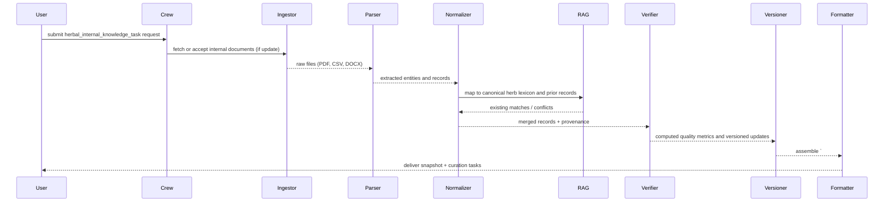

## herbal_internal_knowledge_task — Flow, diagram and pseudocode

Summary
- Purpose: Build, maintain, and query an internally curated knowledge base about herbs, their standardized identifiers, local synonyms, prior lab and clinical findings, editorial notes, and trust signals. This task collects internal documents, normalizes them to canonical herb records, and exposes a machine-parseable snapshot that downstream agents (writers, compliance, safety) can query reliably.
- Primary outputs: guarded JSON + human-readable internal-knowledge snapshot containing canonical herb records, aliases, verified facts, links to prior reports/evidence, editorial notes, and data quality metrics.

### Inputs
- request context: list of herbs or identifiers to update/query, update mode (read-only, refresh, append), scopes (taxonomy, synonyms, lab-records, clinical-notes, editorial-notes)
- optional: uploaded internal documents, CSV/JSON exports, links to existing internal records, or instructions to sync from an external source (e.g., Google Drive folder)

### Outputs
- a guarded Markdown block starting with `# ===INTERNAL_KNOWLEDGE===` followed by a JSON payload
- a human-readable snapshot report summarizing the canonical record for each herb, unresolved mappings, and suggested curation actions
- structured JSON fields: herbs[], aliases[], verified_facts[], evidence_links[], editorial_notes[], quality_metrics

### High-level steps (summary)
1. Validate request and determine mode (query vs. update)
2. If update mode: ingest provided internal documents and run preprocessing (OCR, CSV/JSON parsing)
3. Normalize and map extracted entities to canonical herb identifiers (use lexicon + fuzzy matching rules)
4. Extract key structured fields: scientific name, folk names (per locale), known uses, lab results, clinical signals, regulatory flags, and editorial notes
5. Merge with existing internal records, track provenance and versioning for each field
6. Run verification heuristics (cross-document corroboration, source trust scoring) and compute quality metrics
7. Export snapshot: canonical records, unresolved mappings (requires manual curation), and data-quality reports
8. Provide query endpoints or machine-friendly JSON for downstream agents and schedule follow-up curation tasks if needed

### Sequence diagram (mermaid)



### Pseudocode (step-by-step)

```python
def herbal_internal_knowledge_task(request):
    # 0. Validate request
    require_keys(request, ['targets'])
    mode = request.get('mode','query')  # 'query', 'refresh', 'append'

    # 1. Ingest documents when updating
    docs = []
    if mode in ('refresh','append'):
        for src in request.get('sources', []):
            raw = fetch_file_or_url(src)
            docs.extend(parse_internal_document(raw))

    # 2. Build candidate records from docs or existing DB
    candidate_records = build_candidate_records(docs) if docs else []
    existing = internal_db.get_records(request['targets'])

    # 3. Normalize / map to canonical herb IDs
    for r in candidate_records:
        r['herb_id'] = map_to_herb_lexicon(r.get('name') or r.get('mention'))
        r['aliases'] = find_aliases(r['herb_id'])

    # 4. Merge with existing records and track provenance
    merged_records = []
    for target in request['targets']:
        merged = merge_records(existing.get(target, {}), [c for c in candidate_records if c['herb_id']==target])
        merged['provenance'] = collect_provenance(merged)
        merged_records.append(merged)

    # 5. Run verification heuristics and compute quality metrics
    for m in merged_records:
        m['quality'] = compute_quality_metrics(m)
        m['verification'] = verify_against_rag(m)

    # 6. Create snapshot and unresolved mappings report
    unresolved = find_unresolved_mappings(candidate_records, merged_records)
    snapshot = {'herbs': merged_records, 'unresolved': unresolved, 'timestamp': now_iso()}

    guarded = '# ===INTERNAL_KNOWLEDGE===\n' + json.dumps(snapshot, ensure_ascii=False, indent=2)

    # 7. Optionally schedule curation tasks
    if unresolved:
        schedule_curation_task(unresolved)

    return {'guarded_markdown': guarded, 'json': snapshot}
```

# Explanation Field

The table below documents the machine-facing internal-knowledge summary block emitted by the internal-knowledge task. Downstream agents (translation/synthesis, writers, compliance) may consume this short, canonical English summary to enrich editorial sections. Preserve the guarded header token exactly and follow the English-only rule for machine fields.

| Field | Description (English) | คำอธิบาย (ภาษาไทย) | Example |
|---|---|---|---|
| Guarded header | Exact string that begins the internal-knowledge summary block. Do not change without coordinating code updates. | สตริงหัวข้อบล็อกสำหรับสรุปความรู้ภายใน ต้องไม่แก้ไขโดยไม่ได้ประสานกับโค้ด | `# ===HERBAL_INTERNAL_SUMMARY===` |
| summary_text | A single-line, clean, canonical summary in English only. Keep concise (one sentence) and factual. Avoid Thai text, editorial flourish, or unreferences claims. | ข้อความสรุปสั้น ๆ เป็นภาษาอังกฤษเท่านั้น ควรกระชับเป็นประโยคเดียวและเป็นข้อเท็จจริง ห้ามใส่ภาษาไทยหรือข้อกล่าวหาโดยไม่มีหลักฐาน | `Turmeric is not explicitly mentioned in the context $citation_format. However, the source discusses traditional Thai uses for digestive complaints.` |
| citation_placeholder | Placeholder or explicit citation token that indicates where the upstream citation(s) belong (preserve token format used by internal tools). | ตำแหน่งที่สำหรับใส่การอ้างอิงหรือโทเค็นที่บอกว่าให้ใส่การอ้างอิงไว้ที่ไหน | `$citation_format` or `PMID:12345` |
| provenance | Minimal provenance for the summary: source id(s), extractor_version, and timestamp. Required for auditability. | ข้อมูลแหล่งที่มาต้นทางของสรุป ได้แก่ รหัสแหล่งข้อมูล เวอร์ชันตัวสกัด และเวลาที่สร้าง จำเป็นต้องมีเพื่อการตรวจสอบ | `{ "source": "doc:internal-45", "extractor": "internal-knowledge-v1", "timestamp": "2025-11-19T11:00:00Z" }` |
| usage_note | How downstream consumers should use this block (e.g., enrichment only; do not treat as a primary evidence claim unless supported by referenced provenance). | คำแนะนำการใช้งานสำหรับระบบถัดไป (เช่น ใช้เพื่อขยายเนื้อหาเท่านั้น ห้ามถือเป็นหลักฐานหลักหากไม่มีแหล่งอ้างอิง) | `Use for editorial enrichment; require provenance before asserting as evidence.` |
| guardrails | Rules: machine-facing fields must be English-only; do not invent or expand claims; limit to one-line canonical summaries; never include PII or sacred/restricted content. Coordinate any header renames across repo. | ข้อกำชับ: ฟิลด์สำหรับเครื่องต้องเป็นภาษาอังกฤษเท่านั้น ห้ามสร้างหรือขยายข้อกล่าวหา จำกัดให้เป็นสรุปบรรทัดเดียว ห้ามใส่ข้อมูลระบุตัวบุคคลหรือข้อมูลศักดิ์สิทธิ์ ต้องประสานก่อนเปลี่ยนชื่อหัวข้อ | `English-only; one-line; no fabrication; include provenance; redact sensitive content` |

### Minimal guarded snippet example

```text
# ===HERBAL_INTERNAL_SUMMARY===
Turmeric is not explicitly mentioned in the context $citation_format. However, the context discusses Thai traditional medicine references to digestive uses.
```

| ส่วนประกอบ<br>(Component) | คำสั่งและข้อกำหนด<br>(Instructions & Requirements) | ตัวอย่างรูปแบบข้อมูล<br>(Format Example) |
| :--- | :--- | :--- |
| **Start Tag** | **TH:** **ต้อง** เริ่มต้นด้วยแท็กนี้เท่านั้น เพื่อระบุจุดเริ่มของข้อมูล<br>**EN:** **MUST** start with this tag to identify the data block start. | `# ===HERBAL_INTERNAL_SUMMARY===` |
| **Content Language** | **TH:** เนื้อหาต้องเขียนเป็น **ภาษาอังกฤษ 100%** เท่านั้น ห้ามมีภาษาไทยปน<br>**EN:** Content MUST be written in **100% English**. No Thai text allowed. | English Text Block |
| **Citation Format** | **TH:** ต้องแทรกการอ้างอิงตามรูปแบบตัวแปร `$citation_format` (เช่น ชื่อไฟล์, เลขหน้า)<br>**EN:** MUST insert citations using the specific `$citation_format` (e.g., filename, page). | `Text **[File.pdf, p.5]**.` |
| **Negative Finding** | **TH:** **กรณีไม่พบข้อมูล:** ต้องระบุชัดเจนว่า "ไม่ถูกกล่าวถึง" แต่ให้สรุปบริบทที่เกี่ยวข้องแทน<br>**EN:** **If not found:** Explicitly state "not explicitly mentioned" but summarize relevant context. | `Turmeric is not explicitly mentioned in the context...` |
| **Positive Finding** | **TH:** **กรณีพบข้อมูล:** สรุปสาระสำคัญที่พบอย่างกระชับ<br>**EN:** **If found:** Summarize the key findings concisely. | `Turmeric is described as...` |
| **General Constraint** | **TH:** **กฎข้อบังคับ:** ข้อความต้อง "สะอาด" (Clean) ไม่มี Comment หรือคำอธิบายอื่นนอกเหนือจากเนื้อหา<br>**EN:** **Strict Rule:** Text must be "Clean". No meta-comments or outside text. | N/A (Formatting Rule) |

### Guardrails and output schema notes
- Always return a guarded block `# ===INTERNAL_KNOWLEDGE===` to allow deterministic parsing by downstream agents.
- Each canonical herb record must include: herb_id, scientific_name, localized_names (with locale tags), verified_facts (with provenance), evidence_links (URLs or internal IDs), editorial_notes, version, and quality_metrics.
- Provenance must include source id, parser/extractor version, timestamp, and confidence score for each field.

Example minimal JSON structure:

```json
{
  "herbs": [{
    "herb_id":"HX-001",
    "scientific_name":"Herba examplea",
    "localized_names":[{"name":"Bai Yai","locale":"th-TH"}],
    "verified_facts":[{"fact":"used for digestive complaints","provenance":["doc:123"],"confidence":0.9}],
    "evidence_links":[{"type":"lab_report","id":"LR-2024-05"}],
    "quality_metrics":{"provenance_count":4,"last_updated":"2025-11-18T00:00:00Z"}
  }],
  "unresolved": [],
  "timestamp":"2025-11-18T00:00:00Z"
}
```

### Tools / agents mapping
- Ingestor / parsers: `tools` modules for PDF, DOCX, CSV parsing and OCR utilities
- Normalizer / lexicon: lexicon service or local lookup + fuzzy matching utilities in `tools/utils` and `rag_manager_tools`
- Verifier: cross-document corroboration and trust scoring logic (RAG lookups + source scoring)
- Versioning: internal DB or a simple JSON store with version metadata and change logs
- Formatter: `docx_tools`, Markdown/JSON writers, and `gdrive_upload_file_tools` for artifact export

### Validation checks & QA
- Schema validation: ensure every exported record conforms to canonical schema
- Provenance completeness: warn if any verified_fact lacks provenance
- Quality thresholds: flag records with low provenance_count or low average confidence
- Merge conflicts: surface conflicting values (e.g., two different scientific names) to curation queue

### Edge cases
- Multiple local names mapping to multiple species — mark mapping confidence low and require manual curation
- Conflicting internal reports (old vs. new lab results) — keep history, compute recency-weighted confidence
- Large bulk imports with noisy OCR — attempt heuristic cleaning and schedule manual spot checks
- Sensitive internal notes that should not be exported — respect access controls and redact when necessary

### Testing suggestions
- Unit tests: parser outputs for sample internal documents, lexicon mapping accuracy, merge logic
- Integration tests: simulate a small sync (CSV + PDF) -> update internal DB -> run snapshot -> assert `# ===INTERNAL_KNOWLEDGE===` and expected keys
- Regression tests: run historical import and verify change log/versioning behavior remains stable

---

This document is a developer reference for implementing `herbal_internal_knowledge_task` in `src/herbal_article_creator/crew.py` or for building supporting tools in `src/herbal_article_creator/tools/`.
