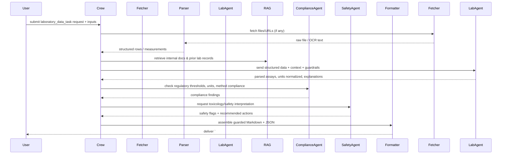

## laboratory_data_task — Flow, diagram and pseudocode

Summary
- Purpose: Ingest, transform, validate, and summarize laboratory data (raw lab reports, CSV/JSON datasets, PDF reports) so results are suitable for scientific citation in herbal articles.
- Primary outputs: machine-parseable Markdown/JSON containing assays, measured values, methods (methodology), data quality (QC), safety summary, and confidence scores.

### Inputs
- request context: list of target herbs or analytes to inspect, scope of assays (e.g., heavy metals, alkaloids, pesticide residues), and metadata (sample_id, collection_date, lab_id)
- optional: uploaded files (CSV/Excel/PDF) or URLs pointing to reports

### Outputs
- a guarded Markdown block beginning with `# ===LAB_DATA===` followed by a JSON payload (machine-parseable)
- a human-readable summary section (method, key results, safety flags)
- a structured JSON object with fields: samples[], assays[], qc[], conclusions[], references[], confidence_score

### High-level steps (summary)
1. Accept input and normalize metadata
2. If files/URLs are provided, fetch and pre-process (OCR for PDFs, CSV/Excel parsing)
3. Extract structured measurements (unit normalization, numeric parsing)
4. Run QC checks (missing values, outliers, unit mismatches, method presence)
5. Cross-check against internal knowledge (RAG) and regulatory thresholds (via compliance tools / fda_tools)
6. Ask an LLM-backed lab interpreter agent to contextualize results and produce a concise summary with citations
7. Run safety checks (safety_inspector_agent / clinical_toxicologist_agent) to flag concerns
8. Produce the final guarded output and formatted artifacts (JSON + Markdown + optionally DOCX)

### Sequence diagram (mermaid)



### Pseudocode (step-by-step)

```python
def laboratory_data_task(request):
    # 0. Contract / validate request
    require_keys(request, ['targets'])

    # 1. Normalize metadata
    metadata = normalize_metadata(request.get('metadata', {}))

    # 2. Fetch / ingest files
    raw_items = []
    for f in request.get('files', []):
        raw = fetch_file(f)  # support http, gdrive, local path
        if is_pdf(raw):
            text = ocr_pdf(raw)
        else:
            text = raw
        raw_items.append(text)

    # 3. Parse into structured measurements
    measurements = []
    for raw in raw_items:
        rows = parse_table_or_report(raw)  # returns dicts with keys: assay, value, unit, method
        rows = normalize_units(rows)
        measurements.extend(rows)

    # 4. QC checks
    qc_report = run_qc_checks(measurements)
    if qc_report['fatal']:
        return format_failure(qc_report)

    # 5. RAG lookup for context (previous lab results, method references)
    context_docs = rag.retrieve(query_for_targets(request['targets']))

    # 6. Lab interpretation using LLM-backed LabAgent
    lab_interpretation = LabAgent.interpret(
        measurements=measurements,
        metadata=metadata,
        context=context_docs,
        guardrails=LAB_GUARDRAILS
    )

    # 7. Compliance checks
    compliance_findings = ComplianceAgent.check(measurements, metadata)

    # 8. Safety/Toxicology screening
    safety_findings = SafetyAgent.assess(measurements, metadata, context_docs)

    # 9. Assemble outputs
    output_json = {
        'samples': group_by_sample(measurements),
        'assays': summarize_assays(measurements),
        'qc': qc_report,
        'lab_interpretation': lab_interpretation,
        'compliance': compliance_findings,
        'safety': safety_findings,
        'confidence': estimate_confidence(lab_interpretation, qc_report, safety_findings),
        'references': collect_references(lab_interpretation, context_docs)
    }

    guarded_md = '## ===LAB_DATA===\n' + json.dumps(output_json, ensure_ascii=False, indent=2)

    # 10. Optionally create DOCX or upload artifacts
    docx_path = Formatter.to_docx(output_json) if request.get('format_docx') else None
    if request.get('upload_to_gdrive') and docx_path:
        gdrive_url = gdrive_upload(docx_path)
        output_json['artifacts'] = {'docx': gdrive_url}

    return {
        'guarded_markdown': guarded_md,
        'json': output_json,
        'docx': docx_path
    }
```

## Explanation Field

Use the table below to document the `# ===LAB_DATA===` guarded output. The table lists each field name (English), a short explanation in Thai, and a small concrete example extracted from the sample internal-lab evidence block.

| Field (English) | Description (English) | คำอธิบาย (ภาษาไทย) | Example |
|---|---|---|---|
| main_sources | Primary internal documents or report filenames (provide page numbers or section hints). Used for provenance and traceability. | เอกสารภายในหลักหรือชื่อไฟล์รายงาน (ระบุเลขหน้า/ส่วน) — ใช้สำหรับการอ้างอิงแหล่งที่มาและการติดตามต้นทาง | `17_TurmericExtraction.pdf (p.5)`  
| linkage_to_target_herb | Short notes explaining how the lab evidence links to the requested herb (sample origin, plant part analysed, extraction method). | หมายเหตุสั้น ๆ อธิบายว่าหลักฐานห้องปฏิบัติการเชื่อมโยงกับสมุนไพรเป้าหมายอย่างไร (ตัวอย่าง: ตัวอย่าง, ส่วนของพืช, วิธีสกัด) | `TLC and GC-MS performed on ethanol extract of turmeric rhizome (เหง้าขมิ้น)`  
| experimental_methods | Concise description of analytical/extraction methods (TLC, GC‑MS, extraction solvent ratios, durations, instrument settings). Include parameters needed for reproducibility. | คำอธิบายสรุปของวิธีที่ใช้ (TLC, GC-MS, โปรโตคอลการสกัด, สารเคมี, อัตราส่วนตัวทำละลาย, ระยะเวลา) รวมพารามิเตอร์ที่จำเป็นสำหรับการทำซ้ำ | `TLC: silica gel F254, solvent hexane:ethyl acetate 7:3`  
| identified_compounds | Named compounds detected or identified in the analysis (prefer canonical chemical names). If tentative, include a confidence label (e.g., tentative/confirmed). | สารประกอบที่ตรวจพบ/ระบุในการวิเคราะห์ (ใช้ชื่อมาตรฐานเมื่อเป็นไปได้) หากเป็นการระบุชั่วคราวให้ระบุระดับความมั่นใจ | `Curcumin (TLC band hRf 41)`  
| chromatography_details | Key chromatographic/readout details supporting identification (Rf values, retention times, library match scores, major peaks). | รายละเอียดสำคัญด้านโครมาโตกราฟี/ผลการอ่านที่สนับสนุนการระบุ (ค่า Rf, เวลาการเกาะติด RT, การจับคู่ฐานข้อมูล, พีคหลัก) | `GC-MS major peak at RT=12.5 min (NIST match)`  
| pharmacological_findings | Reported bioactivity or assay outcomes (zones of inhibition, MIC, enzyme inhibition), with units and context. | ผลการวัดกิจกรรมทางเภสัชวิทยาหรือผลการทดสอบที่รายงานในข้อมูลห้องปฏิบัติการ (เช่น ขนาดเขตยับยั้ง, MIC, การยับยั้งเอนไซม์) ระบุหน่วยหรือขนาดผลกระทบ | `Antibacterial: zone of inhibition 14 mm vs Staph. aureus`  
| quality_control_observations | QC observations: contaminants detected, yields, limits of detection, sample integrity, instrumentation warnings. | ข้อสังเกตเกี่ยวกับการควบคุมคุณภาพ: การพบสารปนเปื้อน, ผลผลิต, ขอบเขตการตรวจพบ, ความสมบูรณ์ของตัวอย่าง, สัญญาณเตือนของเครื่องมือ | `No contaminants detected, ethanol yield: 12.3% w/w`  
| notes | Free-text developer notes and interpretation hints (e.g., suggested follow-ups, caveats about OCR or incomplete metadata). | หมายเหตุอิสระสำหรับนักพัฒนา, คำแนะนำการตีความ, การกระทำถัดไปที่แนะนำ (เช่น ทำซ้ำ, ทดสอบเพิ่มเติม, ระวัง OCR) | `Study suggests turmeric extract has potential for topical antibacterial formulation`  

Guidance / guardrails (short):

- The final `# ===LAB_DATA===` block should be English-first for machine parsing; Thai can be present in `notes` or provenance but the header and machine fields should be English.  
- Do NOT fabricate numerical results; if OCR uncertainty exists, set value to `null` and include `ocr_confidence` and `provenance`.  
- For each identified compound include provenance: source file, page, technique (e.g., GC-MS, TLC) and any matching database/library used.  

Small JSON example (developer-friendly) to illustrate mapping:

```json
{
  "samples": [{
    "sample_id": "S1",
    "source_files": ["17_TurmericExtraction.pdf"],
    "assays": [{
      "name": "Curcumin",
      "method": "TLC",
      "evidence": {"rf": 0.41, "note": "yellow band"}
    }]
  }],
  "qc": {
    "contaminants_found": false, 
    "ethanol_yield_w_w": 12.3
    },
  "pharmacology": [{
    "assay": "antibacterial", 
    "target": "Staph. aureus", 
    "result": "zone_of_inhibition_mm", 
    "value": 14
    }]
}
```

Use this table and example as the canonical Explanation Field for the lab-task guarded output. Keep entries factual, include provenance for every numeric/identification claim, and prefer canonical names and units.

| ฟิลด์ข้อมูล (Key Field) | คำอธิบาย (Description) | ตัวอย่างรูปแบบข้อมูล (Data Format Example) |
| :--- | :--- | :--- |
| **Header** | **TH:** แท็กเริ่มต้นและหัวข้อหลัก ต้องระบุชื่อไทยและอังกฤษของสมุนไพร<br>**EN:** Start tag and main header identifying the herb (Thai/Eng). | `# ===LAB_DATA===`<br>`## Internal Lab Evidence for: ...` |
| **main_sources** | **TH:** รายชื่อไฟล์เอกสารอ้างอิงและเลขหน้าที่มีข้อมูลนี้อยู่<br>**EN:** List of source files (PDFs) and page numbers containing this data. | `* <Filename.pdf (p.5)>` |
| **linkage_to_target_herb** | **TH:** ข้อความยืนยันว่าข้อมูลนี้เป็นของสมุนไพรเป้าหมายจริง (ระบุส่วนที่ใช้ เช่น เหง้า)<br>**EN:** Confirmation linking data to the specific herb (specifying plant part). | `* <TLC ... on ethanol extract of turmeric rhizome>` |
| **experimental_methods** | **TH:** วิธีการทดลอง เช่น เทคนิคการสกัด, สารละลายที่ใช้, วิธีทดสอบ<br>**EN:** Experimental methods used (e.g., Extraction type, Solvents, Techniques). | `* <TLC: silica gel...>`<br>`* <Extraction: 95% ethanol...>` |
| **identified_compounds** | **TH:** สารประกอบสำคัญทางเคมีที่ตรวจพบในตัวอย่าง<br>**EN:** Key chemical compounds identified in the sample. | `* <Curcumin>`<br>`* <Turmerone>` |
| **chromatography_details** | **TH:** รายละเอียดผลการวิเคราะห์ (ค่า Rf, จุด Peak, ผลจากเครื่องมือ)<br>**EN:** Analytical details (Rf values, Peaks, Instrument readings). | `* <TLC: 3 bands, Rf 0.41...>`<br>`* <GC-MS: Peaks identified...>` |
| **pharmacological_findings** | **TH:** ผลการทดสอบฤทธิ์ทางเภสัชวิทยา (เช่น การต้านเชื้อ, ขนาดวงใส)<br>**EN:** Pharmacological activity results (e.g., Antibacterial, Inhibition zone). | `* <Antibacterial activity against...>` |
| **quality_control_observations** | **TH:** ข้อมูลด้านคุณภาพ ความบริสุทธิ์ หรือร้อยละผลผลิต (% Yield)<br>**EN:** Quality control data, purity, or extraction yield (% w/w). | `* <No contaminants detected...>` |
| **notes** | **TH:** บันทึกเพิ่มเติม, ข้อสรุปสั้นๆ หรือแนวโน้มการนำไปพัฒนาต่อ<br>**EN:** Additional notes, brief summary, or potential for development. | `* <Study suggests...>` |

### Tools / agents mapping
- FileFetcher / Parser: `tools` modules (PDF parsers, OCR, CSV/Excel parsers)
- LabInterpreter: a specialized agent (may be created in `crew.py` as `laboratory_agent` or similar) — LLM prompt must include method-awareness and citation requirements
- RAG: `rag_manager_tools` or Pinecone/Chroma lookup for internal lab records
- Compliance: `fda_tools` / `sac_tools` or a `compliance_checker_agent`
- Safety: `safety_inspector_agent` / `clinical_toxicologist_agent`
- Formatter: `docx_tools` / `gdrive_upload_file_tools`

### Validation checks & QA
- sanity: numeric parse succeeded for >90% of rows, else warn
- units: if >1% of rows required unit conversion, log conversions for audit
- methods: if method missing for a critical assay, flag for manual review
- outliers: highlight values >3σ or beyond plausible physiological bounds

### Edge cases
- multi-sheet Excel with inconsistent headers — attempt header mapping, else require manual schema mapping
- PDFs with tables as images — OCR errors can corrupt numbers; use heuristics to detect improbable numeric tokens
- mixed units in same assay — normalise and log conversions
- missing sample IDs — try to infer from filename, but require explicit sample_id for final acceptance

### Testing suggestions
- unit tests for: CSV->measurements parser, unit normalizer, QC checker, LabAgent prompt-output contract (schema assertions)
- integration test: small sample CSV -> run task -> assert `# ===LAB_DATA===` exists and JSON schema valid
