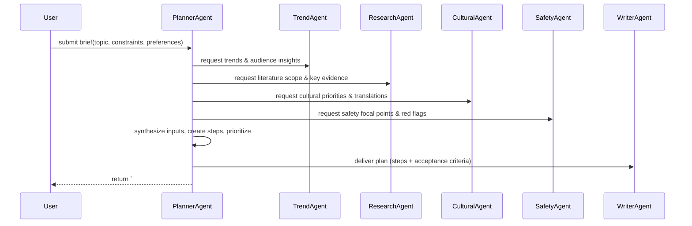

# Planner Task — Flow and Implementation Notes

Purpose
-------
The Planner task (invoked by a Planner agent) receives a high-level brief (topic, objectives, audience, constraints) and produces a machine-readable execution plan that orchestrates specialist agents (trend, research, cultural, safety, writer, etc.). The plan breaks the work into ordered steps, assigns responsible agents/tools, lists inputs and acceptance criteria, and attaches provenance so downstream agents can execute reliably.

Contract (small)
-----------------
- Inputs: { topic: string, brief: string, audience?: string, tone?: string, constraints?: { word_limit, forbidden_content, deadline }, preferences?: {...} }
- Outputs: Guarded markdown block with header `# ===PLANNER_PLAN===` followed by a single JSON object with fields: plan_id, topic, created_at, version, steps[], metadata, provenance, warnings[].
- Error modes: missing/invalid input (returns warnings + partial plan), downstream agent failures (marks affected steps with status "blocked" and provides fallback guidance), safety/cultural conflicts (includes flagged=true + rationale).
- Success criteria: All required execution steps have an assigned agent and either an evidence reference or a confidence score; plan is schema-valid and includes provenance for each evidence-linked step.

Mermaid sequence diagram
------------------------


Pseudocode (high level)
-----------------------
1. validate(brief)
2. normalize_constraints(brief.constraints)
3. fetch_trends = call_agent('analyze_trends_task', brief)
4. fetch_evidence = call_agent('research_evidence_task', brief)
5. fetch_cultural = call_agent('translation_and_synthesis_culture_task', brief)
6. fetch_safety = call_agent('find_safety_data_task', brief)
7. synth = synthesize({fetch_trends, fetch_evidence, fetch_cultural, fetch_safety})
8. steps = create_steps_from_synthesis(synth)
9. for each step in steps: assign_agent(step) ; estimate_time(step)
10. prioritize_steps(steps, constraints)
11. validate_plan_schema(plan)
12. attach_provenance(plan, {agents_responses})
13. output_guarded_block('# ===PLANNER_PLAN===', plan)

### Explanation Field

The table below documents the machine-facing guarded plan block emitted by the Planner. Preserve the guarded header token exactly and ensure machine-facing fields are English-only — downstream executors depend on these tokens and field names for deterministic parsing and execution.

| Field | Description (English) | คำอธิบาย (ภาษาไทย) | Example |
|---|---|---|---|
| Guarded header | Exact header token that begins the planner plan block. Do not rename without coordinating code changes. | สตริงหัวข้อที่ใช้เริ่มบล็อกแผนของ Planner ห้ามเปลี่ยนโดยไม่ได้ประสานงานกับโค้ด | `# ===PLANNER_PLAN===` |
| plan_id | Unique plan identifier (UUID or stable id). Used for tracing and idempotency. | รหัสแผนแบบไม่ซ้ำ (UUID หรือ id คงที่) ใช้สำหรับการติดตามและความไม่ซ้ำ | `plan-123e4567-e89b-12d3-a456-426614174000` |
| topic | Short topic string (English). The primary subject of the plan. | หัวข้อสั้น ๆ เป็นภาษาอังกฤษ หัวข้อหลักของแผน | `Benefits and risks of HerbX for digestion` |
| created_at | ISO8601 timestamp when the plan was generated. | เวลาที่สร้างแผนเป็น ISO8601 | `2025-11-18T10:00:00Z` |
| version | Plan schema or revision version (semantic or integer). | เวอร์ชันของสคีมาหรือการแก้ไขของแผน | `1` |
| steps | Ordered array of step objects. Each step must include id, title (one-line English), description (English), assigned_agent, inputs, outputs_expected, acceptance_criteria, priority, est_minutes, dependencies, evidence_refs, confidence_score, and optional flagged/blocked fields. | อาเรย์ของขั้นตอนที่มีลำดับ แต่ละขั้นตอนต้องมี id, title (ภาษาอังกฤษ 1 บรรทัด), description (ภาษาอังกฤษ), assigned_agent, inputs, outputs_expected, acceptance_criteria, priority, est_minutes, dependencies, evidence_refs, confidence_score และฟิลด์ flagged/blocked แบบไม่จำเป็น | `[{"id":"s1","title":"Gather trends","assigned_agent":"TrendAgent","est_minutes":10}]` |
| metadata | Supplemental metadata: audience, tone, constraints (word_limit, deadline, forbidden_content), preferences. | เมตาดาทาเสริม: กลุ่มเป้าหมาย โทน ข้อจำกัด (จำนวนคำ, เวลาส่ง, ห้ามบางอย่าง), ความชอบ | `{ "audience":"general","tone":"informative","constraints":{"word_limit":1200}}` |
| provenance | Array of provenance entries for agent responses used to assemble the plan (agent, ts, refs). Required for traceability. | รายการแหล่งที่มาย่อของการตอบของตัวแทนที่ใช้ประกอบแผน (agent, เวลา, อ้างอิง) จำเป็นสำหรับการตรวจสอบ | `[{"agent":"TrendAgent","ts":"2025-11-18T09:58:00Z","refs":[]}]` |
| warnings | List of warnings generated during planning (missing inputs, low-confidence evidence, blocked steps). | รายการคำเตือนที่เกิดขึ้นในระหว่างการวางแผน (ข้อมูลขาด พยานหลักฐานความเชื่อมั่นต่ำ ขั้นตอนถูกบล็อก) | `[{"code":"missing_evidence","message":"No RCTs found for primary outcome"}]` |
| usage_note | How executor agents should treat this plan (e.g., require provenance before executing evidence-linked steps, treat flagged steps as manual-review). | วิธีการที่ระบบผู้ดำเนินการควรปฏิบัติตามแผน (เช่น ต้องมีแหล่งก่อนดำเนินการกับขั้นตอนที่เชื่อมโยงหลักฐาน, ถือว่าขั้นตอนที่ flagged ต้องตรวจสอบโดยมนุษย์) | `Require provenance for evidence-linked steps; flagged steps require manual review.` |
| guardrails | Rules: machine-facing fields must be English-only; no fabricated citations or claims; include provenance for every evidence_ref; mark flagged steps for human review; respect constraints (forbidden_content/deadlines). | ข้อกำชับ: ฟิลด์สำหรับเครื่องต้องเป็นภาษาอังกฤษเท่านั้น ห้ามสร้างการอ้างอิงหรือข้อเรียกร้องขึ้นเอง ต้องมีแหล่งสำหรับแต่ละ evidence_ref ติดป้ายขั้นตอนที่ flagged เพื่อให้มนุษย์ตรวจสอบ และเคารพข้อจำกัด (เนื้อหาต้องห้าม/เดดไลน์) | `English-only; no fabrication; include provenance; flag low-confidence or sensitive steps` |

### Minimal guarded snippet example

```text
# ===PLANNER_PLAN===
{
  "plan_id": "plan-123e4567-e89b-12d3-a456-426614174000",
  "topic": "Benefits and risks of HerbX for digestion",
  "created_at": "2025-11-18T10:00:00Z",
  "version": 1,
  "metadata": {"audience":"general","tone":"informative","constraints":{"word_limit":1200}},
  "steps": [
    {
      "id": "s1",
      "title": "Gather trends and audience insights",
      "description": "Collect search trends and assemble top user questions",
      "assigned_agent": "TrendAgent",
      "inputs": {"topic":"HerbX"},
      "outputs_expected": ["trends_summary","top_queries"],
      "acceptance_criteria": "trends_summary contains >=3 data points",
      "priority": "high",
      "est_minutes": 10,
      "dependencies": [],
      "evidence_refs": [],
      "confidence_score": 0.85
    }
  ],
  "provenance": [{"agent":"TrendAgent","ts":"2025-11-18T09:58:00Z","refs":[]}],
  "warnings": []
}
```

Notes:
- Preserve the guarded token `# ===PLANNER_PLAN===` exactly; downstream executors rely on it.
- Machine-parsable fields must be English-only. Localized human-readable instructions (Thai) may appear elsewhere but not inside these machine fields.
- Validate the plan JSON with a schema (pydantic/jsonschema) before emitting.
- If steps reference evidence, that evidence must be present in `provenance` with agent and timestamp.

| ฟิลด์ข้อมูล<br>(Key Field) | คำอธิบายและข้อกำหนด<br>(Description & Requirements) | ตัวอย่างรูปแบบข้อมูล<br>(Format Example) |
| :--- | :--- | :--- |
| **Start Tag** | **TH:** **ต้อง** เริ่มต้นด้วยแท็กนี้เท่านั้น เพื่อระบุจุดเริ่มของข้อมูล<br>**EN:** **MUST** start with this tag to identify the data block start. | `# ===STRATEGIC_PLAN===` |
| **Main Title** | **TH:** หัวข้อหลักสำหรับแผนกลยุทธ์<br>**EN:** Main header for the strategic plan. | `## Strategic Plan for New Product Development...` |
| **Market Opportunity** | **TH:** วิเคราะห์โอกาสทางการตลาด โดยอิงจาก `Trend Facts` เท่านั้น (เช่น การเติบโต, กระแสความนิยม)<br>**EN:** Analyze trends based *only* on `Trend Facts` (e.g., sales growth, specific trends). | `* **Market Opportunity:**`<br>`<Analysis Text>` |
| **Technical Feasibility** | **TH:** วิเคราะห์ความเป็นไปได้ทางเทคนิค อิงจาก `Lab Facts` (เช่น สารประกอบ, วิธีสกัดที่ทำได้จริง)<br>**EN:** Analyze technical viability based on `Lab Facts` (e.g., compounds, extraction). | `* **Technical Feasibility:**`<br>`<Analysis Text>` |
| **Critical Constraints** | **TH:** วิเคราะห์ข้อจำกัดด้านความปลอดภัย/กฎหมาย อิงจาก `Safety/Toxicity Facts` (เช่น พิษต่อตับ, ปริมาณที่จำกัด)<br>**EN:** Analyze constraints based on `Safety/Toxicity Facts` (e.g., liver warnings, dosage). | `* **Critical Constraints (Safety/Toxicity):**`<br>`<Analysis Text>` |
| **Strategic Recommendation** | **TH:** บทสรุปข้อเสนอแนะเชิงกลยุทธ์ (ฟันธงว่าจะทำอย่างไรต่อ)<br>**EN:** A concluding strategic recommendation/point. | `* **Strategic Recommendation:**`<br>`<Conclusion Text>` |
| **Constraint Rule** | **TH:** **กฎเหล็ก:** ห้ามนำข้อมูลภายนอกมาเขียน ต้องใช้ข้อมูลจาก Fact Sheet เท่านั้น<br>**EN:** **Strict Rule:** Base analysis *only* on the provided Fact Sheet. | N/A (Logic Rule) |

Tools and code locations
------------------------
- Orchestrator: `src/herbal_article_creator/crew.py` — factory/runner for Planner agent.
- Planner logic: implement in `src/herbal_article_creator/tools/planner_tools.py` or as `PlannerAgent` class under `src/herbal_article_creator/agents/` (project convention).
- Calls to other tasks: use existing task entrypoints (e.g., `analyze_trends_task`, `research_evidence_task`, `translation_and_synthesis_culture_task`, `find_safety_data_task`) via the Crew runner or direct tool wrappers in `src/herbal_article_creator/tools/`.
- Caching / RAG: consult `src/herbal_article_creator/tools/common_rag.py` or `pinecone_tools.py` for evidence retrieval and storing plan-level context.

Guardrails and formatting rules
------------------------------
- The Planner must always emit the guarded header exactly: `# ===PLANNER_PLAN===` on its own line followed by a single JSON object block.
- The JSON must be schema-valid. Minimal required fields for the plan object:
  - plan_id (uuid)
  - topic (string)
  - created_at (ISO8601)
  - version (semantic or integer)
  - steps (array of step objects)
  - metadata {audience, tone, constraints}
  - provenance (array)
  - warnings (array)

- Each step object: { id, title, description, assigned_agent, inputs, outputs_expected, acceptance_criteria, priority (high|medium|low), est_minutes, dependencies: [step_ids], evidence_refs: [uri_or_doc_id], confidence_score (0-1) }

- Provenance entries must reference the agent that contributed the evidence, timestamp, and any document IDs or anchor text used for the decision.

Checks and validation
---------------------
- Schema validation: run a JSON schema validator (pydantic or jsonschema) before emitting the guarded block.
- Provenance completeness: for any step with evidence_refs empty but acceptance_criteria requiring evidence, add a warning and set confidence_score low.
- Safety & culture checks: if `find_safety_data_task` or `cultural` responses indicate red flags, mark concerned steps with `flagged: true` and include `flag_reason` and recommended mitigation steps.
- Non-hallucination check: any factual claims in step descriptions referencing studies must include an `evidence_refs` entry; otherwise the planner must label them as "strategic suggestion" not fact.

Edge cases and failure modes
---------------------------
- Missing input: return minimal plan with `warnings` stating which inputs were missing and explicit next steps for the user to supply missing data.
- Partial downstream failures: mark affected steps as `blocked` and provide fallback options (e.g., use broader evidence pool or mark as optional).
- Conflicting constraints: include a `conflicts` array in metadata describing the conflict and propose prioritized resolution options.
- Large or long plans: include `pagination` or `phases` so consumer agents can request next phase only.

Testing recommendations
-----------------------
- Unit tests: validate JSON schema, guard header presence, and small synthesis function outputs.
- Integration tests: mock the Trend/Research/Cultural/Safety agents to return deterministic responses and assert the Planner produces expected step assignments and priorities.
- Acceptance tests: run an end-to-end scenario (topic -> planner -> writer) and assert the writer receives a plan with required fields.

Example guarded output (abbreviated)
-----------------------------------
```
# ===PLANNER_PLAN===
{
  "plan_id": "plan-123e4567-e89b-12d3-a456-426614174000",
  "topic": "Benefits and risks of HerbX for digestion",
  "created_at": "2025-11-18T10:00:00Z",
  "version": 1,
  "metadata": {"audience":"general","tone":"informative","constraints":{"word_limit":1200}},
  "steps": [
    {
      "id": "s1",
      "title": "Gather trends and search queries",
      "description": "Collect search trends and assemble top user questions",
      "assigned_agent": "TrendAgent",
      "inputs": {"topic":"HerbX"},
      "outputs_expected": ["trends_summary","top_queries"],
      "acceptance_criteria": "trends_summary contains >=3 data points",
      "priority": "high",
      "est_minutes": 10,
      "dependencies": [],
      "evidence_refs": [],
      "confidence_score": 0.85
    }
  ],
  "provenance": [{"agent":"TrendAgent","ts":"2025-11-18T09:58:00Z","refs":[]}],
  "warnings": []
}
```

Implementation notes
--------------------
- Keep Planner idempotent: repeated calls with same brief + seed should return the same plan_id and plan body unless `force_refresh=true`.
- Persist plans (optional): store plans in a lightweight JSON store (local outputs/ or RAG index) keyed by plan_id for traceability and replay.
- Make the Planner tolerant: when downstream agents are slow, use timeouts and return a draft plan with `status: partial` and `blocked_steps` list.

Where to start
---------------
- Create `src/herbal_article_creator/tools/planner_tools.py` with functions: validate_brief, call_subtasks, synthesize_plan, validate_plan_schema, emit_guarded_plan.
- Add unit tests under `tests/` that assert the guarded header and minimal schema fields.

Reference
---------
- See `project-documents/*_task.md` for how other tasks format guarded outputs and provenance (use the same `# ===...===` header pattern).

---

This document is a developer reference for implementing Planner logic in `src/herbal_article_creator/tools/planner_tools.py` or as a `PlannerAgent` class in `src/herbal_article_creator/agents/`.
