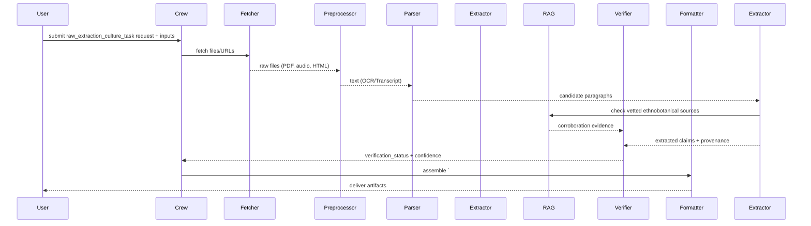

## raw_extraction_culture_task — Flow, diagram and pseudocode

Summary
- Purpose: Ingest and extract raw cultural and ethnobotanical knowledge from heterogeneous local sources (oral transcripts, field notes, community documents, local-language web pages, ethnographies) to create a structured cultural-context dataset that supports culturally-aware content (articles, fact sheets, safety notes).
- Primary outputs: guarded JSON + human-readable summary containing extracted claims, cultural context notes, usage practices, preparation methods, geographic and demographic provenance, and confidence/verification status.

### Inputs
- request context: target herb(s) or traditional use terms, geographic or cultural scope, permitted languages, sensitivity constraints (e.g., Indigenous Knowledge handling), and extraction scope (e.g., uses, preparations, contraindications)
- optional: uploaded transcripts, fieldnotes, scanned pages, URLs to local websites, audio files (transcripts), or pointers to internal RAG corpora

### Outputs
- a guarded Markdown block starting with `# ===CULTURE_DATA===` followed by a JSON payload
- human-readable summary sections for editors (key practices, culturally-sensitive notes, citations and provenance)
- structured JSON fields: claims[], methods[], sources[], locations[], demographics[], verification_status[], confidence_score

### High-level steps (summary)
1. Validate request and apply sensitivity / consent rules (if Indigenous Knowledge or restricted sources are in scope)
2. Fetch specified files/URLs and run pre-processing (OCR for scans, speech-to-text for audio, character-set and encoding normalization)
3. Parse text into candidate claims/paragraphs and perform language detection and segmentation
4. Use rule-based and LLM-assisted extraction to identify claims about uses, preparations, dosages, contraindications, and cultural practices
5. Map extracted mentions to canonical herb identifiers (normalize synonyms, match to internal herb lexicon)
6. Attach provenance: exact text excerpt, source URL/file, page/paragraph index, language, and extractor version
7. Apply verification heuristics (cross-source corroboration, presence in vetted ethnobotanical sources via RAG) and assign verification_status and confidence
8. Redact or flag sensitive content per sensitivity policy and mark items that require community consent or manual review
9. Produce guarded output and formatted artifacts (JSON, Markdown, optionally CSV or DOCX)

### Sequence diagram (mermaid)



### Pseudocode (step-by-step)

```python
def raw_extraction_culture_task(request):
    # 0. Validate request and sensitivity rules
    require_keys(request, ['targets'])
    if contains_indigenous_scope(request) and not has_consent(request):
        return format_failure({'error':'consent_required'})

    # 1. Fetch and preprocess
    raw_texts = []
    for src in request.get('sources', []):
        raw = fetch_file_or_url(src)
        if is_pdf(raw) or is_image(raw):
            text = ocr_pdf(raw)
        elif is_audio(raw):
            text = speech_to_text(raw)
        else:
            text = raw.decode('utf-8') if isinstance(raw, bytes) else raw
        raw_texts.append({'source':src,'text':text})

    # 2. Parse and segment
    segments = []
    for doc in raw_texts:
        lang = detect_language(doc['text'])
        paragraphs = segment_paragraphs(doc['text'], lang=lang)
        for i,p in enumerate(paragraphs):
            segments.append({'source':doc['source'],'lang':lang,'index':i,'text':p})

    # 3. Extract candidate cultural claims
    claims = []
    for seg in segments:
        extracted = CultureExtractor.extract(seg['text'], lang=seg['lang'], guardrails=CULTURE_GUARDRAILS)
        for e in extracted:
            e.update({'source':seg['source'],'index':seg['index'],'lang':seg['lang']})
            claims.append(e)

    # 4. Normalize and map to canonical herbs
    for c in claims:
        c['herb_id'] = map_to_lexicon(c.get('herb_mention'))
        c['normalized_claim'] = normalize_claim_text(c['text'])

    # 5. Attach provenance and run verification
    for c in claims:
        c['provenance'] = build_provenance(c)
    verification = verify_claims_against_rag([c['normalized_claim'] for c in claims])
    for c,ver in zip(claims,verification):
        c['verification_status'] = ver.get('status')
        c['confidence'] = ver.get('confidence')

    # 6. Redact/flag sensitive items
    for c in claims:
        if is_sensitive(c):
            c['requires_consent'] = True
            c['redacted'] = redact_sensitive_fields(c)

    # 7. Build output
    output = {
        'targets': request['targets'],
        'claims': claims,
        'summary': summarize_claims(claims),
        'confidence': aggregate_confidence(claims)
    }

    guarded = '# ===CULTURE_DATA===\n' + json.dumps(output, ensure_ascii=False, indent=2)

    # 8. Optionally create artifacts and upload
    md = Formatter.to_markdown(output)
    if request.get('format_csv'):
        csv_path = Formatter.to_csv(claims)
    if request.get('upload_to_gdrive') and request.get('format_csv'):
        output['artifacts'] = {'csv_gdrive': gdrive_upload(csv_path)}

    return {'guarded_markdown': guarded, 'json': output, 'md': md}
```

## Explanation Field

Below is the machine-facing bilingual (English + Thai) Explanation Field designed for downstream extractors and editors. Preserve the guarded header token exactly as shown in the "Guarded header" row — extractors rely on exact strings for deterministic parsing.

| Field | Description (English) | คำอธิบาย (ภาษาไทย) | Example |
|---|---|---|---|
| Guarded header | Exact string that starts the machine-parseable block. Must not be changed. | สตริงหัวข้อบล็อกสำหรับการดึงข้อมูลโดยอัตโนมัติ ต้องไม่แก้ไข | `# ===CULTURE_DATA===` |
| targets / herb_name | Canonical English name(s) or identifiers for the target herb(s) or traditional use terms. Use normalized forms. | ชื่อสมุนไพร/คำใช้งานแบบดั้งเดิมในรูปแบบมาตรฐาน (ภาษาอังกฤษ) | `Turmeric` or `["Turmeric","Curcumin"]` |
| claims | Array of extracted cultural claims. Each claim should include text excerpt, normalized_claim, herb_id (if mapped), source, language, page/paragraph index, verification_status, and confidence. | อาร์เรย์ของข้ออ้างทางวัฒนธรรมที่สกัด แต่ละรายการต้องมีข้อความย่อ ข้ออ้างที่แปลงแล้ว รหัสสมุนไพร (ถ้าแมปได้) แหล่ง ภาษา หมายเลขหน้า/ย่อหน้า สถานะการตรวจสอบ และคะแนนความมั่นใจ | `[ {"text":"ใช้บรรเทาอาการปวด","normalized_claim":"pain_relief","herb_id":"HX-001","source":"http://...","lang":"th","page":12,"paragraph":3,"verification_status":"corroborated","confidence":0.78} ]` |
| methods | Preparation and processing methods extracted (boiling, decoction, fermentation) with description_quote and provenance. | วิธีการเตรียมและแปรรูปที่สกัด (เช่น ต้ม ต้มเข้มข้น การหมัก) พร้อมคำอธิบายที่อ้างอิงและแหล่งที่มา | `[ {"method":"decoction","description_quote":"ต้มสมุนไพร 30 นาที","source":"fieldnotes.docx"} ]` |
| sources | Array of source metadata for each finding (URL/file, title, author if available, access_date). | อาร์เรย์เมตาดาต้าแหล่งที่มา (URL/ไฟล์ ชื่อเรื่อง ผู้แต่ง ถ้ามี วันที่เข้าถึง) | `[ {"source_url":"http://local.example/doc.pdf","title":"Local Ethnography","access_date":"2025-11-19"} ]` |
| locations | Geographic provenance (country, province/state, locality) when available; keep original-language names and also provide normalized English locations if possible. | แหล่งภูมิศาสตร์ (ประเทศ จังหวัด ตำบล) ระบุชื่อแบบท้องถิ่น พร้อมแปลงเป็นชื่อภาษาอังกฤษถ้าเป็นไปได้ | `{ "country":"Thailand","province":"Chiang Mai","locality":"Mae Rim" }` |
| demographics | Demographic context of use (age group, gender, specific community members) when reported. | บริบทประชากรที่ใช้ (กลุ่มอายุ เพศ สมาชิกชุมชน) เมื่อรายงาน | `{ "age_group":"adult","gender":"female","community":"Karen" }` |
| verification_status | Result of verification heuristics (e.g., corroborated, single-source, disputed, sensitive) and verification confidence. | ผลการตรวจสอบข้อเท็จจริง (เช่น corroborated, single-source, disputed, sensitive) และคะแนนความมั่นใจ | `{"status":"corroborated","confidence":0.82}` |
| sensitive_flag / requires_consent | Boolean or reason indicating whether the claim is sensitive or requires community consent before publication. | ค่าสถานะหรือตัวบ่งชี้ว่าข้อความนั้นมีความอ่อนไหวหรือจำเป็นต้องขอความยินยอมจากชุมชนก่อนเผยแพร่ | `true` or `{ "requires_consent": true, "reason":"sacred_knowledge" }` |
| provenance | Per-item provenance keys: source_file/url, extractor_version, extraction_timestamp, page/paragraph indexes, OCR/confidence metadata. Required for each evidence item. | เมตาดาต้าต้นทางสำหรับแต่ละรายการ: ไฟล์/URL เวอร์ชันตัวสกัด เวลา หมายเลขหน้า/ย่อหน้า และคะแนนความมั่นใจของ OCR จำเป็นต้องมี | `{ "source":"fieldnotes.pdf","extractor":"culture-extractor-v1","timestamp":"2025-11-19T10:30:00Z","page":12 }` |
| confidence | System-estimated confidence for the overall claims set (0.0–1.0) and optionally per-claim confidence. Document how this is computed in the agent code. | คะแนนความมั่นใจโดยรวมสำหรับชุดข้ออ้าง (0.0–1.0) และอาจรวมคะแนนต่อข้ออ้าง ระบุวิธีคำนวณในโค้ด | `0.78` |
| guardrails | Parsing & content guardrails: machine fields must be English-only; do not fabricate claims, locations, or community names; attach original-language excerpts for any claim translated; redact or flag sensitive items and never include sacred/restricted knowledge in public outputs. | ข้อกำชับการแยกวิเคราะห์: ฟิลด์สำหรับเครื่องต้องเป็นภาษาอังกฤษเท่านั้น ห้ามสร้างข้อมูลขึ้นเอง ต้องแนบข้อความต้นฉบับภาษาท้องถิ่นสำหรับข้ออ้างที่แปลแล้ว และให้ปกปิดหรือมาร์กข้อที่อ่อนไหว ห้ามเผยแพร่ความรู้ศักดิ์สิทธิ์ | `English-only; no fabrication; include original excerpts; flag/redact sensitive content` |

### Minimal JSON example (what the guarded block should contain)

```json
{
    "targets": ["Turmeric"],
    "claims": [
        {
            "text": "ใช้บรรเทาอาการปวด",
            "normalized_claim": "pain_relief",
            "herb_id": "HX-001",
            "source": "http://local.example/doc.pdf",
            "lang": "th",
            "page": 12,
            "paragraph": 3,
            "verification_status": "corroborated",
            "confidence": 0.78,
            "provenance": { "extractor": "culture-extractor-v1", "timestamp": "2025-11-19T10:30:00Z" }
        }
    ],
    "summary": "Commonly used as a topical analgesic in Mae Rim community; corroborated by two independent field notes.",
    "provenance": { "report_generated_by": "culture-agent-v1", "timestamp": "2025-11-19T10:35:00Z" },
    "confidence": 0.78
}
```

Notes:
- Preserve the guarded header `# ===CULTURE_DATA===` exactly if used in generated output; coordinate before renaming tokens across the codebase.
- Machine-readable fields must be English-only and strictly typed (arrays/objects where applicable); human-readable narrative sections may be localized but are not canonical for downstream parsing.
- Sensitive or sacred content must be redacted and routed for manual community review; include a `requires_consent` flag and a reason when applicable.

| ฟิลด์ข้อมูล<br>(Key Field) | คำอธิบาย<br>(Description) | ตัวอย่างรูปแบบข้อมูล<br>(Format Example) |
| :--- | :--- | :--- |
| **Start Tag** | **TH:** **ต้อง** เริ่มต้นด้วยแท็กนี้เท่านั้น เพื่อระบุจุดเริ่มของข้อมูล<br>**EN:** **MUST** start with this tag to identify the data block start. | `# ===RAW_THAI_DATA===` |
| **Main Title** | **TH:** หัวข้อหลัก ระบุชื่อสมุนไพรภาษาไทย<br>**EN:** Main header specifying the Thai Herb Name. | `## ข้อมูลวัฒนธรรมดิบสำหรับ:`<br>`<Thai Name>` |
| **Finding Section** | **TH:** หัวข้อย่อยสำหรับแต่ละแหล่งข้อมูล (การค้นหาที่ 1, 2, 3)<br>**EN:** Sub-header for each data source (Finding 1, 2, 3). | `### การค้นหา 1` |
| **source_url** | **TH:** ลิงก์ URL ต้นฉบับของข้อมูล<br>**EN:** The original URL source of the data. | `* **source_url:** <URL>` |
| **community_context** | **TH:** (กลุ่มข้อมูล) บริบทชุมชน: ชื่อชุมชน, จังหวัด, กลุ่มชาติพันธุ์<br>**EN:** (Group) Context: Community name, Location, Ethnic group. | `* **community_context:**`<br>`  * **community_name:** ...`<br>`  * **location:** ...` |
| **full_thai_narrative** | **TH:** ข้อความบรรยายภาษาไทยฉบับเต็มที่คัดลอกมา (สำหรับใช้สังเคราะห์)<br>**EN:** Full Thai narrative text copied verbatim (for synthesis). | `* **full_thai_narrative_context:**`<br>`<Long Thai text...>` |
| **specific_entities** | **TH:** (ส่วนสำคัญ) การแยกข้อมูลเฉพาะ: ชื่อท้องถิ่น, การใช้, การแปรรูป<br>**EN:** (Core) Entity extraction: Local names, Uses, Processing. | `* **specific_entities:**` |
| **local_names** | **TH:** ชื่อเรียกในท้องถิ่น พร้อมประโยคอ้างอิง<br>**EN:** Local dialects/names with context quotes. | `* **local_names:**`<br>`  * **name:** ...`<br>`  * **context_quote:** ...` |
| **traditional_uses** | **TH:** สรรพคุณ/การใช้งานดั้งเดิม พร้อมประโยคอ้างอิง<br>**EN:** Traditional uses with context quotes. | `* **traditional_uses:**`<br>`  * **use:** ...`<br>`  * **context_quote:** ...` |
| **processing_methods** | **TH:** วิธีการปรุง/แปรรูปยา พร้อมประโยคอ้างอิง<br>**EN:** Processing/Cooking methods with context quotes. | `* **processing_methods:**`<br>`  * **method:** ...`<br>`  * **description_quote:** ...` |

### Guardrails and output schema notes
- Always return a guarded block beginning with `# ===CULTURE_DATA===` for downstream parsing.
- Every extracted claim must include explicit provenance: source (URL/file), exact excerpt, language, extractor id/version, and timestamp.
- Respect cultural sensitivity: flag items requiring community consent, do not publish sacred or restricted knowledge, and provide redaction where required.
- Provide normalized herb identifiers where possible (lexicon mapping) and include original raw mention.

Example minimal JSON structure:

```json
{
  "targets": ["Herb X"],
  "claims": [{"herb_id":"HX-001","text":"Used as a post-partum tonic","source":"http://local.example/doc.pdf","lang":"th","provenance":{"page":12,"paragraph":3},"verification_status":"corroborated","confidence":0.78}],
  "confidence": 0.78
}
```

### Tools / agents mapping
- Fetchers / pre-processing: `browse_website_tools.py`, `gdrive_browse_for_rag.py`, PDF/OCR utilities, speech-to-text connectors
- Extractor: a `cultural_extractor` component (LLM-assisted + rule-based) implemented in `tools` or via a new `culture_agent` in `crew.py`
- RAG: `rag_manager_tools` for vetting against vetted ethnobotanical corpora and prior outputs
- Verifier: internal RAG checks and cross-source corroboration logic, optionally assisted by LLM
- Formatter: `docx_tools`, CSV writers, `gdrive_upload_file_tools`

### Validation checks & QA
- Provenance coverage: require provenance for 100% of high-confidence claims; warn if provenance is missing for >5% of claims
- Cross-source corroboration: mark claims as corroborated only when found in multiple independent vetted sources
- Language handling: ensure language-detection and proper encoding; warn if >10% of text appears in an unsupported language
- Sensitivity: fail-fast on detected sacred/restricted labels and require manual review

### Edge cases
- Oral histories or interview transcripts without explicit dates or authors — attach contextual metadata and flag for manual validation
- Non-standard orthography or local names — fall back to fuzzy matching and mark mapping confidence low
- Photos or images of handwritten notes — OCR may fail; flag and queue for manual transcription
- Conflicting cultural claims across regions — present region-tagged claims and avoid merging contradictory evidence without manual adjudication

### Testing suggestions
- Unit tests: OCR-to-text pipeline, language detection, segmenter, lexicon mapping, and provenance builder
- Integration test: small corpus (HTML page + PDF + audio transcript) -> run task -> assert `# ===CULTURE_DATA===` exists and that claims include provenance and lexicon mapping
- Manual review workflow test: simulate sensitive claim detection and assert the system flags and redacts as expected

This document is a developer reference for implementing `raw_extraction_culture_task` in `src/herbal_article_creator/crew.py` or for designing a `culture_agent` / `cultural_extractor` in `src/herbal_article_creator/tools/`.
