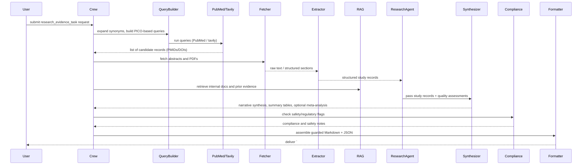

## research_evidence_task — Flow, diagram and pseudocode

Summary
- Purpose: Programmatically search, retrieve, extract, evaluate, and synthesize primary research evidence (clinical studies, preclinical assays, systematic reviews) relevant to a target herb or analyte so the results can be used as evidence in articles and fact sheets.
- Primary outputs: guarded machine-parseable JSON + human-readable narrative that lists included studies, study-level metadata, extracted outcomes, risk-of-bias/quality assessments, synthesized conclusions (narrative and tabular), and confidence scores.

### Inputs
- request context: targets (herb names, synonyms, chemical analytes), research question or PICO constraints (population, intervention/exposure, comparator, outcomes), time window, inclusion/exclusion rules, desired evidence types (e.g., RCTs, observational, in vitro)
- optional: curated query strings, user-provided PMIDs/DOIs, uploaded PDFs or local corpus to include

### Outputs
- a guarded Markdown block starting with `# ===EVIDENCE_DATA===` followed by a JSON payload (machine-parseable)
- human-readable evidence summary: key findings, strength of evidence, safety signals, recommended citations
- structured JSON with fields: studies[], extracted_outcomes[], quality_assessments[], synthesis{}, references[], confidence_score

### High-level steps (summary)
1. Validate request and expand targets (synonyms) for robust searches
2. Build search queries from PICO and run them across configured search tools (PubMed via `pubmed_tools`, tavily, Google Scholar connector if available)
3. De-duplicate and rank candidate results, fetch abstracts and available full text (PDF retrieval)
4. Extract structured study metadata and outcome measures using parsers and LLM-assisted extraction (study type, sample size, intervention/exposure, outcomes, effect sizes, CI/p-values, species/model)
5. Normalize metrics and units, map outcomes to canonical outcome names
6. Assess study quality / risk-of-bias (predefined checklist or LLM-assisted ROB tool)
7. Synthesize evidence: simple narrative synthesis, summary tables, and optional meta-analysis if numeric effect sizes are extractable and compatible
8. Cross-check synthesis against internal knowledge (RAG) and regulatory sources for safety flags
9. Produce guarded output plus artifacts (Markdown summary, JSON, optionally DOCX or CSV tables)

### Sequence diagram (mermaid)



### Pseudocode (step-by-step)

```python
def research_evidence_task(request):
    # 0. Validate request
    require_keys(request, ['targets'])
    pico = request.get('pico') or build_default_pico(request['targets'])

    # 1. Expand synonyms and build queries
    expanded_targets = expand_synonyms(request['targets'])
    queries = build_queries_from_pico(pico, expanded_targets)

    # 2. Run searches across providers
    records = []
    for q in queries:
        hits = search_pubmed(q)
        hits += search_tavily(q)
        records.extend(hits)
    records = deduplicate_records(records)

    # 3. Fetch abstracts and full text where available
    fetched = fetch_records(records)  # returns list of {pmid, doi, abstract, fulltext (maybe)}

    # 4. Extract structured study data
    studies = []
    for r in fetched:
        study = Extractor.extract_study(r)  # returns study-level metadata and outcome measures
        studies.append(study)

    # 5. Normalize outcomes and units
    for s in studies:
        s['outcomes'] = normalize_outcomes(s['outcomes'])

    # 6. Quality / risk-of-bias assessment
    for s in studies:
        s['quality'] = assess_study_quality(s)

    # 7. Evidence synthesis
    synthesis = Synthesizer.summarize(studies, method=request.get('synthesis_method', 'narrative'))

    # 8. Cross-check with RAG/internal docs and regulatory thresholds
    context_docs = rag.retrieve(query_for_targets(expanded_targets))
    safety_notes = ComplianceAgent.check_studies(studies, context_docs)

    # 9. Build output object
    output = {
        'studies': studies,
        'synthesis': synthesis,
        'safety': safety_notes,
        'confidence': estimate_confidence_from(studies, synthesis),
        'references': collect_references(studies)
    }

    guarded = '# ===EVIDENCE_DATA===\n' + json.dumps(output, ensure_ascii=False, indent=2)

    # 10. Optionally create reports / upload
    md_summary = Formatter.to_markdown(output)
    if request.get('format_docx'):
        docx_path = Formatter.to_docx(output)
        if request.get('upload_to_gdrive'):
            output['artifacts'] = {'docx_gdrive': gdrive_upload(docx_path)}

    return {'guarded_markdown': guarded, 'json': output, 'md_summary': md_summary}
```

# Explanation Field

| Field (English) | คำอธิบาย (ภาษาไทย) |
|---|---|
| Final Answer — output template | Final Answer MUST be a single Markdown block starting with `# ===RESEARCH_DATA===` and include `## Scientific Evidence for: <English name>`. The block should contain top-level metadata (`herb_name`, `herb_name_scientific`), a `Validated Compounds` section listing each compound with mechanism and up to 5 supporting studies, and an `Overall Summary` field.
|  | ผลลัพธ์สุดท้ายต้องเป็นบล็อก Markdown เดียวที่ขึ้นต้นด้วย `# ===RESEARCH_DATA===` และมี `## Scientific Evidence for: <ชื่ออังกฤษ>` โดยภายในบล็อกต้องมีเมตาดาตาระดับบน (`herb_name`, `herb_name_scientific`), ส่วน `Validated Compounds` ที่แสดงสารประกอบพร้อมกลไกและการศึกษาสนับสนุนสูงสุด 5 เรื่อง และฟิลด์ `Overall Summary`. |
| herb_name | The common English name of the herb (e.g., "Turmeric"). <br><br>ชื่อภาษาอังกฤษของสมุนไพร (เช่น "Turmeric"). |
| herb_name_scientific | Scientific binomial name (e.g., Curcuma longa) or the literal string `'not_found'` if not available. <br><br>ชื่อวิทยาศาสตร์ (เช่น Curcuma longa) หรือ `'not_found'` ถ้าไม่พบ. |
| Validated Compounds | Array of compound objects related to the herb. Each object: `compound_name`, `mechanism_name`, `supporting_studies` (array). <br><br>อาเรย์ของวัตถุสารประกอบที่เกี่ยวข้องกับสมุนไพร แต่ละรายการมี `compound_name`, `mechanism_name`, `supporting_studies`. |
| compound_name | Name of the compound (e.g., Curcumin) or `'not_found'`. <br><br>ชื่อสารประกอบ (เช่น Curcumin) หรือ `'not_found'`. |
| mechanism_name | Short mechanism label (e.g., Anti-inflammatory) or `'not_found'`. <br><br>คำอธิบายสั้น ๆ ของกลไก (เช่น ต้านการอักเสบ) หรือ `'not_found'`. |
| supporting_studies (object) | For each study include: `study_type`, `abstract_raw` (verbatim abstract text), `key_findings` (6-sentence summary derived from the abstract/content), `pmid`, `canonical_url`, `citation_apa`. Include up to 5 studies per compound. <br><br>สำหรับแต่ละการศึกษาระบุ: `study_type`, `abstract_raw` (บทคัดย่อคำต่อคำ), `key_findings` (สรุป 6 ประโยคจากบทคัดย่อ/เนื้อหา), `pmid`, `canonical_url`, `citation_apa`. จำกัดสูงสุด 5 การศึกษาต่อสาร. |
| study_type | Study design label (RCT, Review, Observational, In vitro, Animal, or `'not_found'`). <br><br>ประเภทการศึกษา (เช่น RCT, Review, Observational, In vitro, Animal หรือ `'not_found'`). |
| abstract_raw | Full verbatim abstract text fetched from PubMed or the study source (MUST NOT be fabricated). <br><br>บทคัดย่อฉบับเต็มจาก PubMed หรือแหล่งต้นทาง (ห้ามแต่งขึ้น). |
| key_findings | A concise 6-sentence factual summary derived only from `abstract_raw` and the study content. Do NOT invent information. <br><br>สรุป 6 ประโยคที่ได้จากบทคัดย่อเท่านั้น ห้ามแต่งข้อมูล. |
| pmid | PubMed ID string for the study or `'not_found'`. <br><br>ID ของ PubMed หรือ `'not_found'`. |
| canonical_url | Canonical DOI URL (https://doi.org/...) or other canonical link, or `'not_found'`. Clean tracking parameters. <br><br>URL DOI แบบ canonical หรือ `'not_found'` (ลบพารามิเตอร์ติดตาม). |
| citation_apa | Verbatim APA citation string extracted from `pubmed_parse` or the literal `'Citation not available'`. MUST NOT be fabricated. <br><br>อ้างอิงแบบ APA ที่ดึงมาจาก `pubmed_parse` หรือ `'Citation not available'`. ห้ามแต่งขึ้น. |
| Overall Summary | A concise synthesis of the validated compounds and supporting studies; use the literal `'not_found'` if no evidence. <br><br>สรุปรวมสั้น ๆ ของสารที่ยืนยันและการศึกษาสนับสนุน หากไม่มีหลักฐานให้ใช้ `'not_found'`. |

### Guardrails and output schema notes
- Always return the guarded block `# ===EVIDENCE_DATA===` to ensure downstream consumers can reliably parse the payload.
- Each study entry must include at minimum: id (PMID/DOI or internal id), citation, study_type, sample_size, population details, interventions/exposures, outcomes with numeric effect sizes (if present) and units, confidence/quality score, and extraction provenance (which tool/agent produced the fields).
- All citation strings must include a resolvable identifier (PMID, DOI) where possible.
- When meta-analysis is performed, include the model used, heterogeneity (I^2), and sensitivity analysis notes.

Example minimal JSON structure:

```json
{
  "studies": [{"id":"PMID:123456","citation":"Author et al. Year","study_type":"RCT","sample_size":120,"outcomes":[{"name":"symptom_reduction","value":0.45,"ci":"0.20-0.70","unit":"SMD"}],"quality":{"risk_of_bias":"low"}}],
  "synthesis": {"method":"narrative","summary":"Evidence suggests..."},
  "confidence": "moderate"
}
```

นี่คือตารางคำอธิบายโครงสร้าง **Research Data Output** (ข้อมูลงานวิจัยทางวิทยาศาสตร์) ในรูปแบบ Markdown 2 ภาษา (ไทย/อังกฤษ) สำหรับนำไปใช้ในไฟล์ `.md` ครับ

### ตารางอธิบายรูปแบบข้อมูลงานวิจัย (Research Data Format Schema)

ตารางนี้ใช้อธิบายโครงสร้างของบล็อก `# ===RESEARCH_DATA===` ซึ่งใช้จัดเก็บข้อมูลงานวิจัยอย่างละเอียดและเป็นโครงสร้าง

| ฟิลด์ข้อมูล (Key Field) | คำอธิบาย (Description) | ตัวอย่างรูปแบบข้อมูล (Data Format Example) |
| :--- | :--- | :--- |
| **Header** | **TH:** แท็กเริ่มต้นและหัวข้อหลัก (ต้องเริ่มด้วยแท็กนี้เสมอ)<br>**EN:** Start tag and main header (MUST start with this tag). | `# ===RESEARCH_DATA===`<br>`## Scientific Evidence for...` |
| **herb\_name** | **TH:** ชื่อสามัญภาษาอังกฤษของสมุนไพร<br>**EN:** Common English name of the herb. | `* **herb_name:** Turmeric` |
| **herb\_name\_scientific** | **TH:** ชื่อวิทยาศาสตร์ (ถ้าไม่พบให้ใส่ 'not\_found')<br>**EN:** Scientific name (or 'not\_found'). | `* **herb_name_scientific:** Curcuma longa` |
| **compound\_name** | **TH:** ชื่อสารประกอบสำคัญที่พบ (ภายใต้หัวข้อ Validated Compounds)<br>**EN:** Name of the active compound identified. | `* **compound_name:** Curcumin` |
| **mechanism\_name** | **TH:** กลไกการออกฤทธิ์ของสารนั้นๆ<br>**EN:** Mechanism of action for that compound. | `* **mechanism_name:** Anti-inflammatory` |
| **study\_type** | **TH:** ประเภทของงานวิจัย (เช่น RCT, Review, Meta-analysis)<br>**EN:** Type of study (e.g., RCT, Review). | `* **study_type:** RCT` |
| **abstract\_raw** | **TH:** บทคัดย่อฉบับเต็ม (คัดลอกมาทั้งหมดห้ามตัดทอน)<br>**EN:** Full verbatim abstract text (Do not truncate). | `* **abstract_raw:** Background: ...` |
| **key\_findings** | **TH:** สรุปผลการค้นพบสำคัญ (ประมาณ 6 ประโยค)<br>**EN:** Summary of key findings (approx. 6 sentences). | `* **key_findings:** The study found that...` |
| **pmid / canonical\_url** | **TH:** รหัส PubMed ID และลิงก์ DOI หรือ URL ต้นฉบับ<br>**EN:** PubMed ID and DOI link or canonical URL. | `* **pmid:** 12345678`<br>`* **canonical_url:** https://doi.org/...` |
| **citation\_apa** | **TH:** การอ้างอิงรูปแบบ APA (คัดลอกมาแบบเป๊ะๆ)<br>**EN:** Verbatim APA citation string. | `* **citation_apa:** Smith, J. (2023)...` |
| **summary** | **TH:** บทสรุปภาพรวมของหลักฐานทางวิทยาศาสตร์ทั้งหมด<br>**EN:** Overall summary of all scientific evidence. | `### Overall Summary`<br>`* **summary:** Evidence suggests...` |

-----

### วิธีนำไปใช้ (Copy Code)

คุณสามารถคัดลอกโค้ด Markdown ด้านล่างไปวางในไฟล์ `.md` ได้เลยครับ

```markdown
| ฟิลด์ข้อมูล (Key Field) | คำอธิบาย (Description) | ตัวอย่างรูปแบบข้อมูล (Data Format Example) |
| :--- | :--- | :--- |
| **Header** | **TH:** แท็กเริ่มต้นและหัวข้อหลัก (ต้องเริ่มด้วยแท็กนี้เสมอ)<br>**EN:** Start tag and main header (MUST start with this tag). | `# ===RESEARCH_DATA===`<br>`## Scientific Evidence for...` |
| **herb_name** | **TH:** ชื่อสามัญภาษาอังกฤษของสมุนไพร<br>**EN:** Common English name of the herb. | `* **herb_name:** Turmeric` |
| **herb_name_scientific** | **TH:** ชื่อวิทยาศาสตร์ (ถ้าไม่พบให้ใส่ 'not_found')<br>**EN:** Scientific name (or 'not_found'). | `* **herb_name_scientific:** Curcuma longa` |
| **compound_name** | **TH:** ชื่อสารประกอบสำคัญที่พบ (ภายใต้หัวข้อ Validated Compounds)<br>**EN:** Name of the active compound identified. | `* **compound_name:** Curcumin` |
| **mechanism_name** | **TH:** กลไกการออกฤทธิ์ของสารนั้นๆ<br>**EN:** Mechanism of action for that compound. | `* **mechanism_name:** Anti-inflammatory` |
| **study_type** | **TH:** ประเภทของงานวิจัย (เช่น RCT, Review, Meta-analysis)<br>**EN:** Type of study (e.g., RCT, Review). | `* **study_type:** RCT` |
| **abstract_raw** | **TH:** บทคัดย่อฉบับเต็ม (คัดลอกมาทั้งหมดห้ามตัดทอน)<br>**EN:** Full verbatim abstract text (Do not truncate). | `* **abstract_raw:** Background: ...` |
| **key_findings** | **TH:** สรุปผลการค้นพบสำคัญ (ประมาณ 6 ประโยค)<br>**EN:** Summary of key findings (approx. 6 sentences). | `* **key_findings:** The study found that...` |
| **pmid / canonical_url** | **TH:** รหัส PubMed ID และลิงก์ DOI หรือ URL ต้นฉบับ<br>**EN:** PubMed ID and DOI link or canonical URL. | `* **pmid:** 12345678`<br>`* **canonical_url:** https://doi.org/...` |
| **citation_apa** | **TH:** การอ้างอิงรูปแบบ APA (คัดลอกมาแบบเป๊ะๆ)<br>**EN:** Verbatim APA citation string. | `* **citation_apa:** Smith, J. (2023)...` |
| **summary** | **TH:** บทสรุปภาพรวมของหลักฐานทางวิทยาศาสตร์ทั้งหมด<br>**EN:** Overall summary of all scientific evidence. | `### Overall Summary`<br>`* **summary:** Evidence suggests...` |
```

### Tools / agents mapping
- Query / search: `pubmed_tools`, `tavily_tools`, and any configured search connectors
- Fetcher / full-text retrieval: PDF fetchers, DOI resolvers, and configured corpus connectors
- Extractor: a combination of rule-based parsers and LLM-assisted extractors in `tools` (orchestrated by `research_agent`)
- RAG: `rag_manager_tools` for internal docs, prior evidence, or lab corpora
- Synthesizer: a component that summarizes and (optionally) runs meta-analytic calculations
- Compliance: `fda_tools`, `sac_tools`, or `compliance_checker_agent` for regulatory/safety cross-checks
- Formatter: `docx_tools`, `gdrive_upload_file_tools`, and Markdown/CSV renderers

### Validation checks & QA
- Coverage: fraction of top N search hits with successful extraction; warn if <80%.
- Provenance: every extracted numeric value must record source (pmid/doi, page, table id, extractor version).
- Quality spread: report distribution of study quality scores and flag if synthesis heavily weighted by low-quality studies.
- Consistency: detect inconsistent outcome direction across studies and flag for manual review.

### Edge cases
- Paywalled or unavailable full text — fall back to abstract-level extraction and flag reduced confidence.
- Heterogeneous outcome measures that prevent numeric meta-analysis — provide narrative synthesis and mapping suggestions.
- Non-English studies — attempt translation, but mark translated fields and reduce confidence.
- Preprints / non-peer-reviewed sources — include but label and lower confidence by default.

### Testing suggestions
- Unit tests: query builder, deduplication, extractor accuracy on a small set of known abstracts, quality assessor logic.
- Integration test: known small corpus (3–5 studies) -> run `research_evidence_task` -> assert presence of `# ===EVIDENCE_DATA===`, correct study ids, and expected keys in JSON.
- End-to-end test: mock PubMed results and PDFs -> run pipeline -> validate synthesis output and artifacts.

---

This document is intended as a developer reference when implementing `research_evidence_task` in `src/herbal_article_creator/crew.py` or when building a `research_agent` that performs evidence retrieval and synthesis.
