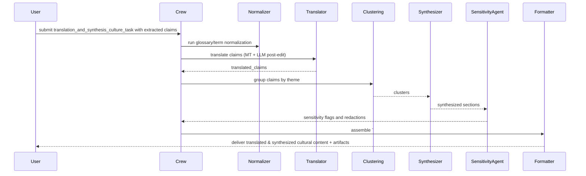

## translation_and_synthesis_culture_task — Flow, diagram and pseudocode

Summary
- Purpose: Translate extracted cultural content into the project's working language (usually English), synthesize multiple extracted cultural claims into concise, non-redundant editorial content, and preserve provenance and sensitivity annotations. This task prepares culturally-sourced material for inclusion in articles, fact sheets, and safety notes while ensuring proper citation, consent handling, and accurate translation.
- Primary outputs: a guarded machine-parseable JSON payload plus human-readable synthesized text containing translated claims, synthesis notes, provenance, sensitivity flags, and recommended editorial language.

### Inputs
- request context: targets (herb names), list of extracted cultural claims (e.g., from `raw_extraction_culture_task`), preferred target language for translation, sensitivity/consent policies, and synthesis rules (e.g., length, tone, required sections)
- optional: translator preference (automated vs. human-in-the-loop), glossaries or localization guidance, examples of prior synthesized content

### Outputs
- a guarded Markdown block starting with `# ===CULTURE_TRANSLATION===` followed by a JSON payload
- a human-readable synthesized section: translated claims grouped by theme (uses, preparations, contraindications), editorial notes on cultural sensitivity and provenance, and suggested language for publication
- structured JSON with fields: translated_claims[], synthesis_sections[], provenance[], sensitivity_flags[], confidence_score

### High-level steps (summary)
1. Validate inputs and ensure each claim has provenance and permission status
2. Optionally run glossary/term normalization to preserve local names and scientific identifiers
3. Translate each claim to the target language using configured translation tools (machine translation + optional domain-aware LLM post-editing)
4. Normalize and canonicalize translated strings (spelling, units, localization of measures)
5. Group and cluster translated claims by theme (e.g., medicinal use, preparation, route, ritual context)
6. Synthesize clusters into concise editorial sections per synthesis rules; remove duplicates and resolve conflicts with explicit provenance notes
7. Inject sensitivity annotations and redact or rephrase content flagged as sensitive or requiring consent
8. Produce final guarded output and formatted artifacts (JSON, Markdown, optionally DOCX), keeping provenance and mapping to original raw excerpts

### Sequence diagram (mermaid)



### Pseudocode (step-by-step)

```python
def translation_and_synthesis_culture_task(request):
    # 0. Validate inputs
    require_keys(request, ['claims', 'target_language'])
    claims = request['claims']
    target_lang = request['target_language']
    glossary = request.get('glossary')

    # 1. Ensure provenance and permissions
    for c in claims:
        if 'provenance' not in c:
            c['provenance'] = attempt_infer_provenance(c)
        if is_sensitive(c) and not has_consent(c):
            c['restricted'] = True

    # 2. Normalize terms using glossary
    if glossary:
        claims = apply_glossary(claims, glossary)

    # 3. Translate claims (MT + optional LLM post-edit)
    translated = []
    for c in claims:
        if c.get('restricted'):
            translated.append({'original':c,'translated':None,'note':'restricted'})
            continue
        mt = machine_translate(c['text'], src=c.get('lang'), tgt=target_lang)
        post = llm_post_edit(mt, context=c, guardrails=TRANSLATION_GUARDRAILS)
        translated.append({'original':c,'translated':post})

    # 4. Normalize translated strings
    for t in translated:
        if t['translated']:
            t['translated'] = normalize_spelling_and_units(t['translated'], locale=target_lang)

    # 5. Cluster by theme
    clusters = cluster_translated_claims([t for t in translated if t['translated']])

    # 6. Synthesize clusters into editorial sections
    synthesis_sections = []
    for cl in clusters:
        section = synthesize_cluster(cl, style=request.get('tone','neutral'), max_length=request.get('max_length',300))
        synthesis_sections.append({'theme':cl['theme'],'section':section,'sources':cl['sources']})

    # 7. Apply sensitivity checks
    sensitivity_results = []
    for s in synthesis_sections:
        flags = SensitivityAgent.check(s)
        s['sensitivity_flags'] = flags
        sensitivity_results.append(flags)

    # 8. Build output
    output = {
        'translated_claims': translated,
        'synthesis_sections': synthesis_sections,
        'provenance': collect_provenance(translated),
        'sensitivity_flags': sensitivity_results,
        'confidence': aggregate_confidence(translated, synthesis_sections)
    }

    guarded = '# ===CULTURE_TRANSLATION===\n' + json.dumps(output, ensure_ascii=False, indent=2)

    md = Formatter.to_markdown(output)
    if request.get('format_docx'):
        docx_path = Formatter.to_docx(output)
        if request.get('upload_to_gdrive'):
            output['artifacts'] = {'docx_gdrive': gdrive_upload(docx_path)}

    return {'guarded_markdown': guarded, 'json': output, 'md_summary': md}
```

## Explanation Field

Below is the machine-facing bilingual (English + Thai) Explanation Field for downstream parsers and editorial use. Preserve the guarded header token exactly as shown in the "Guarded header" row — extractors depend on exact tokens for deterministic parsing. Note: the file's Outputs section above specifies `# ===CULTURE_TRANSLATION===` as the generated guarded block; if this Explanation Field shows a different token, coordinate before renaming.

| Field | Description (English) | คำอธิบาย (ภาษาไทย) | Example |
|---|---|---|---|
| Guarded header | Exact string that starts the machine-parseable block. Do not change without coordinating a code change. | สตริงหัวข้อบล็อกที่ใช้สำหรับการดึงข้อมูลโดยอัตโนมัติ ต้องไม่แก้ไขโดยไม่ได้ประสานงานกับโค้ด | `# ===CULTURE_TRANSLATION===` |
| targets / herb_name | Canonical English name(s) or identifiers for the target herb(s). Use normalized forms (Latin/English). | ชื่อสมุนไพร/รหัสเป้าหมายในรูปแบบมาตรฐาน (ภาษาอังกฤษ) | `Turmeric` |
| translated_claims | Array of translated claim objects. Each item should include original (excerpt and source), translated text, language, translation_method (MT/HT/LLM), translation_confidence, and provenance. | อาร์เรย์ของข้ออ้างที่แปลแล้ว แต่ละรายการต้องมีข้อความต้นฉบับและแหล่งที่มา ข้อความที่แปล ภาษา วิธีการแปล คะแนนความมั่นใจ และแหล่งที่มา | `[ {"original":{"text":"...","source":"..."},"translated":"Used as a postpartum tonic","lang":"en","method":"MT+LLM_postedit","confidence":0.92,"provenance":{...}} ]` |
| synthesis_sections | Array of synthesized editorial sections grouped by theme (e.g., Uses, Preparations, Contraindications). Each section should include the synthesized_text, theme, source_excerpts (list of original excerpts with provenance), and sensitivity_flags. | อาร์เรย์ของส่วนสังเคราะห์ที่จัดเป็นกลุ่มตามหัวข้อ แต่ละส่วนต้องมีข้อความสังเคราะห์ หัวข้อ ข้อความต้นฉบับที่ใช้ และป้ายความอ่อนไหว | `[ {"theme":"Uses","section":"Traditionally used as...","sources":[{"source":"...","excerpt":"..."}],"sensitivity_flags":[]} ]` |
| provenance | Collection of provenance items for the entire output (report_generated_by, timestamp) plus per-item provenance included in translated_claims and synthesis_sections. | การรวบรวมข้อมูลแหล่งที่มาสำหรับผลลัพธ์ทั้งหมด (ผู้สร้างรายงาน เวลา) รวมทั้งข้อมูลต้นทางต่อรายการที่รวมอยู่ใน translated_claims และ synthesis_sections | `{ "report_generated_by":"culture-translator-v1","timestamp":"2025-11-19T10:45:00Z" }` |
| sensitivity_flags | Array of sensitivity annotations (e.g., restricted, sacred, requires_consent) with reasons and suggested handling (redact, manual_review). | อาร์เรย์ของป้ายการอ่อนไหว เช่น restricted, sacred, requires_consent พร้อมเหตุผลและแนวทางจัดการที่แนะนำ | `[ {"flag":"requires_consent","reason":"sacred_knowledge","handling":"manual_review"} ]` |
| glossary_terms_used | If a glossary was supplied, list glossary mappings applied (original_term -> normalized_term) and any conflicts. | หากมีการส่ง glossary ให้แสดงรายการการแมปศัพท์ที่ใช้ (ศัพท์ต้นฉบับ -> ศัพท์ที่แปลง) และความขัดแย้งที่พบ | `[ {"original":"Khamin Chan","normalized":"Kaempferia galanga"} ]` |
| artifacts | Optional artifacts generated (docx, csv) with local paths or URLs if uploaded. | ผลิตภัณฑ์/ไฟล์ที่สร้างขึ้น (docx, csv) พร้อมเส้นทางไฟล์หรือ URL หากอัปโหลด | `{ "docx":"/tmp/translated_doc.docx","gdrive_url":"https://drive..." }` |
| confidence | Overall system confidence (0.0–1.0) and optionally per-section or per-claim confidence. Document calculation in agent code. | คะแนนความมั่นใจโดยรวมของระบบ (0.0–1.0) และอาจรวมคะแนนต่อส่วนหรือข้ออ้าง ระบุวิธีคำนวณในโค้ดของเอเยนต์ | `0.85` |
| guardrails | Parsing & content guardrails: machine fields must be English-only; never fabricate translations or provenance; preserve original-language excerpts alongside translations; redact/flag sensitive material and require manual review where `requires_consent==true`. | ข้อกำชับ: ฟิลด์สำหรับเครื่องต้องเป็นภาษาอังกฤษเท่านั้น ห้ามสร้างคำแปลหรือแหล่งที่มาขึ้นเอง ให้แนบข้อความต้นฉบับภาษาท้องถิ่นพร้อมคำแปล และปกปิด/มาร์กข้อมูลอ่อนไหวที่ต้องการการตรวจสอบด้วยมือ | `English-only; no fabrication; include original excerpts; flag/redact sensitive content` |

### Minimal JSON example (what the guarded block should contain)

```json
{
    "translated_claims": [
        {
            "original": {"text":"ใช้หลังคลอด","source":"http://local.example/doc.pdf"},
            "translated": "Used as a postpartum tonic",
            "lang": "en",
            "method": "MT+LLM_postedit",
            "confidence": 0.92,
            "provenance": {"source":"http://local.example/doc.pdf","page":3,"paragraph":2}
        }
    ],
    "synthesis_sections": [
        {"theme":"Uses","section":"Traditionally used as a postpartum tonic in Region X.","sources":[{"source":"http://local.example/doc.pdf","excerpt":"..."}],"sensitivity_flags":[]}
    ],
    "provenance": {"report_generated_by":"culture-translator-v1","timestamp":"2025-11-19T10:45:00Z"},
    "sensitivity_flags": [],
    "confidence": 0.85
}
```

Notes:
- Preserve the guarded header token `# ===CULTURE_TRANSLATION===` exactly if you use it in generated output. If this document shows a different token (`# ===CULTURE_DATA===`), coordinate before renaming tokens across the codebase.
- Machine-parsable fields must be English-only and strictly typed (arrays/objects); human-readable narrative sections may be localized but must not be used as canonical values by downstream parsers.
- Sensitive items must be redacted or flagged and routed to a manual review workflow that includes community consent where required.

| ฟิลด์ข้อมูล<br>(Key Field) | คำอธิบายและข้อกำหนด<br>(Description & Requirements) | ตัวอย่างรูปแบบข้อมูล<br>(Format Example) |
| :--- | :--- | :--- |
| **Start Tag** | **TH:** **ต้อง** เริ่มต้นด้วยแท็กนี้เท่านั้น (ภาษาอังกฤษล้วน)<br>**EN:** **MUST** start with this tag. Output must be 100% English. | `# ===CULTURE_DATA===` |
| **Main Title** | **TH:** หัวข้อหลัก ระบุชื่อสมุนไพร (อังกฤษ และ ไทย)<br>**EN:** Main header specifying Herb Name (Eng & Thai). | `## Cultural Context for:`<br>`<Eng (Thai)>` |
| **Finding Section** | **TH:** หัวข้อย่อยสำหรับแต่ละแหล่งข้อมูล (SAC Website)<br>**EN:** Sub-header for each processed source URL. | `### Finding 1` |
| **community_context** | **TH:** (กลุ่มข้อมูล) ข้อมูลทั่วไปของชุมชน **(ต้องแปลเป็นอังกฤษ)**: ชื่อ, ที่ตั้ง, ชาติพันธุ์<br>**EN:** (Group) Translated info: Community Name, Location, Ethnic Group. | `* **community_context:**`<br>`  * **community_name:** ...`<br>`  * **location:** ...` |
| **community_profile_summaries** | **TH:** (กลุ่มข้อมูล) **ส่วนสำคัญ:** ต้องเขียนสรุปใหม่เป็นภาษาอังกฤษ (100-150 คำ) เน้นเรื่องสมุนไพรตามหัวข้อย่อย 5 ด้าน<br>**EN:** (Group) **Crucial:** Write 100-150 word English summaries focused on herbs for 5 categories. | `* **community_profile_summaries:**`<br>`  * **community_highlight:** ...`<br>`  * **local_wisdom:** ...` |
| **specific_entities** | **TH:** (กลุ่มข้อมูล) ข้อมูลจำเพาะที่สกัดออกมา: ชื่อท้องถิ่น, การใช้, วิธีแปรรูป<br>**EN:** (Group) Extracted entities: Local names, Uses, Processing methods. | `* **specific_entities:**` |
| **local_names** | **TH:** ชื่อเรียกในท้องถิ่น (แปลเป็นอังกฤษ) + ประโยคอ้างอิง (แปลเป็นอังกฤษ)<br>**EN:** Translated local names + Translated context quotes. | `* **local_names:**`<br>`  * **name:** ...`<br>`  * **context_quote:** ...` |
| **traditional_uses** | **TH:** สรรพคุณ/การใช้งาน (แปลเป็นอังกฤษ) + ประโยคอ้างอิง (แปลเป็นอังกฤษ)<br>**EN:** Translated uses + Translated context quotes. | `* **traditional_uses:**`<br>`  * **use:** ...`<br>`  * **context_quote:** ...` |
| **processing_methods** | **TH:** วิธีการแปรรูป (แปลเป็นอังกฤษ) + ประโยคอ้างอิง (แปลเป็นอังกฤษ)<br>**EN:** Translated processing methods + Translated context quotes. | `* **processing_methods:**`<br>`  * **method:** ...`<br>`  * **description_quote:** ...` |
| **Empty Data** | **TH:** หากหัวข้อไหนไม่พบข้อมูล ให้ระบุว่า 'No herbal-related information found'<br>**EN:** If data is missing, explicitly write 'No herbal-related information found'. | `* **name_etymology:**`<br>`No herbal-related information found` |

### Guardrails and output schema notes
- Always return the guarded block `# ===CULTURE_TRANSLATION===` so downstream consumers parse reliably.
- Preserve original local terms alongside translated equivalents; glossary terms must be used when provided.
- For any content flagged as restricted/sensitive, do not provide a translated version unless explicit consent is present. Instead include a redaction note and provenance for manual review.
- Each synthesized section must list the original excerpts (provenance) used to create it.

Example minimal JSON structure:

```json
{
  "translated_claims": [{"original":{"text":"...","source":"..."},"translated":"Used as a tonic after childbirth","note":null}],
  "synthesis_sections": [{"theme":"Uses","section":"Traditionally used as a postpartum tonic in Region X.","sources":["URL:...","PMCID:..."]}],
  "sensitivity_flags": [],
  "confidence": 0.85
}
```

### Tools / agents mapping
- Translator: MT engine (e.g., Google Translate, local MT) + LLM post-editor (for domain-aware phrasing) implemented in `tavily_tools` or a translation wrapper
- Normalizer / glossary: small utility in `tools/utils` to map local names to canonical herb ids and preferred terms
- Clustering & Synthesizer: LLM or rule-based clustering followed by LLM-assisted summarization (synthesizer agent)
- SensitivityAgent: component that applies policy rules around consent and cultural sensitivity (could be implemented as `safety_inspector_agent` variant or `cultural_policy_agent`)
- Formatter: `docx_tools`, Markdown renderers, and `gdrive_upload_file_tools`

### Validation checks & QA
- Glossary fidelity: ensure glossary terms are used; flag any replacements that conflict with glossary rules
- Provenance completeness: every synthesized section must cite at least one source excerpt
- Sensitivity enforcement: restricted items must never be automatically published; require manual confirmation
- Translation quality: sample-check a small percent (e.g., 5%) of translations with LLM quality checks (fluency, fidelity)

### Edge cases
- Ambiguous local names that map to multiple species — preserve the original local name and mark mapping confidence low
- Legal/consent restrictions for Indigenous Knowledge — redaction and manual consent workflows must be followed
- Idiomatic expressions that do not translate literally — prefer explanatory translations and preserve original phrase in parentheses
- Extremely terse raw excerpts (single-word mentions) — avoid over-interpretation; label as low confidence

### Testing suggestions
- Unit tests: glossary application, translation pipeline (MT + post-edit), clustering correctness on small synthetic dataset
- Integration test: run task on small set of extracted claims with a glossary and assert `# ===CULTURE_TRANSLATION===` appears, sections are produced, and provenance is attached
- Manual QA: sampling translations and synthesized sections for editorial review before publishing

This document is a developer reference for implementing `translation_and_synthesis_culture_task` in `src/herbal_article_creator/crew.py` or for building a `culture_synthesizer`/`translation_agent` inside `src/herbal_article_creator/tools/`.
