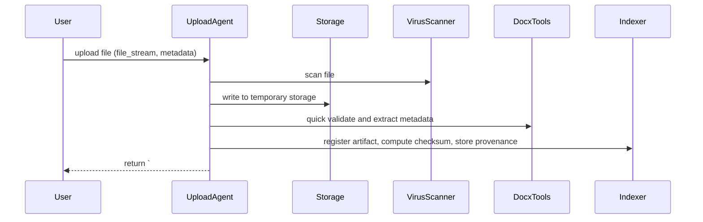

# Upload DOCX Task — Flow and Implementation Notes

Purpose
-------
The Upload DOCX task handles incoming DOCX files from users or partners, validates and normalizes them, extracts embedded assets and metadata, and registers the artifact in the system so downstream tasks (convert, audit, writer, planner) can consume them. It enforces file-type checks, scans for obvious integrity issues, and ensures uploads are stored with correct provenance and accessible URIs.

Contract (small)
-----------------
- Inputs: { uploaded_file_path: string OR file_stream, uploader_id?: string, collection?: string, options?: { extract_images: bool, normalize: bool, tag_owner: string } }
- Outputs: Guarded markdown block with header `# ===DOCX_UPLOAD===` followed by a JSON object: upload_id, artifact_id (if converted), original_filename, stored_paths {local, remote}, created_at, uploader_id, checks {file_type_ok, virus_scan, checksum, word_count}, status (success|partial|failed), warnings[], provenance.
- Error modes: unsupported file type (reject), virus/malware detected (quarantine + failed), storage write error (partial/failed), malformed DOCX (partial import with errors), permission denied.
- Success criteria: file stored successfully, checksum recorded, basic structural verification passes (readable DOCX), and metadata/provenance saved for downstream tasks.

Mermaid sequence diagram
------------------------


Pseudocode (high level)
-----------------------
1. accept_upload(file_stream, metadata)
2. save_temp_path = Storage.write_temp(file_stream)
3. file_type_ok = DocxTools.is_docx(save_temp_path)
4. if not file_type_ok: emit guarded `# ===DOCX_UPLOAD===` status=failed (reason=bad_type)
5. virus_result = VirusScanner.scan(save_temp_path)
6. if virus_result.positive: quarantine file; emit status=failed, quarantine_info
7. checksum = compute_checksum(save_temp_path)
8. parsed = DocxTools.quick_parse(save_temp_path)  # get title, word_count, images_count, footnotes
9. dest_path = Storage.move_to_permanent(save_temp_path, dest_bucket/outputs/uploads/)
10. if options.extract_images: images = DocxTools.extract_images(dest_path); store assets
11. register = Indexer.register({artifact metadata, checksum, uploader_id, storage_path})
12. emit_guarded_block('# ===DOCX_UPLOAD===', {upload_id, artifact_id, original_filename, stored_paths, checks, status, warnings, provenance})

Tools and code locations
------------------------
- Orchestrator: `src/herbal_article_creator/crew.py` — task binding and routing.
- Upload helpers: `src/herbal_article_creator/tools/gdrive_upload_file_tools.py` and new `src/herbal_article_creator/tools/upload_tools.py` for temp store, final move, and index registration.
- DOCX parsing: reuse `src/herbal_article_creator/tools/docx_tools.py` for quick validation and optional extraction.
- Virus/malware scanning: integrate an external scanner or a lightweight check library; implement adapter under `src/herbal_article_creator/tools/security_tools.py`.
- Indexing/metadata: `src/herbal_article_creator/tools/pinecone_tools.py` or a simple JSON indexer in `outputs/indexes/` depending on project configuration.

Guardrails and formatting rules
------------------------------
- Guarded header: the upload task must output `# ===DOCX_UPLOAD===` exactly on its own line followed by a JSON object.
- Minimal JSON fields:
  - upload_id (uuid)
  - artifact_id (uuid or null if not converted)
  - original_filename
  - stored_paths { local: path, remote: optional_url }
  - created_at (ISO8601)
  - uploader_id
  - checks { file_type_ok, virus_scan: {status, details}, checksum }
  - status (success|partial|failed)
  - warnings (array)
  - provenance { agent, ts, storage_snapshot }

Checks and validation
---------------------
- File type: ensure the file is a DOCX (magic bytes / zip container with document.xml).
- Virus scan: run an available scanner; if positive, quarantine and mark `failed`.
- Checksum: compute SHA256 (or configurable) and record for integrity checks and deduping.
- Basic structural parse: ensure `document.xml` present and readable; check core properties like title and word count.
- Duplicate detection: compare checksum and stored index (if artifact with same checksum exists, return status=partial with existing artifact_id).
- Metadata completeness: ensure uploader_id present (or tag as `unknown_uploader`) and record any provided tags/collections.

Edge cases and failure modes
---------------------------
- Large uploads: for very large files, support chunked uploads and streaming scan; return `partial=true` and `upload_session_id` for resumption.
- Non-DOCX files with .docx extension: detect by file magic and reject with clear reason.
- Storage failures: retry with exponential backoff and provide diagnostics if persistent.
- Duplicate uploads: if a duplicate is detected, avoid re-ingest and return existing artifact reference with status=partial/duplicate.
- Quarantine policy: if virus positive, store in `quarantine/` and do not index; include administrator notification in actions_recommended.

Testing recommendations
-----------------------
- Unit tests: test `is_docx`, checksum calculation, and guarded output format.
- Integration: simulate a full upload flow including temp write, scan (mocked), move to permanent storage, and index registration.
- Failure tests: simulate virus detection, storage write failures, and duplicate detection to assert proper statuses and warnings.

Example guarded output (abbreviated)
-----------------------------------
```
# ===DOCX_UPLOAD===
{
  "upload_id": "upload-123e4567-e89b-12d3-a456-426614174000",
  "artifact_id": "docx-123e4567-e89b-12d3-a456-426614174000",
  "original_filename": "HerbX_research_notes.docx",
  "stored_paths": {"local":"outputs/uploads/HerbX_research_notes_20251118.docx","remote":"https://drive.example/..."},
  "created_at": "2025-11-18T12:45:00Z",
  "uploader_id": "user-42",
  "checks": {"file_type_ok": true, "virus_scan": {"status":"clean"}, "checksum":"sha256:..."},
  "status": "success",
  "warnings": [],
  "provenance": {"agent":"UploadAgent","ts":"2025-11-18T12:45:00Z","storage_snapshot":"snap-20251118-1245"}
}
```

Implementation notes
--------------------
- Idempotency: use checksum-based deduping. If a checksum matches an existing artifact, return that artifact_id instead of creating duplicates (status=partial/duplicate).
- Temporary storage: keep uploads in a temp area until validated to avoid partial or corrupt artifacts in the main storage area.
- Notifications: on `failed` or `quarantine`, notify administrators or the uploader according to project notification settings.

Where to start
---------------
- Implement `src/herbal_article_creator/tools/upload_tools.py` with: save_temp, is_docx, compute_checksum, move_to_permanent, register_artifact, emit_guarded_upload.
- Integrate or mock a virus scanner under `src/herbal_article_creator/tools/security_tools.py`.
- Add tests under `tests/test_upload_tools.py` for success and failure cases.

Document created: 2025-11-18
