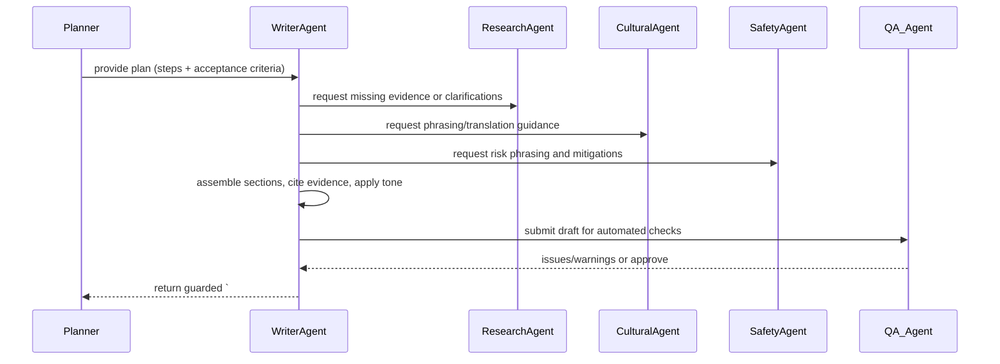

(# Write Article Task — Flow and Implementation Notes)

Purpose
-------
The Write Article task (executed by a Writer agent) transforms an execution plan (from the Planner) plus evidence and cultural/safety signals into a structured, publication-ready draft. The task should produce machine-parseable outputs (guarded blocks) and human-facing article artifacts (Markdown, DOCX), with explicit provenance and acceptance criteria so QA agents can validate content before publishing.

Contract (small)
-----------------
- Inputs: { plan: planner_plan_object OR plan_id, evidence_bundle: [evidence_docs], cultural_notes, safety_flags, writer_preferences (tone, word_limit, sections), assets (images/figures) }
- Outputs: Guarded markdown block with header `# ===ARTICLE_DRAFT===` followed by a JSON metadata block and then the article body in Markdown. Also returns optional `docx` or `html` artifacts saved to outputs.
- Error modes: missing plan or evidence (returns error + suggestions), contradictions between safety/cultural flags and plan (returns flagged steps and proposed edits), timeouts when external evidence fetches fail (emit draft with `status: partial`).
- Success criteria: Draft includes all required sections from the plan (e.g., summary, evidence, risks, recommendations), matches tone and constraints, and contains evidence_refs for factual claims.

Mermaid sequence diagram
------------------------


Pseudocode (high level)
-----------------------
1. validate_input(inputs)
2. plan = load_plan(inputs.plan or inputs.plan_id)
3. gather_evidence = ensure_evidence(inputs.evidence_bundle, plan.evidence_refs)
4. if missing_evidence: call research agent or mark `evidence_missing` in warnings
5. sections = for each plan.step generate_section(step, evidence, cultural_notes, safety_flags)
6. apply_style_and_tone(sections, writer_preferences)
7. cite_and_link_evidence(sections)
8. assemble_markdown = render_sections_to_markdown(sections)
9. metadata = { draft_id, plan_id, created_at, author_agent, version, attachments }
10. run_automated_checks(assemble_markdown, metadata)
11. if checks.pass: status = "ready_for_review" else status = "needs_revision" with issues
12. emit_guarded_output('# ===ARTICLE_DRAFT===', {metadata, status}) + markdown body
13. optionally export artifacts (docx/html) and store references in metadata

### Explanation Field

| ส่วนประกอบ<br>(Section) | คำสั่งการเขียน<br>(Instructions) | แหล่งข้อมูลที่ใช้<br>(Source Data) | รูปแบบ<br>(Format) |
| :--- | :--- | :--- | :--- |
| **Title** | **TH:** ตั้งชื่อบทความให้น่าสนใจ (เช่น จากภูมิปัญญาสู่กลยุทธ์)<br>**EN:** Create an engaging title (e.g., From Ancient Wisdom to Modern Strategy). | ชื่อสมุนไพรหลัก<br>(Main Herb Name) | `# Header 1` |
| **Herbal in Wellness Trends** | **TH:** เขียนย่อหน้าสังเคราะห์ให้น่าอ่าน เพื่อปูพื้นฐานเกี่ยวกับเทรนด์<br>**EN:** Synthesize an engaging paragraph to set the stage based on trends. | `Trend Facts`<br>(from MASTER_FACT_SHEET) | `## Header 2`<br>+ Paragraph |
| **Scientific Deep-Dive** | **TH:** เขียนข้อมูลเชิงลึกทางวิทยาศาสตร์ เน้นข้อเท็จจริงและเทคนิค<br>**EN:** Synthesize a technical and factual section based on science/lab data. | `Science Facts`<br>`Lab Facts` | `## Header 2`<br>+ Paragraph |
| **Scientific Research** | **TH:** **คัดลอกมาวาง (Verbatim):** บทคัดย่องานวิจัยฉบับเต็ม ห้ามตัดทอน<br>**EN:** **Verbatim copy:** The full abstract text without modification. | `abstract_raw` | `> Blockquote` |
| **Traditional Wisdom** | **TH:** เล่าเรื่องราวหรือทำเป็นข้อๆ เกี่ยวกับภูมิปัญญาดั้งเดิม<br>**EN:** Present cultural facts as a flowing narrative or clear bullet points. | `Culture Facts` | `## Header 2`<br>+ Narrative/Bullets |
| **Safety, Regulatory, Constraints** | **TH:** สรุปข้อควรระวัง กฎหมาย และความเป็นพิษ (ต้องระบุให้ชัดเจน)<br>**EN:** Summarize safety, FDA, and toxicity findings (State clearly). | `Thai FDA Fact`<br>`Safety Fact`<br>`Toxicity Fact` | `## Header 2`<br>+ Summary |
| **Strategic Analysis** | **TH:** วิเคราะห์โอกาสทางการตลาดและข้อจำกัดทางกลยุทธ์<br>**EN:** Discuss market opportunities and constraints based on the plan. | `# ===STRATEGIC_PLAN===` | `## Header 2`<br>+ Analysis |
| **Herbal Knowledge Summary** | **TH:** **คัดลอกมาวาง:** ข้อความที่ Clean แล้วจากระบบ RAG ภายใน<br>**EN:** **Copy/Paste:** Full cleaned text from internal RAG system. | `Internal RAG Fact (Herbal)`<br>`Internal RAG Fact (Cultural)` | `## Header 2`<br>+ Text |
| **Conclusion** | **TH:** บทสรุปปิดท้าย เชื่อมโยงข้อเท็จจริงเข้ากับมุมมองทางกลยุทธ์<br>**EN:** Final summary balancing facts with strategic outlook. | การสังเคราะห์จากทุกส่วน<br>(Synthesis of all sections) | `## Header 2`<br>+ Paragraph |
| **References** | **TH:** **คัดลอกมาวาง:** รูปแบบการอ้างอิง APA แบบเป๊ะๆ<br>**EN:** **Verbatim copy:** Exact APA citation string. | `citation_apa` | `# Header 1`<br>+ List `[1]` |
| **Sources Consulted** | **TH:** **คัดลอกมาวาง:** รายชื่อ URL ทั้งหมดที่ใช้ใน Fact Sheet<br>**EN:** **Copy/Paste:** List ALL URLs found in the Fact Sheet. | `Source URL` (All types) | `# Header 1`<br>+ List `[1]` |

Tools and code locations
------------------------
- Orchestrator: `src/herbal_article_creator/crew.py` — route tasks and agent calls.
- Writer logic: implement in `src/herbal_article_creator/tools/docx_tools.py` (for DOCX export) and a new `src/herbal_article_creator/tools/writer_tools.py` that assembles sections, renders markdown, and enforces guardrails.
- Evidence lookups: use `src/herbal_article_creator/tools/common_rag.py`, `pubmed_tools.py`, or other research connectors when missing evidence must be fetched.
- QA checks: script under `src/herbal_article_creator/tools/qa_checks.py` to run style, link validity, evidence_refs completeness, and safety/culture flag checks.

Guardrails and formatting rules
------------------------------
- The guarded header must be exactly `# ===ARTICLE_DRAFT===` on its own line.
- After the header, include a single JSON metadata object (compact or pretty) with keys: draft_id (uuid), plan_id, created_at, author_agent, status, version, artifacts (list), warnings.
- The article body follows the JSON block and should be valid Markdown. Recommended top-level sections derived from plan:
	- Title
	- Short summary (2-3 sentences)
	- Key findings (bullet list with evidence_refs)
	- Evidence details (linked or cited paragraphs — each factual claim must include an evidence_ref)
	- Safety & contraindications (clear, highlighted)
	- Cultural considerations (phrasing guidance)
	- Recommendations / next steps
	- References (list with full citation and doc_ids)

- Evidence citation format: use inline bracketed refs like [EVID-<doc_id>:anchor] and also include a references section with structured entries.

Checks and validation
---------------------
- Evidence completeness: every factual claim with a numeric or clinical assertion must have at least one `evidence_ref` in the same paragraph.
- Safety and cultural flags: any flagged content must appear under Safety & contraindications and include `flag_reason` and `source_ref`.
- Tone and length: ensure the total word count is within `writer_preferences.word_limit`; if not, the task should trim lower-priority sections and add `trimmed_sections` metadata.
- Link validation: check that all evidence_refs resolve to stored doc IDs or external URLs; flag broken refs.
- Non-hallucination: the writer must not invent study results; if uncertain, label as "suggested" and include `confidence_score`.

Edge cases and failure modes
---------------------------
- Missing plan: return a clear error and suggest `plan_id` or accept a minimal `sections` input to allow manual drafting.
- High-conflict evidence: if sources disagree strongly, the writer should surface both views, provide relative confidence, and mark consensus level low.
- Timeouts fetching evidence: produce a draft with `status: partial` and list missing refs under `metadata.warnings`.
- Localization: for multi-lingual output, ensure translations come from `translation_and_synthesis_culture_task` and add `language` metadata.

Testing recommendations
-----------------------
- Unit tests: render a single section from a plan step and assert inclusion of evidence_refs and metadata fields.
- Integration tests: simulate a full plan + mocked evidence agents and assert guarded output contains JSON metadata, required sections, and no missing evidence in critical paragraphs.
- QA checks tests: create cases where safety flags exist and ensure the writer places them in the dedicated section and includes `flag_reason`.

Example guarded output (abbreviated)
-----------------------------------
```
# ===ARTICLE_DRAFT===
{
	"draft_id": "draft-123e4567-e89b-12d3-a456-426614174000",
	"plan_id": "plan-123e4567-e89b-12d3-a456-426614174000",
	"created_at": "2025-11-18T10:15:00Z",
	"author_agent": "WriterAgent",
	"status": "ready_for_review",
	"version": 1,
	"artifacts": ["outputs/drafts/draft-... .docx"],
	"warnings": []
}

# Title: Benefits and Risks of HerbX for Digestion

## Short summary
HerbX has historical use for digestive complaints and limited modern evidence for symptomatic relief. [EVID-abc123]

## Key findings
- Symptom improvement reported in small randomized trial (n=120) [EVID-xyz789]
- Common adverse effects: mild GI upset (1–3%) [EVID-abc123]

## Safety & contraindications
Do not combine HerbX with anticoagulants—see [EVID-bleed123] for case reports.

## References
- EVID-abc123: Example Study, Journal, 2021, DOI: ...

```

Implementation notes
--------------------
- Keep drafts versioned and idempotent: if called with same inputs and `force_refresh=false`, return the same `draft_id` unless `force_refresh=true`.
- Export formats: implement optional DOCX/HTML export via `docx_tools.py` and store artifact paths in metadata.
- Audit logs: persist a small audit record listing plan_id, draft_id, agents_called, and evidence_refs used.

Where to start
---------------
- Implement `src/herbal_article_creator/tools/writer_tools.py` with helpers: render_section, cite_evidence, assemble_markdown, emit_guarded_draft, export_docx.
- Add automated QA checks in `src/herbal_article_creator/tools/qa_checks.py` and wire them into the writer pipeline.
- Add tests under `tests/test_writer_tools.py` covering guarded output, evidence citation, and safety placement.

Document created: 2025-11-18

